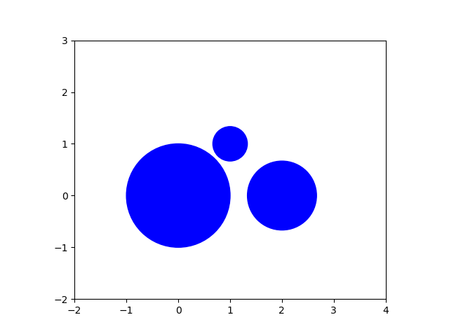
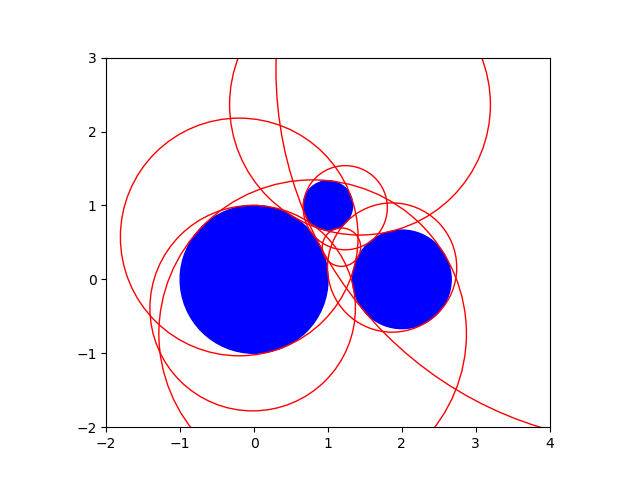
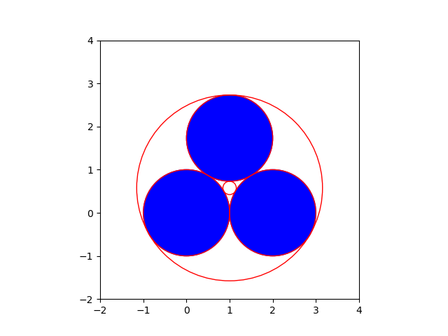
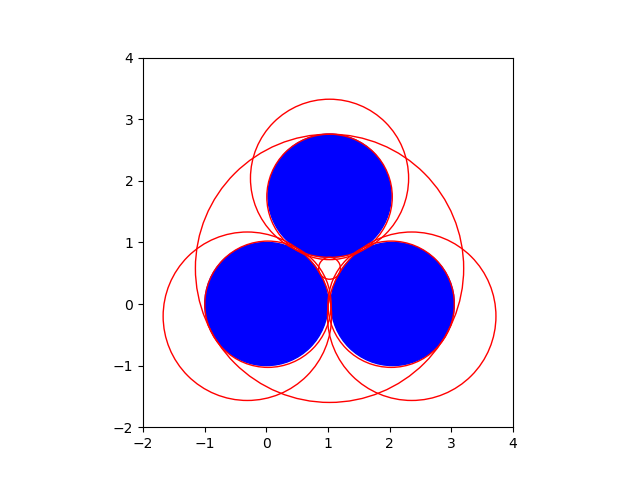

The Circle Problem of Apollonius
================================

The circle problem of Apollonius has the following input/output specification:

Given three circles, find all circles that are tangent to the given circles.

the polynomial systems
----------------------

Without loss of generality, we take the first circle to be the unit circle,
centered at (0, 0) and with radius 1.  The origin of the second circle lies
on the first coordinate axis, so its center has coordinates (``c2x``, 0) and
radius ``r2``.  The third circle has center (``c3x``, ``c3y``) and radius ``r3``.
So there are five parameters in this problem: ``c2x``, ``r2``, ``c3x``, ``c3y``,
and ``r3``.
Values for the five parameters are defined by the first five equations.
The next three equations determine the center (``x``, ``y``) and the radius ``r``
of the circle which touches the three given circles.
The condition on the center of the touching circle is that its distance
to the center of the given circle is either the difference or the sum of
the radii of both circles.  So we arrive at eight polynomial systems.

The problem formulation is coded in the function ``polynomials``.

::

    def polynomials(c2x, r2, c3x, c3y, r3):
        """
        On input are the five parameters of the circle problem of Apollonius:
        c2x : the x-coordinate of the center of the second circle,
        r2 : the radius of the second circle,
        c3x : the x-coordinate of the center of the third circle,
        c3y : the y-coordinate of the center of the third circle,
        r3 : the radius of the third circle.
        Returns a list of lists.  Each list contains a polynomial system.
        Solutions to each polynomial system define center (x, y) and radius r
        of a circle touching three given circles.
        """
        e1m = 'x^2 + y^2 - (r-1)^2;'
        e1p = 'x^2 + y^2 - (r+1)^2;'
        e2m = '(x-%.15f)^2 + y^2 - (r-%.15f)^2;' % (c2x, r2)
        e2p = '(x-%.15f)^2 + y^2 - (r+%.15f)^2;' % (c2x, r2)
        e3m = '(x-%.15f)^2 + (y-%.15f)^2 - (r-%.15f)^2;' % (c3x, c3y, r3)
        e3p = '(x-%.15f)^2 + (y-%.15f)^2 - (r+%.15f)^2;' % (c3x, c3y, r3)
        eqs0 = [e1m,e2m,e3m]
        eqs1 = [e1m,e2m,e3p]
        eqs2 = [e1m,e2p,e3m]
        eqs3 = [e1m,e2p,e3p]
        eqs4 = [e1p,e2m,e3m]
        eqs5 = [e1p,e2m,e3p]
        eqs6 = [e1p,e2p,e3m]
        eqs7 = [e1p,e2p,e3p]
        return [eqs0,eqs1,eqs2,eqs3,eqs4,eqs5,eqs6,eqs7]

As an example of a general problem, the center of the second circle 
is at ``(2, 0)``, with radius ``2/3``, and the third circle is centered
at ``(1, 1)``, with a radius of ``1/3``.

Let us look at the eight polynomial systems, 
computed as the output of the function ``polynomials``.

::

    general_problem = polynomials(2, 2.0/3, 1, 1, 1.0/3)
    for pols in general_problem:
        print(pols)

The eight polynomial systems are shown below:

::

      ['x^2 + y^2 - (r-1)^2;', '(x-2.000000000000000)^2 + y^2 - (r-0.666666666666667)^2;', '(x-1.000000000000000)^2 + (y-1.000000000000000)^2 - (r-0.333333333333333)^2;']
      ['x^2 + y^2 - (r-1)^2;', '(x-2.000000000000000)^2 + y^2 - (r-0.666666666666667)^2;', '(x-1.000000000000000)^2 + (y-1.000000000000000)^2 - (r+0.333333333333333)^2;']
      ['x^2 + y^2 - (r-1)^2;', '(x-2.000000000000000)^2 + y^2 - (r+0.666666666666667)^2;', '(x-1.000000000000000)^2 + (y-1.000000000000000)^2 - (r-0.333333333333333)^2;']
      ['x^2 + y^2 - (r-1)^2;', '(x-2.000000000000000)^2 + y^2 - (r+0.666666666666667)^2;', '(x-1.000000000000000)^2 + (y-1.000000000000000)^2 - (r+0.333333333333333)^2;']
      ['x^2 + y^2 - (r+1)^2;', '(x-2.000000000000000)^2 + y^2 - (r-0.666666666666667)^2;', '(x-1.000000000000000)^2 + (y-1.000000000000000)^2 - (r-0.333333333333333)^2;']
      ['x^2 + y^2 - (r+1)^2;', '(x-2.000000000000000)^2 + y^2 - (r-0.666666666666667)^2;', '(x-1.000000000000000)^2 + (y-1.000000000000000)^2 - (r+0.333333333333333)^2;']
      ['x^2 + y^2 - (r+1)^2;', '(x-2.000000000000000)^2 + y^2 - (r+0.666666666666667)^2;', '(x-1.000000000000000)^2 + (y-1.000000000000000)^2 - (r-0.333333333333333)^2;']
      ['x^2 + y^2 - (r+1)^2;', '(x-2.000000000000000)^2 + y^2 - (r+0.666666666666667)^2;', '(x-1.000000000000000)^2 + (y-1.000000000000000)^2 - (r+0.333333333333333)^2;']

plotting circles
----------------

The package ``matplotlib`` has primitives to define circles.

::

    import matplotlib.pyplot as plt

The input to the three given circles of the general problem is codified 
in the list of tuples set below.

::

    crcdata = [((0, 0), 1), ((2, 0), 2.0/3), ((1, 1), 1.0/3)]

The input circles will be shown as blue disks.
Let us then render our general configuration.

::

    (xa, xb, ya, yb) = (-2, 4, -2, 3)

The code to make :numref:`apolloniusfig1` is below:

::

    fig = plt.figure()
    axs = fig.add_subplot(111, aspect='equal')
    for (center, radius) in crcdata:
        crc = plt.Circle(center, radius, edgecolor='blue', facecolor='blue')
        axs.add_patch(crc)
    plt.axis([xa, xb, ya, yb])
    fig.canvas.draw()

.. _apolloniusfig1:

    
   Three input circles. 

solving polynomial systems
--------------------------

To solve the polynomial systems, we apply the blackbox solver.

::

    from phcpy.solver import solve

and we need some functions to extract the real solutions.

::

    from phcpy.solutions import strsol2dict, is_real

The ``solve4circles`` calls the solver on the polynomial systems of the problem.

::

    def solve4circles(syst, verbose=True):
        """
        Given in syst is a list of polynomial systems.
        Returns a list of tuples.  Each tuple in the list of return
        consists of the coordinates of the center and the radius of
        a circle touching the three given circles.
        """
        (circle, eqscnt) = (0, 0)
        result = []
        for eqs in syst:
            eqscnt = eqscnt + 1
            if verbose:
                print('solving system', eqscnt, ':')
                for pol in eqs:
                    print(pol)
            sols = solve(eqs)
            if verbose:
                print('system', eqscnt, 'has', len(sols), 'solutions')
            for sol in sols:
                if is_real(sol, 1.0e-8):
                    soldic = strsol2dict(sol)
                    if soldic['r'].real > 0:
                        circle = circle + 1
                        ctr = (soldic['x'].real, soldic['y'].real)
                        rad = soldic['r'].real
                        result.append((ctr, rad))
                        if verbose:
                            print('solution circle', circle)
                            print('center =', ctr)
                            print('radius =', rad)
        return result

The function ``solve4circles`` puts the solutions of the polynomial 
system in the format of our problem.
Each solution is a circle, represented by a tuple of the coordinates 
of the center and the radius of the circle.

::

    sols = solve4circles(general_problem)

has as output    

::

    solving system 1 :
    x^2 + y^2 - (r-1)^2;
    (x-2.000000000000000)^2 + y^2 - (r-0.666666666666667)^2;
    (x-1.000000000000000)^2 + (y-1.000000000000000)^2 - (r-0.333333333333333)^2;
    system 1 has 2 solutions
    solution circle 1
    center = (0.792160611810177, -0.734629275680581)
    radius = 2.08036966247227
    solving system 2 :
    x^2 + y^2 - (r-1)^2;
    (x-2.000000000000000)^2 + y^2 - (r-0.666666666666667)^2;
    (x-1.000000000000000)^2 + (y-1.000000000000000)^2 - (r+0.333333333333333)^2;
    system 2 has 2 solutions
    solving system 3 :
    x^2 + y^2 - (r-1)^2;
    (x-2.000000000000000)^2 + y^2 - (r+0.666666666666667)^2;
    (x-1.000000000000000)^2 + (y-1.000000000000000)^2 - (r-0.333333333333333)^2;
    system 3 has 2 solutions
    solution circle 2
    center = (-0.200806137165905, 0.573494560766514)
    radius = 1.60763403126575
    solving system 4 :
    x^2 + y^2 - (r-1)^2;
    (x-2.000000000000000)^2 + y^2 - (r+0.666666666666667)^2;
    (x-1.000000000000000)^2 + (y-1.000000000000000)^2 - (r+0.333333333333333)^2;
    system 4 has 2 solutions
    solution circle 3
    center = (-0.0193166119185703, -0.389367744928919)
    radius = 1.38984660096895
    solving system 5 :
    x^2 + y^2 - (r+1)^2;
    (x-2.000000000000000)^2 + y^2 - (r-0.666666666666667)^2;
    (x-1.000000000000000)^2 + (y-1.000000000000000)^2 - (r-0.333333333333333)^2;
    system 5 has 2 solutions
    solution circle 4
    center = (5.35264994525194, 2.83381218937338)
    radius = 5.05651326763565
    solving system 6 :
    x^2 + y^2 - (r+1)^2;
    (x-2.000000000000000)^2 + y^2 - (r-0.666666666666667)^2;
    (x-1.000000000000000)^2 + (y-1.000000000000000)^2 - (r+0.333333333333333)^2;
    system 6 has 2 solutions
    solution circle 5
    center = (1.86747280383257, 0.159838772566819)
    radius = 0.874300697932419
    solving system 7 :
    x^2 + y^2 - (r+1)^2;
    (x-2.000000000000000)^2 + y^2 - (r+0.666666666666667)^2;
    (x-1.000000000000000)^2 + (y-1.000000000000000)^2 - (r-0.333333333333333)^2;
    system 7 has 2 solutions
    solution circle 6
    center = (1.43293571744453, 2.36388335544507)
    radius = 1.76428097133387
    solution circle 7
    center = (1.23373094922213, 0.96944997788827)
    radius = 0.56905236199947
    solving system 8 :
    x^2 + y^2 - (r+1)^2;
    (x-2.000000000000000)^2 + y^2 - (r+0.666666666666667)^2;
    (x-1.000000000000000)^2 + (y-1.000000000000000)^2 - (r+0.333333333333333)^2;
    system 8 has 2 solutions
    solution circle 8
    center = (1.1821983625488, 0.435483976535281)
    radius = 0.25985684195945

As a summary, let us print the solution circles.

::

    for (idx, circle) in enumerate(sols):
        print('Circle', idx+1, ':', circle)

::

    Circle 1 : ((0.792160611810177, -0.734629275680581), 2.08036966247227)
    Circle 2 : ((-0.200806137165905, 0.573494560766514), 1.60763403126575)
    Circle 3 : ((-0.0193166119185703, -0.389367744928919), 1.38984660096895)
    Circle 4 : ((5.35264994525194, 2.83381218937338), 5.05651326763565)
    Circle 5 : ((1.86747280383257, 0.159838772566819), 0.874300697932419)
    Circle 6 : ((1.43293571744453, 2.36388335544507), 1.76428097133387)
    Circle 7 : ((1.23373094922213, 0.96944997788827), 0.56905236199947)
    Circle 8 : ((1.1821983625488, 0.435483976535281), 0.25985684195945)

Observe that we have a constellation where all eight touching circles
have real coordinates as centers and a positive radius.

In :numref:`apolloniusfig2`
the given circles are plotted as blue disks,
while the eight solution circles are plotted in red,
done by the code below.

::

    fig = plt.figure()
    axs = fig.add_subplot(111, aspect='equal')
    for (center, radius) in crcdata:
        crc = plt.Circle(center, radius, edgecolor='blue', facecolor='blue')
        axs.add_patch(crc)
    for (center, radius) in sols:
        crc = plt.Circle(center, radius, edgecolor='red', facecolor='none')
        axs.add_patch(crc)
    plt.axis([xa, xb, ya, yb])
    fig.canvas.draw()

.. _apolloniusfig2:

    
   Eight circles touching three given circles.

a special problem
-----------------

In a special configuration of three circles,
the three circles are mutually touching each other.

::

    from math import sqrt
    height = sqrt(3)

The output of

::

   special_problem = polynomials(2, 1, 1, height, 1)
   for pols in special_problem:
       print(pols)

is the following list of eight polynomial systems:

::

    ['x^2 + y^2 - (r-1)^2;', '(x-2.000000000000000)^2 + y^2 - (r-1.000000000000000)^2;', '(x-1.000000000000000)^2 + (y-1.732050807568877)^2 - (r-1.000000000000000)^2;']
    ['x^2 + y^2 - (r-1)^2;', '(x-2.000000000000000)^2 + y^2 - (r-1.000000000000000)^2;', '(x-1.000000000000000)^2 + (y-1.732050807568877)^2 - (r+1.000000000000000)^2;']
    ['x^2 + y^2 - (r-1)^2;', '(x-2.000000000000000)^2 + y^2 - (r+1.000000000000000)^2;', '(x-1.000000000000000)^2 + (y-1.732050807568877)^2 - (r-1.000000000000000)^2;']
    ['x^2 + y^2 - (r-1)^2;', '(x-2.000000000000000)^2 + y^2 - (r+1.000000000000000)^2;', '(x-1.000000000000000)^2 + (y-1.732050807568877)^2 - (r+1.000000000000000)^2;']
    ['x^2 + y^2 - (r+1)^2;', '(x-2.000000000000000)^2 + y^2 - (r-1.000000000000000)^2;', '(x-1.000000000000000)^2 + (y-1.732050807568877)^2 - (r-1.000000000000000)^2;']
    ['x^2 + y^2 - (r+1)^2;', '(x-2.000000000000000)^2 + y^2 - (r-1.000000000000000)^2;', '(x-1.000000000000000)^2 + (y-1.732050807568877)^2 - (r+1.000000000000000)^2;']
    ['x^2 + y^2 - (r+1)^2;', '(x-2.000000000000000)^2 + y^2 - (r+1.000000000000000)^2;', '(x-1.000000000000000)^2 + (y-1.732050807568877)^2 - (r-1.000000000000000)^2;']
    ['x^2 + y^2 - (r+1)^2;', '(x-2.000000000000000)^2 + y^2 - (r+1.000000000000000)^2;', '(x-1.000000000000000)^2 + (y-1.732050807568877)^2 - (r+1.000000000000000)^2;']

::

    specialinput = [((0, 0), 1), ((2, 0), 1), ((1, height), 1)]
    (xa, xb, ya, yb) = (-2, 4, -2, 4)

The code to show the special input is

::

    fig = plt.figure()
    axs = fig.add_subplot(111, aspect='equal')
    for (center, radius) in specialinput:
        crc = plt.Circle(center, radius, edgecolor='blue', facecolor='blue')
        axs.add_patch(crc)
    plt.axis([xa, xb, ya, yb])
    fig.canvas.draw()

which produces :numref:`apolloniusfig3`.

.. _apolloniusfig3:

    
   Three touching input circles.

The output of

::

    specialsols = solve4circles(special_problem)

is

::

    solving system 1 :
    x^2 + y^2 - (r-1)^2;
    (x-2.000000000000000)^2 + y^2 - (r-1.000000000000000)^2;
    (x-1.000000000000000)^2 + (y-1.732050807568877)^2 - (r-1.000000000000000)^2;
    system 1 has 2 solutions
    solution circle 1
    center = (1.0, 0.577350269189626)
    radius = 2.15470053837925
    solving system 2 :
    x^2 + y^2 - (r-1)^2;
    (x-2.000000000000000)^2 + y^2 - (r-1.000000000000000)^2;
    (x-1.000000000000000)^2 + (y-1.732050807568877)^2 - (r+1.000000000000000)^2;
    system 2 has 1 solutions
    solving system 3 :
    x^2 + y^2 - (r-1)^2;
    (x-2.000000000000000)^2 + y^2 - (r+1.000000000000000)^2;
    (x-1.000000000000000)^2 + (y-1.732050807568877)^2 - (r-1.000000000000000)^2;
    system 3 has 1 solutions
    solving system 4 :
    x^2 + y^2 - (r-1)^2;
    (x-2.000000000000000)^2 + y^2 - (r+1.000000000000000)^2;
    (x-1.000000000000000)^2 + (y-1.732050807568877)^2 - (r+1.000000000000000)^2;
    system 4 has 1 solutions
    solution circle 2
    center = (2.89107059865923e-16, 1.15377761182971e-16)
    radius = 1.0
    solving system 5 :
    x^2 + y^2 - (r+1)^2;
    (x-2.000000000000000)^2 + y^2 - (r-1.000000000000000)^2;
    (x-1.000000000000000)^2 + (y-1.732050807568877)^2 - (r-1.000000000000000)^2;
    system 5 has 1 solutions
    solving system 6 :
    x^2 + y^2 - (r+1)^2;
    (x-2.000000000000000)^2 + y^2 - (r-1.000000000000000)^2;
    (x-1.000000000000000)^2 + (y-1.732050807568877)^2 - (r+1.000000000000000)^2;
    system 6 has 1 solutions
    solution circle 3
    center = (2.0, 7.69185074553436e-17)
    radius = 1.0
    solving system 7 :
    x^2 + y^2 - (r+1)^2;
    (x-2.000000000000000)^2 + y^2 - (r+1.000000000000000)^2;
    (x-1.000000000000000)^2 + (y-1.732050807568877)^2 - (r-1.000000000000000)^2;
    system 7 has 1 solutions
    solution circle 4
    center = (1.0, 1.73205080756888)
    radius = 0.999999999999999
    solving system 8 :
    x^2 + y^2 - (r+1)^2;
    (x-2.000000000000000)^2 + y^2 - (r+1.000000000000000)^2;
    (x-1.000000000000000)^2 + (y-1.732050807568877)^2 - (r+1.000000000000000)^2;
    system 8 has 2 solutions
    solution circle 5
    center = (1.0, 0.577350269189626)
    radius = 0.154700538379251

Let us look closer at the solutions :

::

    for (idx, circle) in enumerate(specialsols):
        print('Circle', idx+1, ':', circle)

::

    Circle 1 : ((1.0, 0.577350269189626), 2.15470053837925)
    Circle 2 : ((2.89107059865923e-16, 1.15377761182971e-16), 1.0)
    Circle 3 : ((2.0, 7.69185074553436e-17), 1.0)
    Circle 4 : ((1.0, 1.73205080756888), 0.999999999999999)
    Circle 5 : ((1.0, 0.577350269189626), 0.154700538379251)

We have five solutions?  Not eight?

The code for the next plot is in

::

    fig = plt.figure()
    axs = fig.add_subplot(111, aspect='equal')
    for (center, radius) in specialinput:
        crc = plt.Circle(center, radius, edgecolor='blue', facecolor='blue')
        axs.add_patch(crc)
    for (center, radius) in specialsols:
        crc = plt.Circle(center, radius, edgecolor='red', facecolor='none')
        axs.add_patch(crc)
    plt.axis([xa, xb, ya, yb])
    fig.canvas.draw()

The plot in :numref:`apolloniusfig4`
shows that the input circles are solutions as well.

.. _apolloniusfig4:

    
   All circles touching three given touching circles.

a perturbed problem
-------------------

Consider a small perturbation of a special configuration of three circles,
where the three circles are mutually touching each other.

::

    perturbedinput = [((0, 0), 1), ((2.05, 0), 1), ((1.025, height+0.025), 1)]
    perturbed_problem = polynomials(2.05, 1, 1.025, height+0.025, 1)\n",
    perturbedsols = solve4circles(perturbed_problem)"

produces the following output :

::

    solving system 1 :
    x^2 + y^2 - (r-1)^2;
    (x-2.050000000000000)^2 + y^2 - (r-1.000000000000000)^2;
    (x-1.025000000000000)^2 + (y-1.757050807568877)^2 - (r-1.000000000000000)^2;
    system 1 has 2 solutions
    solution circle 1
    center = (1.025, 0.579551408418395)
    radius = 2.17749939915048
    solving system 2 :
    x^2 + y^2 - (r-1)^2;
    (x-2.050000000000000)^2 + y^2 - (r-1.000000000000000)^2;
    (x-1.025000000000000)^2 + (y-1.757050807568877)^2 - (r+1.000000000000000)^2;
    system 2 has 2 solutions
    solving system 3 :
    x^2 + y^2 - (r-1)^2;
    (x-2.050000000000000)^2 + y^2 - (r+1.000000000000000)^2;
    (x-1.025000000000000)^2 + (y-1.757050807568877)^2 - (r-1.000000000000000)^2;
    system 3 has 2 solutions
    solving system 4 :
    x^2 + y^2 - (r-1)^2;
    (x-2.050000000000000)^2 + y^2 - (r+1.000000000000000)^2;
    (x-1.025000000000000)^2 + (y-1.757050807568877)^2 - (r+1.000000000000000)^2;
    system 4 has 2 solutions
    solution circle 2
    center = (0.0248497799767383, -0.00390011791639834)
    radius = 1.02515397552384
    solution circle 3
    center = (-0.309008334843067, -0.198660887619915)
    radius = 1.36735854321414
    solving system 5 :
    x^2 + y^2 - (r+1)^2;
    (x-2.050000000000000)^2 + y^2 - (r-1.000000000000000)^2;
    (x-1.025000000000000)^2 + (y-1.757050807568877)^2 - (r-1.000000000000000)^2;
    system 5 has 2 solutions
    solving system 6 :
    x^2 + y^2 - (r+1)^2;
    (x-2.050000000000000)^2 + y^2 - (r-1.000000000000000)^2;
    (x-1.025000000000000)^2 + (y-1.757050807568877)^2 - (r+1.000000000000000)^2;
    system 6 has 2 solutions
    solution circle 4
    center = (2.35900833484306, -0.19866088761991)
    radius = 1.36735854321413
    solution circle 5
    center = (2.02515022002328, -0.00390011791640729)
    radius = 1.02515397552386
    solving system 7 :
    x^2 + y^2 - (r+1)^2;
    (x-2.050000000000000)^2 + y^2 - (r+1.000000000000000)^2;
    (x-1.025000000000000)^2 + (y-1.757050807568877)^2 - (r-1.000000000000000)^2;
    system 7 has 2 solutions
    solution circle 6
    center = (1.025, 1.73870496299037)
    radius = 1.01834584457851
    solution circle 7
    center = (1.025, 2.04075732867107)
    radius = 1.28370652110219
    solving system 8 :
    x^2 + y^2 - (r+1)^2;
    (x-2.050000000000000)^2 + y^2 - (r+1.000000000000000)^2;
    (x-1.025000000000000)^2 + (y-1.757050807568877)^2 - (r+1.000000000000000)^2;
    system 8 has 2 solutions
    solution circle 8
    center = (1.025, 0.579551408418395)
    radius = 0.177499399150482

Let us look at the solution circles :

::

    for (idx, circle) in enumerate(perturbedsols):
        print('circle', idx+1, ':', circle)

::

    circle 1 : ((1.025, 0.579551408418395), 2.17749939915048)
    circle 2 : ((0.0248497799767383, -0.00390011791639834), 1.02515397552384)
    circle 3 : ((-0.309008334843067, -0.198660887619915), 1.36735854321414)
    circle 4 : ((2.35900833484306, -0.19866088761991), 1.36735854321413)
    circle 5 : ((2.02515022002328, -0.00390011791640729), 1.02515397552386)
    circle 6 : ((1.025, 1.73870496299037), 1.01834584457851)
    circle 7 : ((1.025, 2.04075732867107), 1.28370652110219)
    circle 8 : ((1.025, 0.579551408418395), 0.177499399150482)

:numref:`apolloniusfig5` is made by the code below:

::

    fig = plt.figure()
    axs = fig.add_subplot(111, aspect='equal')
    for (center, radius) in perturbedinput:
        crc = plt.Circle(center, radius, edgecolor='blue', facecolor='blue')
        axs.add_patch(crc)
    for (center, radius) in perturbedsols:
        crc = plt.Circle(center, radius, edgecolor='red', facecolor='none')
        axs.add_patch(crc)
    plt.axis([xa, xb, ya, yb])
    fig.canvas.draw()

.. _apolloniusfig5:

    
   The solution to the perturbed problem

The solution to the perturbed problem allows to account for the number five 
as the number of touching circles of the special problem: 
the original circles had to be counted twice, as their multiplicity equals two.  
And so we thus have :math:`3 \times 2 + 2 = 8`.
