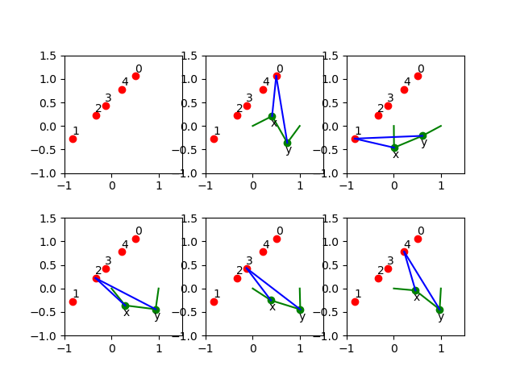
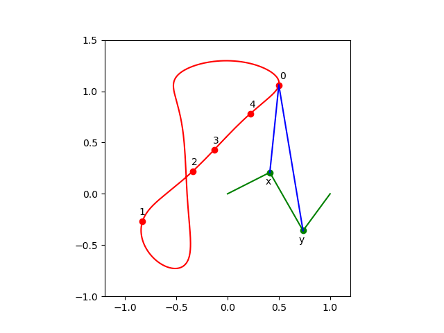

A 4-Bar Mechanism
=================

The equations to design a 4-bar mechanism are defined with sympy.

The system appears in a paper by A.P. Morgan and C.W. Wampler on
**Solving a Planar Four-Bar Design Using Continuation**, published in
*the Journal of Mechanical Design*, volume 112, pages 544-550, 1990.

The solutions for a straight-line confirmation are shown with matplotlib.
Random numbers will be generated.

::

    from math import sqrt
    from random import uniform

From `sympy` we import the following:

::

    from sympy import var
    from sympy.matrices import Matrix

For the plotting, we import ``pyplot`` of ``matplotlib``.

::

    import matplotlib.pyplot as plt

And then, last an not least, the blackbox solver
of ``phcpy`` is imported.

::

    from phcpy.solver import solve

As ``phcpy`` is an API, the problem is solved
via a sequence of functions.

solving a polynomial system
---------------------------

The system of polynomial equations is formulated
by the function in the code cell below.

::

    def polynomials(d0, d1, d2, d3, d4, a):
        """
        Given in d0, d1, d2, d3, d4 are the coordinates of
        the precision points, given as Matrix objects.
        Also the coordinates of the pivot in a are stored in a Matrix.
        Returns the system of polynomials to design the 4-bar
        mechanism with a coupler passing through the precision points.
        """
        # the four rotation matrices
        c1, s1, c2, s2 = var('c1, s1, c2, s2')
        c3, s3, c4, s4 = var('c3, s3, c4, s4')
        R1 = Matrix([[c1, -s1], [s1, c1]])
        R2 = Matrix([[c2, -s2], [s2, c2]])
        R3 = Matrix([[c3, -s3], [s3, c3]])
        R4 = Matrix([[c4, -s4], [s4, c4]])
        # the first four equations reflecting cos^2(t) + sin^(t) = 1
        p1, p2 = 'c1^2 + s1^2 - 1;', 'c2^2 + s2^2 - 1;'
        p3, p4 = 'c3^2 + s3^2 - 1;', 'c4^2 + s4^2 - 1;'
        # the second four equations on X
        x1, x2 = var('x1, x2')
        X = Matrix([[x1], [x2]])
        c1x = 0.5*(d1.transpose()*d1 - d0.transpose()*d0)
        c2x = 0.5*(d2.transpose()*d2 - d0.transpose()*d0)
        c3x = 0.5*(d3.transpose()*d3 - d0.transpose()*d0)
        c4x = 0.5*(d4.transpose()*d4 - d0.transpose()*d0)
        e1x = (d1.transpose()*R1 - d0.transpose())*X + c1x
        e2x = (d2.transpose()*R2 - d0.transpose())*X + c2x
        e3x = (d3.transpose()*R3 - d0.transpose())*X + c3x
        e4x = (d4.transpose()*R4 - d0.transpose())*X + c4x
        s1, s2 = str(e1x[0]) + ';', str(e2x[0]) + ';'
        s3, s4 = str(e3x[0]) + ';', str(e4x[0]) + ';'
        # the third group of equations on Y
        y1, y2 = var('y1, y2')
        Y = Matrix([[y1], [y2]])
        c1y = c1x - a.transpose()*(d1 - d0)
        c2y = c2x - a.transpose()*(d2 - d0)
        c3y = c3x - a.transpose()*(d3 - d0)
        c4y = c4x - a.transpose()*(d4 - d0)
        e1y = ((d1.transpose() - a.transpose())*R1 \
             - (d0.transpose() - a.transpose()))*Y + c1y
        e2y = ((d2.transpose() - a.transpose())*R2 \
             - (d0.transpose() - a.transpose()))*Y + c2y
        e3y = ((d3.transpose() - a.transpose())*R3 \
             - (d0.transpose() - a.transpose()))*Y + c3y
        e4y = ((d4.transpose() - a.transpose())*R4 \
             - (d0.transpose() - a.transpose()))*Y + c4y
        s5, s6 = str(e1y[0]) + ';', str(e2y[0]) + ';'
        s7, s8 = str(e3y[0]) + ';', str(e4y[0]) + ';'
        return [p1, p2, p3, p4, s1, s2, s3, s4, s5, s6, s7, s8]

Let us generate random points and define the polynomial system.

::

    pt0 = Matrix(2, 1, lambda i,j: uniform(-1,+1))
    pt1 = Matrix(2, 1, lambda i,j: uniform(-1,+1))
    pt2 = Matrix(2, 1, lambda i,j: uniform(-1,+1))
    pt3 = Matrix(2, 1, lambda i,j: uniform(-1,+1))
    pt4 = Matrix(2, 1, lambda i,j: uniform(-1,+1))
    # the pivot is a
    piv = Matrix([[1], [0]])
    equ = polynomials(pt0,pt1,pt2,pt3,pt4,piv)
    for pol in equ:
        print(pol)

Then the output for random numbers as the parameters is

::

      c1^2 + s1^2 - 1;
      c2^2 + s2^2 - 1;
      c3^2 + s3^2 - 1;
      c4^2 + s4^2 - 1;
      x1*(-0.275586755195824*c1 + 0.325788266703467*s1 + 0.676839821431551) + x2*(0.325788266703467*c1 + 0.275586755195824*s1 - 0.0938422352018522) - 0.142416227311081;\n",
      x1*(0.902513020087508*c2 - 0.151712455719013*s2 + 0.676839821431551) + x2*(-0.151712455719013*c2 - 0.902513020087508*s2 - 0.0938422352018522) + 0.185313955832297;\n",
      x1*(-0.44237719048943*c3 - 0.542955104453471*s3 + 0.676839821431551) + x2*(-0.542955104453471*c3 + 0.44237719048943*s3 - 0.0938422352018522) + 0.0117896575671138;\n",
      x1*(-0.319438148253377*c4 - 0.397350378412077*s4 + 0.676839821431551) + x2*(-0.397350378412077*c4 + 0.319438148253377*s4 - 0.0938422352018522) - 0.103495227599703;\n",
      y1*(-1.27558675519582*c1 + 0.325788266703467*s1 + 1.67683982143155) + y2*(0.325788266703467*c1 + 1.27558675519582*s1 - 0.0938422352018522) - 0.543669293546807;\n",
      y1*(-0.0974869799124924*c2 - 0.151712455719013*s2 + 1.67683982143155) + y2*(-0.151712455719013*c2 + 0.0974869799124924*s2 - 0.0938422352018522) - 1.39403888568676;\n",
      y1*(-1.44237719048943*c3 - 0.542955104453471*s3 + 1.67683982143155) + y2*(-0.542955104453471*c3 + 1.44237719048943*s3 - 0.0938422352018522) - 0.222672973375007;\n",
      y1*(-1.31943814825338*c4 - 0.397350378412077*s4 + 1.67683982143155) + y2*(-0.397350378412077*c4 + 1.31943814825338*s4 - 0.0938422352018522) - 0.460896900777877;\n"

The solutions of the polynomial system define a mechanism
of which the coupler passes through the five points.

::

    sols = solve(equ)
    len(sols)

The number is ``36`` which is invariant for this problem.
Solving a general problem, for random precision points, 
shows that the number of solutions is 36.

a straight-line configuration
-----------------------------

Let us consider a special problem.
Observe the extraction of real solutions in the function below.

::

    def straight_line(verbose=True):
        """
        This function solves an instance where the five precision
        points lie on a line.  The coordinates are taken from Problem 7
        of the paper by A.P. Morgan and C.W. Wampler.
        Returns a list of solution dictionaries for the real solutions.
        """
        from phcpy.solutions import strsol2dict, is_real
        pt0 = Matrix([[ 0.50], [ 1.06]])
        pt1 = Matrix([[-0.83], [-0.27]])
        pt2 = Matrix([[-0.34], [ 0.22]])
        pt3 = Matrix([[-0.13], [ 0.43]])
        pt4 = Matrix([[ 0.22], [ 0.78]])
        piv = Matrix([[1], [0]])
        equ = polynomials(pt0,pt1,pt2,pt3,pt4,piv)
        if verbose:
            print('the polynomial system :')
            for pol in equ:
                print(pol)
        sols = solve(equ)
        if verbose:
            print('the solutions :')
            for (idx, sol) in enumerate(sols):
                print('Solution', idx+1, ':')
                print(sol)
            print('computed', len(sols), 'solutions')
        result = []
        for sol in sols:
            if is_real(sol, 1.0e-8):
                soldic = strsol2dict(sol)
                result.append(soldic)
        return result

Running the function

::

    sols = straight_line()

shows

::

    the polynomial system :
    c1^2 + s1^2 - 1;
    c2^2 + s2^2 - 1;
    c3^2 + s3^2 - 1;
    c4^2 + s4^2 - 1;
    x1*(-0.83*c1 - 0.27*s1 - 0.5) + x2*(-0.27*c1 + 0.83*s1 - 1.06) - 0.3059;
    x1*(-0.34*c2 + 0.22*s2 - 0.5) + x2*(0.22*c2 + 0.34*s2 - 1.06) - 0.6048;
    x1*(-0.13*c3 + 0.43*s3 - 0.5) + x2*(0.43*c3 + 0.13*s3 - 1.06) - 0.5859;
    x1*(0.22*c4 + 0.78*s4 - 0.5) + x2*(0.78*c4 - 0.22*s4 - 1.06) - 0.3584;
    y1*(-1.83*c1 - 0.27*s1 + 0.5) + y2*(-0.27*c1 + 1.83*s1 - 1.06) + 1.0241;
    y1*(-1.34*c2 + 0.22*s2 + 0.5) + y2*(0.22*c2 + 1.34*s2 - 1.06) + 0.2352;
    y1*(-1.13*c3 + 0.43*s3 + 0.5) + y2*(0.43*c3 + 1.13*s3 - 1.06) + 0.0440999999999999;
    y1*(-0.78*c4 + 0.78*s4 + 0.5) + y2*(0.78*c4 + 0.78*s4 - 1.06) - 0.0784;

and then continues with ``the solutions :`` which is skipped
as the output of the function gives the list of real solutions.

::

    for (idx, sol) in enumerate(sols):
        (x1v, x2v) = (sol['x1'].real, sol['x2'].real)
        (y1v, y2v) = (sol['y1'].real, sol['y2'].real)
        print('Solution', idx+1, ':')
        print('x = ', x1v, x2v)
        print('y = ', y1v, y2v)

The coordinates of the real solutions are shown below.

::

    Solution 1 :
    x =  -0.0877960434509403 -0.85138690751564
    y =  0.235837391307301 -1.41899202703639
    Solution 2 :
    x =  0.0193359267851516 -0.937757011012446
    y =  1.22226669109342 -1.08285087742709
    Solution 3 :
    x =  -0.595728628822183 -0.617010917712341
    y =  0.118171353650905 -1.82939267557673
    Solution 4 :
    x =  -0.158077261086826 -0.793782551346416
    y =  -0.548761782690284 0.278116829722178
    Solution 5 :
    x =  14.265306631912 -6.51576530896231
    y =  -0.621791031677556 -0.0713939584963069
    Solution 6 :
    x =  -1.79178664902321 1.04613207405924
    y =  -1.46486338398045 1.21676347168425
    Solution 7 :
    x =  0.130643755560844 -0.942516053801942
    y =  0.963729735050218 -1.01577587226827
    Solution 8 :
    x =  -0.358757861563373 -0.537230434093211
    y =  0.0870595124133798 1.5543474028655
    Solution 9 :
    x =  -11.0926159017278 0.450863935272926
    y =  -0.396207302280832 -1.04172821286545
    Solution 10 :
    x =  -0.154697709323186 -0.812626279169727
    y =  3.30145715645532 -2.31860323051595
    Solution 11 :
    x =  -0.0801573081756841 -0.855275240173407
    y =  -0.297321862562434 -2.18414388671793
    Solution 12 :
    x =  0.676178657404253 -0.613650952963839
    y =  0.356055523659319 0.310794500797803
    Solution 13 :
    x =  1.4739209688177 -1.71128474823024
    y =  -0.654679846479676 0.028907166911727
    Solution 14 :
    x =  -0.264640920049152 -0.69691152780256
    y =  0.370368746423895 -1.54221173415608
    Solution 15 :
    x =  -1.0856845753759 -0.352998488913482
    y =  0.319028475056347 0.687883260707162

a four-bar mechanism
--------------------

The code in the function below are applied to make the plots.

::

    def angle(csa, sna):
        """
        Given in csa and sna are the cosine and sine of an angle a,
        that is: csa = cos(a) and sna = sin(a).
        On return is the angle a, with the proper orientation.
        """
        from math import acos, pi
        agl = acos(csa)
        if sna >= 0:
            return agl
        else:
            dlt = pi - agl
            return pi + dlt

::
   
    def angles(soldic):
        """
        Given a solution dictionary, extracts the angles from
        the four cosines and sines of the angles.
        Returns None if the angles are not ordered increasingly.
        Otherwise, returns the sequence of ordered angles.
        """
        from math import acos, asin
        c1v, s1v = soldic['c1'].real, soldic['s1'].real
        c2v, s2v = soldic['c2'].real, soldic['s2'].real
        c3v, s3v = soldic['c3'].real, soldic['s3'].real
        c4v, s4v = soldic['c4'].real, soldic['s4'].real
        ag1 = angle(c1v, s1v)
        ag2 = angle(c2v, s2v)
        ag3 = angle(c3v, s3v)
        ag4 = angle(c4v, s4v)
        ordered = (ag1 > ag2) and (ag2 > ag3) and (ag3 > ag4)
        if ordered:
            print(ag1, ag2, ag3, ag4, 'ordered angles')
            return (ag1, ag2, ag3, ag4)
        return None

::

    def plotpoints(points):
        """
        Plots the precision points and the pivots.
        """
        xpt = [a for (a, b) in points]
        ypt = [b for (a, b) in points]
        plt.plot(xpt, ypt, 'ro')
        plt.text(xpt[0] - 0.01, ypt[0] + 0.08, \"0\")
        plt.text(xpt[1] - 0.01, ypt[1] + 0.08, \"1\")
        plt.text(xpt[2] - 0.01, ypt[2] + 0.08, \"2\")
        plt.text(xpt[3] - 0.01, ypt[3] + 0.08, \"3\")
        plt.text(xpt[4] - 0.01, ypt[4] + 0.08, \"4\")
        plt.plot([0, 1], [0, 0], 'w^') # pivots marked by white triangles
        plt.axis([-1.0, 1.5, -1.0, 1.5])

::

    def plotbar(fig, points, idx, x, y):
        """
        Plots a 4-bar with coordinates given in x and y,
        and the five precision points in the list points.
        The index idx is the position with respect to a point in points.
        """
        if idx < 0:
            fig.add_subplot(231, aspect='equal')
        if idx == 0:
            fig.add_subplot(232, aspect='equal')
        elif idx == 1:
            fig.add_subplot(233, aspect='equal')
        elif idx == 2:
            fig.add_subplot(234, aspect='equal')
        elif idx == 3:
            fig.add_subplot(235, aspect='equal')
        elif idx == 4:
            fig.add_subplot(236, aspect='equal')
        plotpoints(points)
        if idx >= 0:
            xpt = [a for (a, b) in points]
            ypt = [b for (a, b) in points]
            (xp0, xp1) = (x[0] + xpt[idx], x[1] + ypt[idx])
            (yp0, yp1) = (y[0] + xpt[idx], y[1] + ypt[idx])
            plt.plot([xp0, yp0], [xp1, yp1], 'go')
            plt.plot([xp0, yp0], [xp1, yp1], 'g')
            plt.text(xp0 - 0.04, xp1 - 0.22, \"x\")
            plt.text(yp0 - 0.04, yp1 - 0.22, \"y\")
            plt.plot([0, xp0], [0, xp1], 'g')
            plt.plot([yp0, 1], [yp1, 0], 'g')
            plt.plot([xp0, xpt[idx]], [xp1, ypt[idx]], 'b')
            plt.plot([yp0, xpt[idx]], [yp1, ypt[idx]], 'b')

::

    def rotate(x, y, a):
        """
        Applies a planar rotation defined by the angle a
        to the points x and y.
        """
        from sympy.matrices import Matrix
        from math import cos, sin
        rot = Matrix([[cos(a), -sin(a)], [sin(a), cos(a)]])
        xmt = Matrix([[x[0]], [x[1]]])
        ymt = Matrix([[y[0]], [y[1]]])
        rxm = rot*xmt
        rym = rot*ymt
        rox = (rxm[0], rxm[1])
        roy = (rym[0], rym[1])
        return (rox, roy)

::

    def show4bar():
        """
        Plots a 4-bar design, for the five precision points
        on a straight line, with coordinates taken from Problem 7
        of the Morgan-Wampler paper.
        """
        pt0 = ( 0.50,  1.06)
        pt1 = (-0.83, -0.27)
        pt2 = (-0.34,  0.22)
        pt3 = (-0.13,  0.43)
        pt4 = ( 0.22,  0.78)
        points = [pt0, pt1, pt2, pt3, pt4]
        ags = [1.44734213756, 0.928413708131, 0.751699211109, 0.387116282208]
        x =  (-0.0877960434509, -0.851386907516)
        y =  (0.235837391307, -1.41899202704)
        fig = plt.figure()
        plotbar(fig,points, -1, x, y)
        plotbar(fig,points, 0, x, y)
        rx1, ry1 = rotate(x, y, ags[0])
        plotbar(fig,points, 1, rx1, ry1)
        rx2, ry2 = rotate(x, y, ags[1])
        plotbar(fig,points, 2, rx2, ry2)
        rx3, ry3 = rotate(x, y, ags[2])
        plotbar(fig,points, 3, rx3, ry3)
        rx4, ry4 = rotate(x, y, ags[3])
        plotbar(fig,points, 4, rx4, ry4)
        fig.canvas.draw()
        plt.savefig('fourbarfig1')

The mechanism which passes through the precision points is shown in
:numref:`fourbarfig1` obtained as the output of

::

    show4bar()

.. _fourbarfig1:

    
   A mechanism passing through precision points.

::

    for sol in sols:
        agl = angles(sol)
        if agl != None:
            (x1v, x2v) = (sol['x1'].real, sol['x2'].real)
            (y1v, y2v) = (sol['y1'].real, sol['y2'].real)
            print('x = ', x1v, x2v)
            print('y = ', y1v, y2v)

The output is

::

    1.4473421375642717 0.9284137081314461 0.75169921110931 0.3871162822082786 ordered angles
    x =  -0.0877960434509403 -0.85138690751564
    y =  0.235837391307301 -1.41899202703639
    2.524711332238134 0.9038272905536054 0.7498546795650226 0.38277375732994035 ordered angles
    x =  -0.0801573081756841 -0.855275240173407
    y =  -0.297321862562434 -2.18414388671793
    5.771983513802544 3.9629563185486125 3.442223836627024 0.5242754656511442 ordered angles
    x =  0.676178657404253 -0.613650952963839
    y =  0.356055523659319 0.310794500797803

Observe that one of the lists of ordered angles is used in the ``showbar()``.

the coupler curve
-----------------

The coupler curve is the curve drawn by the coupler point.

::
   
    def plotpoints2(points):
        """
        Plots the precision points and the pivots.
        """
        xpt = [a for (a, b) in points]
        ypt = [b for (a, b) in points]
        plt.plot(xpt, ypt, 'ro')
        plt.text(xpt[0] + 0.01, ypt[0] + 0.06, \"0\")
        plt.text(xpt[1] - 0.03, ypt[1] + 0.06, \"1\")
        plt.text(xpt[2] - 0.01, ypt[2] + 0.06, \"2\")
        plt.text(xpt[3] - 0.01, ypt[3] + 0.06, \"3\")
        plt.text(xpt[4] - 0.01, ypt[4] + 0.06, \"4\")
        plt.plot([0, 1], [0, 0], 'w^') # pivots marked by white triangles
        plt.axis([-1.2, 1.2, -1.0, 1.5])

::

    def plotbar2(fig, points, idx, x, y):
        """
        Plots a 4-bar with coordinates given in x and y,
        and the five precision points in the list points.
        The index idx is the position with respect to a point in points.
        """
        plotpoints2(points)
        xpt = [a for (a, b) in points]
        ypt = [b for (a, b) in points]
        (xp0, xp1) = (x[0] + xpt[0], x[1] + ypt[0])
        (yp0, yp1) = (y[0] + xpt[0], y[1] + ypt[0])
        if idx >= 0:
            (xp0, xp1) = (x[0] + xpt[idx], x[1] + ypt[idx])
            (yp0, yp1) = (y[0] + xpt[idx], y[1] + ypt[idx])
            plt.plot([xp0, yp0], [xp1, yp1], 'go')
            plt.plot([xp0, yp0], [xp1, yp1], 'g')
            plt.text(xp0 - 0.04, xp1 - 0.12, \"x\")
            plt.text(yp0 - 0.04, yp1 - 0.12, \"y\")
            plt.plot([0, xp0], [0, xp1], 'g')
            plt.plot([yp0, 1], [yp1, 0], 'g')
            plt.plot([xp0, xpt[idx]], [xp1, ypt[idx]], 'b')
            plt.plot([yp0, xpt[idx]], [yp1, ypt[idx]], 'b')

::

    def lenbar(pt0, x, y):
        """
        In pt0 are the coordinates of the first precision point
        and in x and y the coordinates of the solution design.
        Returns the length of the bar between x and y.
        """
        (xp0, xp1) = (x[0] + pt0[0], x[1] + pt0[1])
        (yp0, yp1) = (y[0] + pt0[0], y[1] + pt0[1])
        result = sqrt((xp0 - yp0)**2 + (xp1 - yp1)**2)
        return result

::

    def coupler(x, y, xr, yr):
        """
        In x and y are the coordinates of the solution design.
        In xr and yr are the distances to the coupler point.
        Computes the intersection between two circles, centered
        at x and y, with respective radii in xr and yr.
        """
        A = -2*x[0] + 2*y[0]
        B = -2*x[1] + 2*y[1]
        C = x[0]**2 + x[1]**2 - xr**2 - y[0]**2 - y[1]**2 + yr**2
        fail = True
        if A + 1.0 != 1.0: # eliminate z1
            (alpha, beta) = (-C/A, -B/A)
            a = beta**2 + 1
            b = 2*alpha*beta - 2*x[1] - 2*x[0]*beta
            c = alpha**2 + x[0]**2 + x[1]**2 - xr**2 - 2*x[0]*alpha
            if b**2 - 4*a*c >= 0:
                fail = False
                disc = sqrt(b**2 - 4*a*c)
                z2 = (-b + disc)/(2*a)
                z1 = alpha + beta*z2
        if fail:
            (alpha, beta) = (-C/B, -A/B)
            a = beta**2 + 1
            b = 2*alpha*beta - 2*y[1] - 2*y[0]*beta
            c = alpha**2 + y[0]**2 + y[1]**2 - yr**2 - 2*y[0]*alpha
            disc = sqrt(b**2 - 4*a*c)
            z1 = (-b + disc)/(2*a)
            z2 = alpha + beta*z1
            dxz = sqrt((x[0]-z1)**2 + (x[1]-z2)**2)
        return (z1, z2)

::

    def xcrank(pt0, x):
        """
        In pt0 are the coordinates of the first precision point
        and in x the coordinates of the solution design.
        This function computes the length of the crank
        and its initial angle with respect to the first point.
        """
        from math import atan
        (xp0, xp1) = (x[0] + pt0[0], x[1] + pt0[1])
        crklen = sqrt(xp0**2 + xp1**2)
        crkagl = atan(xp1/xp0)
        return (crklen, crkagl)

::

    def ycrank(pt0, y):
        """
        In pt0 are the coordinates of the first precision point
        and in y the coordinates of the solution design.
        This function computes the length of the crank
        and its initial angle with respect to the first point.
        """
        from math import cos, sin, acos, pi
        (yp0, yp1) = (y[0] + pt0[0], y[1] + pt0[1])
        crklen = sqrt((yp0 - 1)**2 + yp1**2)
        crkagl = acos((yp0-1)/crklen)
        if yp1 < 0:
            dlt = pi - crkagl
            crkagl = pi + dlt
        cx = 1 + crklen*cos(crkagl)
        cy = crklen*sin(crkagl)
        return (crklen, crkagl)

::

    def xpos(y1, y2, dxy, rad):
        """
        Given in y1 and y2 are the coordinates of the point y,
        in dxy is the distance between the points x and y,
        and rad is the distance between x and (1, 0).
        The coordinates of the point x are returned in a tuple.
        """
        A = -2*y1  # coefficient with y1
        B = -2*y2  # coefficient with y2
        C = y1**2 + y2**2 - dxy**2 + rad**2 # constant
        fail = True
        if abs(y2) < 1.0e-8:
            x1 = -C/A
            x2sqr = rad**2 - x1**2
            x2 = sqrt(x2sqr)
            fail = False
        else: # eliminate x2
            (alpha, beta) = (-C/B, -A/B)
            (a, b, c) = (1+beta**2, 2*alpha*beta, alpha**2 - rad**2)
            b4ac = b**2 - 4*a*c
            disc = sqrt(b4ac)
            x1m = (-b - disc)/(2*a)
            x2m = alpha + beta*x1m
            x1p = (-b + disc)/(2*a)
            x2p = alpha + beta*x1p
        return ((x1m, x2m), (x1p, x2p))

::

    def plotcrank(crk, agl, dxy, rad, xrd, yrd):
        """
        Plots several positions of the crank.  On input are:
        crk : length of the crank from the point y to (1, 0),
        agl : start angle,
        rad : length of the crank from (0, 0) to the point x,
        xrd : length from the point x to the coupler point,
        yrd : length from the point y to the coupler point.
        """
        from math import sin, cos, pi
        (xzm, yzm) = ([], [])
        (xzp, yzp) = ([], [])
        nbr = 205
        inc = (pi+0.11763)/nbr
        b = agl - 2.558 # 125
        for k in range(nbr):
            (y1, y2) = (1 + crk*cos(b), crk*sin(b))
            (xm, xp) = xpos(y1, y2, dxy, rad)
            (x1m, x2m) = xm
            (x1p, x2p) = xp
            (z1m, z2m) = coupler([x1m, x2m], [y1, y2], xrd, yrd)
            (z1p, z2p) = coupler([x1p, x2p], [y1, y2], xrd, yrd)
            xzm.append(z1m)
            yzm.append(z2m)
            xzp.append(z1p)
            yzp.append(z2p)
            if k < 0: # selective plot
                plt.plot([0, x1m], [0, x2m], 'g')
                plt.plot([x1m, y1], [x2m, y2], 'g')
                plt.plot([y1, 1], [y2, 0], 'g')
                dyp = sqrt((y1-1)**2 + y2**2)
                dyx = sqrt((x1m-y1)**2 + (x2m-y2)**2)
                print('dxy =', dxy, 'dyp =', dyp)
            if k < 0:
                print('y2 =', y2)\
                plt.plot([x1m, z1m], [x2m, z2m], 'b')
                plt.plot([y1, z1m], [y2, z2m], 'b')
                plt.plot([x1p, z1p], [x2p, z2p], 'b')
                plt.plot([y1, z1p], [y2, z2p], 'b')
            b = b + inc
        plt.plot(xzp[:1]+xzm[:102]+xzp[102:], \
                 yzp[:1]+yzm[:102]+yzp[102:], 'r')
        plt.plot(xzp[:102]+xzm[102:], yzp[:102]+yzm[102:], 'r')

::

    def plotcoupler():
        """
        Plots the coupler curve for a straight line 4-bar mechanism.
        """
        pt0 = ( 0.50,  1.06)
        pt1 = (-0.83, -0.27)
        pt2 = (-0.34,  0.22)
        pt3 = (-0.13,  0.43)
        pt4 = ( 0.22,  0.78)
        points = [pt0, pt1, pt2, pt3, pt4]
        ags = [1.44734213756, 0.928413708131, 0.751699211109, 0.387116282208]
        x = (-0.0877960434509, -0.851386907516)
        y = (0.235837391307, -1.41899202704)
        (xcrk, xagl) = xcrank(pt0, x)
        (ycrk, yagl) = ycrank(pt0, y)
        dxy = lenbar(pt0, x, y)
        fig = plt.figure()
        fig.add_subplot(111, aspect='equal')
        xrd = sqrt(x[0]**2 + x[1]**2) # distance from x to pt0
        yrd = sqrt(y[0]**2 + y[1]**2) # distance from y to pt0
        plotcrank(ycrk, yagl, dxy, xcrk, xrd, yrd)
        plotbar2(fig, points, 0, x, y)
        fig.canvas.draw()
        plt.savefig('fourbarfig2')

Running the function

:: 

    plotcoupler()

produces the plot in :numref:`fourbarfig2`.

.. _fourbarfig2:

    
   The coupler curve of a 4-bar mechanism.
