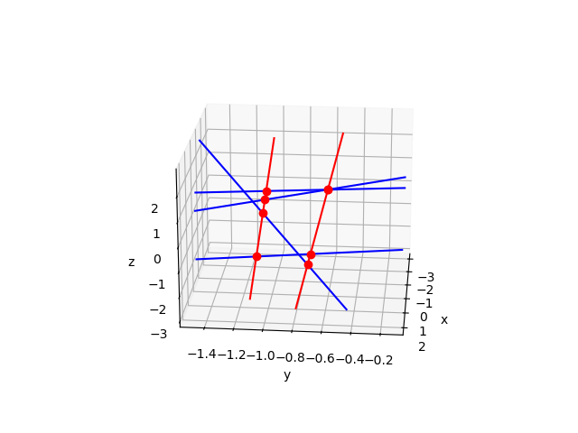

Two Lines Meeting Four Given Lines
==================================

Given four lines in general position,
there are two lines which meet all four given lines.
With Pieri homotopies we can solve this Schubert problem.
For the verification of the intersection conditions, ``numpy`` is used.
The plots are made with ``matplotlib``.

We use random numbers and for reproducible plots, fix the seed.

::

   from random import seed

From ``numpy`` we import the following.

::

   from numpy import zeros, array, concatenate, matrix
   from numpy.linalg import det, solve

The plots are in 3-space.

::

   import matplotlib.pyplot as plt
   from mpl_toolkits.mplot3d import Axes3D

From `phcpy` we import the following functions:

::

    "from phcpy.solutions import coordinates
    "from phcpy.schubert import random_complex_matrix
    "from phcpy.schubert import pieri_root_count, run_pieri_homotopies
    "from phcpy.schubert import real_osculating_planes
    "from phcpy.schubert import make_pieri_system
    "from phcpy.trackers import double_track as track

solving a general instance
--------------------------

A random instance of the four given lines will lead to two solution lines.
The formal root count run as

::

    (mdim, pdim, deg) = (2, 2, 0)
    pcnt = pieri_root_count(mdim, pdim, deg, False)
    pcnt

and outputs ``2``.

To setup the problem, some auxiliary functions are first defined.

::

    def indices(name):
        """
        For the string name in the format xij
        return (i, j) as two integer indices.
        """
        return (int(name[1]), int(name[2]))

::

    def solution_plane(rows, cols, sol):
        """
        Returns a sympy matrix with as many rows
        as the value of rows and with as many columns
        as the value of columns, using the string
        represention of a solution in sol.
        """
        result = zeros((rows, cols), dtype=complex)
        for k in range(cols):
            result[k][k] = 1
        (vars, vals) = coordinates(sol)
        for (name, value) in zip(vars, vals):
            i, j = indices(name)
            result[i-1][j-1] = value
        return result

::

    def verify_determinants(inps, sols, verbose=True):
        """
        Verifies the intersection conditions with determinants,
        concatenating the planes in inps with those in the sols.
        Both inps and sols are lists of numpy arrays.
        Returns the sum of the absolute values of all determinants.
        If verbose, then for all solutions in sols, the computed
        determinants are printed to screen.
        """
        checksum = 0
        for sol in sols:
            if verbose:
                print('checking solution\\n', sol)
            for plane in inps:
                cat = concatenate([plane, sol], axis=-1)
                mat = matrix(cat)
                dcm = det(mat)
                if verbose:
                    print('the determinant :', dcm)
                checksum = checksum + abs(dcm)
        return checksum

::

    def solve_general(mdim, pdim, qdeg):
        """
        Solves a general instance of Pieri problem, computing the
        p-plane producing curves of degree qdeg which meet a number
        of general m-planes at general interpolation points,
        where p = pdim and m = mdim on input.
        For the problem of computing the two lines which meet
        four general lines, mdim = 2, pdim = 2, and qdeg = 0.
        Returns a tuple with four lists.
        The first two lists contain matrices with the input planes
        and the solution planes respectively.
        The third list is the list of polynomials solved
        and the last list is the solution list.
        """
        dim = mdim*pdim + qdeg*(mdim+pdim)
        ranplanes = [random_complex_matrix(mdim+pdim, mdim) for _ in range(0, dim)]
        (pols, sols) = run_pieri_homotopies(mdim, pdim, qdeg, ranplanes)
        inplanes = [array(plane) for plane in ranplanes]
        outplanes = [solution_plane(mdim+pdim, pdim, sol) for sol in sols]
        return (inplanes, outplanes, pols, sols)

::

    (inp, otp, pols, sols) = solve_general(mdim, pdim, deg)

The four input lines are represented as matrices.

::

    for plane in inp:
        print(plane)

shows 

::

    [[ 0.98771734-0.15625123j  0.52929265-0.84843933j]
     [ 0.0108879 -0.99994073j  0.43271012+0.90153311j]
     [ 0.670366  +0.74203061j  0.84995049-0.52686257j]
     [-0.99870177+0.05093886j  0.55311134-0.83310735j]]
    [[ 0.1176291 +0.9930576j   0.73982601-0.67279824j]
     [-0.4096813 -0.91222872j  0.98222659+0.18769903j]
     [ 0.49367521+0.86964635j -0.00101345-0.99999949j]
     [ 0.99603164-0.0889999j   0.37233497-0.92809841j]]
    [[-0.86632581+0.49947932j  0.99954174-0.03027052j]
     [ 0.26897023+0.96314849j  0.29943145+0.95411781j]
     [ 0.77919846-0.62677728j  0.52235751-0.85272659j]
     [ 0.4481898 +0.89393842j  0.97691942+0.21360816j]]
    [[ 0.40705515-0.91340358j -0.66900116+0.74326136j]
     [-0.11164153+0.99374854j -0.51718407-0.8558742j ]
     [-0.01384859+0.9999041j  -0.38779064+0.92174748j]
     [ 0.32407475-0.94603148j  0.87995025-0.47506584j]]

::

    print('The solution planes :')
    for plane in otp:
        print(plane)

has as output

::

    The solution planes :
    [[ 1.        +0.j          0.        +0.j        ]
     [-0.64379718+0.67758706j  1.        +0.j        ]
     [ 0.69735824-0.15805905j -1.46030164-0.68747669j]
     [ 0.        +0.j         -1.74595349+0.00175246j]]
    [[ 1.        +0.j          0.        +0.j        ]
     [ 1.4746012 +0.78327696j  1.        +0.j        ]
     [ 1.20071164-2.11957742j  0.91569812-1.31875637j]
     [ 0.        +0.j         -1.04202682+0.09584754j]]

To check the solutions, we use ``numpy`` as follows:

::

    check = verify_determinants(inp, otp)
    print('Sum of absolute values of determinants :', check)

The output of the check is

::

    checking solution
    [[ 1.        +0.j          0.        +0.j        ]
     [-0.64379718+0.67758706j  1.        +0.j        ]
     [ 0.69735824-0.15805905j -1.46030164-0.68747669j]
     [ 0.        +0.j         -1.74595349+0.00175246j]]
    the determinant : (2.9667224835639593e-15+1.3550262739027277e-15j)
    the determinant : (4.195866422887001e-15-1.4293281742484199e-15j)
    the determinant : (-1.8017495082844853e-15-1.5770416093056093e-15j)
    the determinant : (-2.0927676352675787e-16+1.091663409852285e-15j)
    checking solution
    [[ 1.        +0.j          0.        +0.j        ]
     [ 1.4746012 +0.78327696j  1.        +0.j        ]
     [ 1.20071164-2.11957742j  0.91569812-1.31875637j]
     [ 0.        +0.j         -1.04202682+0.09584754j]]
    the determinant : (1.0002339027616943e-14-3.132413944024583e-14j)
    the determinant : (2.8791053191246284e-14-3.6564204184655514e-15j)
    the determinant : (-3.605052372912635e-14+5.874582883240587e-15j)
    the determinant : (-2.6498852748806624e-14-2.7706915851697867e-15j)
    Sum of absolute values of determinants : 1.362741358344356e-13

Observe that all determines evaluate to numbers close to machine precision.

four real lines
---------------

We can generate inputs for which all solutions are real.

::

    def solve_real(mdim, pdim, start, sols):
        """
        Solves a real instance of Pieri problem, for input planes
        of dimension mdim osculating a rational normal curve.
        On return are the planes of dimension pdim.
        """
        oscplanes = real_osculating_planes(mdim, pdim, 0)
        target = make_pieri_system(mdim, pdim, 0, oscplanes, is_real=True)
        gamma, rtsols = track(target, start, sols)
        print('The solutions to the real problem :')
        for (idx, sol) in enumerate(rtsols):
            print('Solution', idx+1, ':')
            print(sol)
        inplanes = [array(plane) for plane in oscplanes]
        outplanes = [solution_plane(mdim+pdim, pdim, sol) for sol in rtsols]
        return (inplanes, outplanes, target, rtsols)

For visualization, the seed of the random number generators is set fixed.

::

    seed(400)

The output of

::

    (oscp, otp2, pols2, sols2) = solve_real(mdim, pdim, pols, sols)

is

::

    The solutions to the real problem :
    Solution 1 :
    t :  1.00000000000000E+00   0.00000000000000E+00
    m : 1
    the solution for t :
     x21 : -2.84638025557899E-02   1.31371731030452E-46
     x32 : -1.19348750548289E-01  -2.62743462060903E-46
     x42 : -4.99706612461873E+00   2.38220738935219E-44
     x31 : -1.06771882518925E+00   3.15292154473084E-45
    == err :  5.410E-15 = rco :  5.611E-03 = res :  5.551E-16 =
    Solution 2 :
    t :  1.00000000000000E+00   0.00000000000000E+00
    m : 1
    the solution for t :
     x21 : -5.52734869685360E-02   5.47382212626882E-48
     x32 : -1.19348750548290E-01   4.37905770101505E-47
     x42 : -2.57330433323918E+00   3.83167548838817E-47
     x31 : -6.60558824288729E-01   1.91583774419409E-47,
    == err :  6.174E-16 = rco :  1.324E-02 = res :  3.747E-16 =

::

    print('The input planes :')
    for plane in oscp:
        print(plane)

::

    The input planes :
    [[-0.63223829 -0.07958136]
     [ 0.24317589 -0.42625018]
     [ 0.44517428  0.75891681]
     [-0.58562795  0.48582185]]
    [[-0.63156273  0.07848797]
     [ 0.31098671 -0.49445305]
     [ 0.32529788  0.85734178]
     [-0.63134544  0.11966993]]
    [[-0.66765465 -0.21150281]
     [-0.41782225 -0.46153796]
     [ 0.14470336 -0.77816698]
     [ 0.59893469 -0.36973696]]
    [[-0.69033039  0.11246161]
     [-0.09104114 -0.32159814]
     [ 0.66631728 -0.28602371]
     [ 0.26678969  0.89561011]]

::

    print('The solution planes :')
    for plane in otp2:
        print(plane)

::

    The solution planes :
    [[ 1.        +0.00000000e+00j  0.        +0.00000000e+00j]
     [-0.0284638 +1.31371731e-46j  1.        +0.00000000e+00j]
     [-1.06771883+3.15292154e-45j -0.11934875-2.62743462e-46j]
     [ 0.        +0.00000000e+00j -4.99706612+2.38220739e-44j]]
    [[ 1.        +0.00000000e+00j  0.        +0.00000000e+00j]
     [-0.05527349+5.47382213e-48j  1.        +0.00000000e+00j]
     [-0.66055882+1.91583774e-47j -0.11934875+4.37905770e-47j]
     [ 0.        +0.00000000e+00j -2.57330433+3.83167549e-47j]]

Let us verify the real solution planes as well:

::

    check = verify_determinants(oscp, otp2)
    print('Sum of absolute values of determinants :', check)

Observe the output of the verification:

::

    checking solution
    [[ 1.        +0.00000000e+00j  0.        +0.00000000e+00j]
     [-0.0284638 +1.31371731e-46j  1.        +0.00000000e+00j]
     [-1.06771883+3.15292154e-45j -0.11934875-2.62743462e-46j]
     [ 0.        +0.00000000e+00j -4.99706612+2.38220739e-44j]]
    the determinant : (2.7334976213462325e-15-2.490244814186718e-45j)
    the determinant : (6.194410394095717e-15-2.4210378066256254e-45j)
    the determinant : (6.1256567148522274e-15-4.974841059851325e-47j)
    the determinant : (-1.7538510134158814e-15-1.6274706457865366e-45j)
    checking solution
    [[ 1.        +0.00000000e+00j  0.        +0.00000000e+00j]
     [-0.05527349+5.47382213e-48j  1.        +0.00000000e+00j]
     [-0.66055882+1.91583774e-47j -0.11934875+4.37905770e-47j]
     [ 0.        +0.00000000e+00j -2.57330433+3.83167549e-47j]]
    the determinant : (-6.163408511151722e-16-7.868415222942327e-49j)
    the determinant : (3.1253636658440115e-16-1.6674497687062525e-48j)
    the determinant : (-1.4639612348256832e-16-1.964057003033534e-47j)
    the determinant : (-1.3795665037633665e-15+8.091364203252659e-48j)
    Sum of absolute values of determinants : 1.926225558865557e-14

Observe the size of the values of the determinants.

visualization
-------------

The code in the functions below help visualizing the problem.

::

    def input_generators(plane):
        """
        Given in plane is a numpy matrix, with in its columns
        the coordinates of the points which span a line, in 4-space.
        The first coordinate must not be zero.
        Returns the affine representation of the line,
        after dividing each generator by its first coordinate.
        """
        pone = list(plane[:,0])
        ptwo = list(plane[:,1])
        aone = [x/pone[0] for x in pone]
        atwo = [x/ptwo[0] for x in ptwo]
        return (aone[1:], atwo[1:])

::

    def output_generators(plane):
        """
        Given in plane is a numpy matrix, with in its columns
        the coordinates of the points which span a line, in 4-space.
        The solution planes follow the localization pattern
        1, *, *, 0 for the first point and 0, 1, *, * for
        the second point, which means that the second point
        in standard projective coordinates lies at infinity.
        For the second generator, the sum of the points is taken.
        The imaginary part of each coordinate is omitted.
        """
        pone = list(plane[:,0])
        ptwo = list(plane[:,1])
        aone = [x.real for x in pone]
        atwo = [x.real + y.real for (x, y) in zip(pone, ptwo)]
        return (aone[1:], atwo[1:])

::

    def boxrange(inlines, outlines):
        """
        Returns a list of three lists with the [min, max]
        values of each coordinate of each generator in the lists
        inlines and outlines.
        The ranges are adjusted for the particular real case.
        """
        fst = inlines[0][0]
        result = {'xmin': fst[0], 'xmax': fst[0], \
                  'ymin': fst[1], 'ymax': fst[1], \
                  'zmin': fst[2], 'zmax': fst[2]} 
        pts = [x for (x, y) in inlines] + [y for (x, y) in inlines] \
            + [x for (x, y) in outlines] + [y for (x, y) in outlines]
        print('the points :\n', pts)
        for point in pts:
            result['xmin'] = min(result['xmin'], point[0])
            result['ymin'] = min(result['ymin'], point[1])
            result['zmin'] = min(result['zmin'], point[2])
            result['xmax'] = max(result['xmax'], point[0])
            result['ymax'] = max(result['ymax'], point[1])
            result['zmax'] = max(result['zmax'], point[2])
        return ((result['xmin']+3, result['xmax']-3), \
                (result['ymin']+8, result['ymax']-11), \
                (result['zmin']+3, result['zmax']-5))

::

    def inbox(point, lims):
        """
        Returns true if the coordinates of the point
        are in the box defined by the 3-tuple lims
        which contain the minima and maxima for the coordinates.
        """
        tol = 1.0e-8 # this is essential for roundoff
        (xlim, ylim, zlim) = lims
        if point[0] < xlim[0] - tol:
            return False
        elif point[0] > xlim[1] + tol:
            return False
        elif point[1] < ylim[0] - tol:
            return False
        elif point[1] > ylim[1] + tol:
            return False
        elif point[2] < zlim[0] - tol:
            return False
        elif point[2] > zlim[1] + tol:
            return False
        else:
            return True

::

    def equal(pt1, pt2):
        """
        Returns true if the all coordinates of pt1 and pt2
        match up to a tolerance of 1.0e-10.
        """
        tol = 1.0e-8
        if abs(pt1[0] - pt2[0]) > tol:
            return False
        elif abs(pt1[1] - pt2[1]) > tol:
            return False
        elif abs(pt1[2] - pt2[2]) > tol:
            return False
        return True

::

    def isin(points, pnt):
        """
        Returns true if pnt belongs to the list points.
        """
        if len(points) == 0:
            return False
        else:
            for point in points:
                if equal(point, pnt):
                    return True
            return False

::

    def plot_line(axs, line, lims, color):
        """
        Plots the line defined as a tuple of two points,
        using the axis object in axs.
        The 3-tuple lims contains three lists with limits [min, max]
        for the x, y, and z coordinates.
        """
        (fst, snd) = line
        axs.set_xlabel('x')
        axs.set_ylabel('y')
        axs.set_zlabel('z')
        axs.set_xlim(lims[0])
        axs.set_ylim(lims[1])
        axs.set_zlim(lims[2])
        dir = (fst[0] - snd[0], fst[1] - snd[1], fst[2] - snd[2])
        result = []
        for k in range(3):
            fac = (lims[k][1]-fst[k])/dir[k]
            pnt = (fst[0] + fac*dir[0], fst[1] + fac*dir[1], fst[2] + fac*dir[2])
            if inbox(pnt, lims):
                if not isin(result, pnt): result.append(pnt)
        for k in range(3):
            fac = (lims[k][0]-fst[k])/dir[k]
            pnt = (fst[0] + fac*dir[0], fst[1] + fac*dir[1], fst[2] + fac*dir[2])
            if inbox(pnt, lims):
                if not isin(result, pnt): result.append(pnt)
        (one, two) = (result[0], result[1])
        # axs.plot([fst[0], snd[0]], [fst[1], snd[1]], [fst[2], snd[2]], 'bo')
        # axs.plot([one[0], two[0]], [one[1], two[1]], [one[2], two[2]], 'ro')
        axs.plot([one[0], two[0]], [one[1], two[1]], [one[2], two[2]], color)
        plt.savefig('fourlinesfig1')

::

    def plot_lines(inlines, outlines, points, lims):
        """
        Generates coordinates of the points in a random line
        and then plots this line.  The intersection points are
        in the list points and limits for the bounding box in lims
        """
        fig = plt.figure()
        axs = fig.add_subplot(111, projection='3d')
        for line in inlines:
            plot_line(axs, line, lims, 'b')
        for line in outlines:
            plot_line(axs, line, lims, 'r')
        for point in points:
            axs.plot([point[0]], [point[1]], [point[2]], 'ro')
        axs.view_init(azim=5, elev=20)
        plt.show()
        plt.savefig('fourlinesfig2')

::

    def intersection_point(apl, bpl, check=True):
        """
        Given in apl the two points that define a line
        and in bpl the two points that define another line,
        returns the intersection point.
        If check, then additional tests are done
        and the outcome of the tests is written to screen.
        """
        (apt, bpt) = apl
        (cpt, dpt) = bpl
        mat = array([[apt[0], bpt[0], -cpt[0]], \
                     [apt[1], bpt[1], -cpt[1]], \
                     [apt[2], bpt[2], -cpt[2]]])
        rhs = array([[dpt[0]], [dpt[1]], [dpt[2]]])
        sol = solve(mat, rhs)
        cff = list(sol[:,0])
        csm = cff[0] + cff[1]
        result = ((cff[0]*apt[0] + cff[1]*bpt[0])/csm, \
                  (cff[0]*apt[1] + cff[1]*bpt[1])/csm, \
                  (cff[0]*apt[2] + cff[1]*bpt[2])/csm)
        if check:
            csm = cff[2] + 1.0
            verify = ((cff[2]*cpt[0] + dpt[0])/csm, \
                      (cff[2]*cpt[1] + dpt[1])/csm, \
                      (cff[2]*cpt[2] + dpt[2])/csm)
            print('the solution :\\n', result)
            print('the solution verified :\\n', verify)
            res = matrix(rhs) - matrix(mat)*matrix(sol)
            print('the residual :\n', res)
        return result

::

    def intersection_points(ipl, opl):
        """
        Returns the list of intersection points between
        the input planes in ipl and the output planes in opl.
        """
        result = []
        for inplane in ipl:
            for outplane in opl:
                result.append(intersection_point(inplane, outplane))
        return result

::

    def show_planes(ipl, opl):
        """
        Shows the input and the output planes.
        """
        (inlines, outlines) = ([], [])
        for plane in ipl:
            inlines.append(input_generators(plane))
        for plane in opl:
            outlines.append(output_generators(plane))
        print('The generators of the input lines :')
        for line in inlines:
            print(line)
        print('The generators of the output lines :')
        for line in outlines:
            print(line)
        brg = boxrange(inlines, outlines)
        print('the range:', brg)
        intpts = intersection_points(inlines, outlines)
        print('the intersection points :')
        for point in intpts:
            print(point)
        plot_lines(inlines, outlines, intpts, brg)
        plt.savefig('fourlinesfig3')

We end up with an interactive backend for the 3d plot.

::

    %matplotlib widget
    show_planes(oscp, otp2)

produces the following output:

::

    The generators of the input lines :
    ([-0.3846269613221122, -0.7041242012482366, 0.9262772651610497], [5.356155982058531, -9.53636379773747, -6.104719131981401])
    ([-0.4924082638753003, -0.5150682033346254, 0.9996559434380463], [-6.2997304815421655, 10.923225600528575, 1.5246914154709972])
    ([0.6258059455871108, -0.2167338369356443, -0.8970725931155779], [2.1821835337633937, 3.6792275561013374, 1.7481420529767318])
    ([0.13188052906200864, -0.9652150521086493, -0.3864666725234145], [-2.8596260453517486, -2.5433009310133032, 7.963696648872165])
    The generators of the output lines :
    ([-0.0284638025557899, -1.06771882518925, 0.0], [0.97153619744421, -1.187067575737539, -4.99706612461873])
    ([-0.055273486968536, -0.660558824288729, 0.0], [0.944726513031464, -0.779907574837019, -2.57330433323918])
    the points :
    [[-0.3846269613221122, -0.7041242012482366, 0.9262772651610497], [-0.4924082638753003, -0.5150682033346254, 0.9996559434380463], [0.6258059455871108, -0.2167338369356443, -0.8970725931155779], [0.13188052906200864, -0.9652150521086493, -0.3864666725234145], [5.356155982058531, -9.53636379773747, -6.104719131981401], [-6.2997304815421655, 10.923225600528575, 1.5246914154709972], [2.1821835337633937, 3.6792275561013374, 1.7481420529767318], [-2.8596260453517486, -2.5433009310133032, 7.963696648872165], [-0.0284638025557899, -1.06771882518925, 0.0], [-0.055273486968536, -0.660558824288729, 0.0], [0.97153619744421, -1.187067575737539, -4.99706612461873], [0.944726513031464, -0.779907574837019, -2.57330433323918]]
    the range: ((-3.2997304815421655, 2.3561559820585307), (-1.5363637977374704, -0.07677439947142517), (-3.104719131981401, 2.9636966488721654))
    the solution :
     (-0.15837537533646365, -1.052214041296111, 0.6491767195382462)
    the solution verified :
     (-0.15837537533646406, -1.0522140412961136, 0.6491767195382475)
    the residual :
     [[4.44089210e-16]
     [1.11022302e-15]
     [0.00000000e+00]]
    the solution :
     (-0.4430230234123302, -0.6142814015884848, 0.9977975623422988)
    the solution verified :
     (-0.44302302341232946, -0.6142814015884835, 0.997797562342297)
    the residual :
     [[ 0.00000000e+00]
     [-2.22044605e-16]
     [ 0.00000000e+00]]
    the solution :
     (-0.2236498742909531, -1.0444236114032255, 0.9753577070651858)
    the solution verified :
     (-0.22364987429095395, -1.0444236114032293, 0.9753577070651895)
    the residual :
     [[-1.11022302e-16]
     [-6.66133815e-16]
     [ 0.00000000e+00]]
    the solution :
     (-0.441973240857878, -0.6144066918247044, 0.9950961523459683)
    the solution verified :
     (-0.44197324085787826, -0.6144066918247048, 0.9950961523459688)
    the residual :
     [[1.11022302e-16]
     [2.22044605e-16]
     [0.00000000e+00]]
    the solution :
     (0.2715464337673154, -1.1035246720461052, -1.4991709889690488)
    the solution verified :
     (0.27154643376731663, -1.1035246720461096, -1.4991709889690552)
    the residual :
     [[1.11022302e-16]
     [2.22044605e-16]
     [0.00000000e+00]]
    the solution :
     (0.42557851238329614, -0.7179479096100174, -1.2373785335787928)
    the solution verified :
     (0.42557851238329597, -0.7179479096100173, -1.2373785335787926)
    the residual :
     [[-1.11022302e-16]
     [ 0.00000000e+00]
     [ 0.00000000e+00]]
    the solution :
     (-0.056164218290926694, -1.0644128151815966, 0.1384208091079073)
    the solution verified :
     (-0.05616421829092654, -1.0644128151815933, 0.1384208091079069)
    the residual :
     [[ 6.66133815e-16]
     [-2.44249065e-15]
     [-1.77635684e-15]]
    the solution :
     (0.5683194604437922, -0.7349838634131002, -1.6046944337535327)
    the solution verified :
     (0.5683194604438059, -0.7349838634131174, -1.6046944337535711)
    the residual :
     [[ 1.11022302e-16]
     [ 3.33066907e-16]
     [-4.44089210e-16]]
    the intersection points :
    (-0.15837537533646365, -1.052214041296111, 0.6491767195382462)
    (-0.4430230234123302, -0.6142814015884848, 0.9977975623422988)
    (-0.2236498742909531, -1.0444236114032255, 0.9753577070651858)
    (-0.441973240857878, -0.6144066918247044, 0.9950961523459683)
    (0.2715464337673154, -1.1035246720461052, -1.4991709889690488)
    (0.42557851238329614, -0.7179479096100174, -1.2373785335787928)
    (-0.056164218290926694, -1.0644128151815966, 0.1384208091079073)
    (0.5683194604437922, -0.7349838634131002, -1.6046944337535327)

The code produces :numref:`fourlinesfig3`.

.. _fourlinesfig3:

    
   Two lines meeting four given lines.
