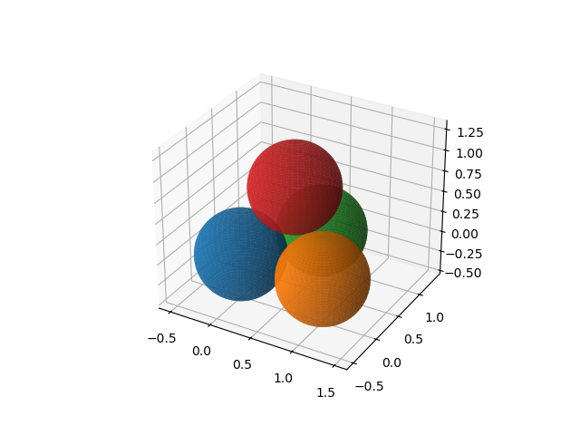
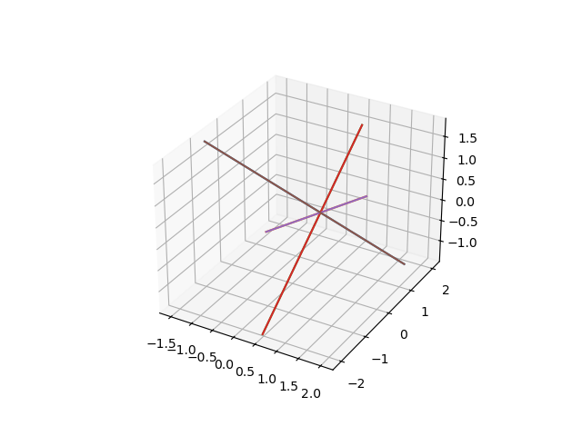
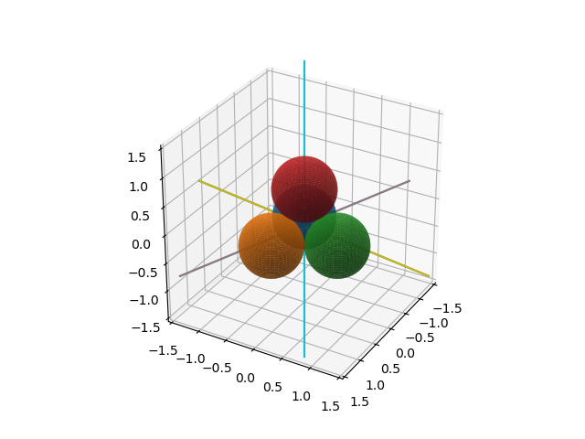

All Lines Tangent to Four Spheres
=================================

Consider all tangent lines to four mutually touching spheres.

The original formulation as polynomial system came from
Cassiano Durand, then at the CS department in Purdue.
The positioning of the centers of the spheres, each with radius
0.5 at the vertices of a tetrahedron came from Thorsten Theobald,
then at TU Muenich.  The centers of the four spheres are

.. math::

   c_1 = (0, 0, 0), \quad
   c_2 = (1, 0, 0), \quad
   c_3 = (1/2, \sqrt{3}/2, 0), \quad
   c_4 = (1/2, \sqrt{3}/6, \sqrt{6}/3).

Let :math:`t = (x_0, x_1, x_2)` be the tangent vector
and :math:`m = (x_3, x_4, x_5)` the moment vector.

The first equation is :math:`\|t\|=1`, the second :math:`m \cdot t = 0`,
the other equations are :math:`\|m - c_i \times t \|^2 - r^2 = 0`
where the radius :math:`r = 1/2`.

::

    from sympy import var, sqrt
    from sympy.vector import CoordSys3D, Vector
    import matplotlib.pyplot as plt
    import numpy as np

    from phcpy.solver import solve
    from phcpy.solutions import coordinates

centers and radii
-----------------

Choices of the centers and radii of four mutually tangent spheres are defined here.

::

    ctr1 = (0, 0, 0)
    ctr2 = (1, 0, 0)
    ctr3 = (0.5, sqrt(3.0)/2, 0)
    ctr4 = (0.5, sqrt(3.0)/6, sqrt(6.0)/3)
    radius = 0.5
    centers = [ctr1, ctr2, ctr3, ctr4]

The choices were made for the suitability of the plot.
Other choices can be found in the paper by Frank Sottile and Thorsten Theobald:
**Line problems in nonlinear computational geometry**.
In *Computational Geometry - Twenty Years Later*, pages 411-432,
edited by J.E. Goodman, J. Pach, and R. Pollack, AMS, 2008.

formulating the equations
-------------------------

We need some vector calculus, done with ``sympy``.

::

    N = CoordSys3D('N')
    x0, x1, x2 = var('x0, x1, x2')
    vt = Vector.zero + x0*N.i + x1*N.j + x2*N.k
    normt = vt.dot(vt) - 1
    normt

which produces the first equation

::

    x0**2 + x1**2 + x2**2 - 1

The second equation is

::

    x0*x3 + x1*x4 + x2*x5

is computed by the code

::

    x3, x4, x5 = var('x3, x4, x5')
    vm = Vector.zero + x3*N.i + x4*N.j + x5*N.k
    momvt = vt.dot(vm)

The radii are ``[0.5, 0.5, 0.5, 0.5]`` defined by

::

    radii = [radius for _ in range(4)]

The polynomial system is constructed by

::

    eqs = [normt, momvt]
    for (ctr, rad) in zip(centers, radii):
        vc = Vector.zero + ctr[0]*N.i + ctr[1]*N.j + ctr[2]*N.k
        left = vm - vc.cross(vt)
        equ = left.dot(left) - rad**2
        eqs.append(equ)

To apply the blackbox solver, we have to convert the polynomials to strings.

::

    fourspheres = []
    print('the polynomial system :')
    for pol in eqs:
        print(pol)
        fourspheres.append(str(pol) + ';')

The output to the above code cell is

::

    the polynomial system :
    x0**2 + x1**2 + x2**2 - 1
    x0*x3 + x1*x4 + x2*x5
    x3**2 + x4**2 + x5**2 - 0.25
    x3**2 + (-x1 + x5)**2 + (x2 + x4)**2 - 0.25
    (-0.866025403784439*x2 + x3)**2 + (0.5*x2 + x4)**2 + (0.866025403784439*x0 - 0.5*x1 + x5)**2 - 0.25
    (-0.816496580927726*x0 + 0.5*x2 + x4)**2 + (0.288675134594813*x0 - 0.5*x1 + x5)**2 + (0.816496580927726*x1 - 0.288675134594813*x2 + x3)**2 - 0.25

So, we have six polynomial equations in six unknowns.

solving the problem
-------------------

Now we call the blackbox solver.

::

    sols = solve(fourspheres)

    for (idx, sol) in enumerate(sols):
        print('Solution', idx+1, ':')
        print(sol)

The solution list is shown below:

::

    Solution 1 :
    t :  1.00000000000000E+00   0.00000000000000E+00
    m : 4
    the solution for t :
     x0 :  1.82013100766029E-16   2.92227989168779E-16
     x1 : -8.16496580927726E-01  -2.50326444773076E-17
     x2 : -5.77350269189626E-01   3.54015053218724E-17
     x3 :  6.04879596033482E-17   3.06586029409515E-17
     x4 :  2.88675134594813E-01  -1.77007526609362E-17
     x5 : -4.08248290463863E-01  -1.25163222386536E-17,
    == err :  4.981E-16 = rco :  1.657E-17 = res :  3.821E-16 =
    Solution 2 :
    t :  1.00000000000000E+00   0.00000000000000E+00
    m : 4
    the solution for t :
     x0 : -7.07106781186547E-01  -2.17839875856796E-16
     x1 : -4.08248290463863E-01   2.08243914343071E-16
     x2 :  5.77350269189626E-01  -1.19547586767375E-16
     x3 :  2.50000000000000E-01  -3.72860037233369E-31
     x4 : -4.33012701892219E-01   2.77333911991762E-31
     x5 : -1.99196604815539E-16   2.50510368981921E-16
    == err :  1.118E-15 = rco :  2.133E-17 = res :  4.441E-16 =
    Solution 3 :
    t :  1.00000000000000E+00   0.00000000000000E+00
    m : 4
    the solution for t :
     x0 :  7.07106781186547E-01   1.37982017054626E-16
     x1 : -4.08248290463863E-01   3.39894708038934E-18
     x2 :  5.77350269189626E-01  -1.66589349202482E-16
     x3 :  2.50000000000000E-01  -4.09837892165604E-31
     x4 : -1.44337567297407E-01   1.66589349202482E-16
     x5 : -4.08248290463863E-01  -5.88982292472640E-17
    == err :  1.023E-15 = rco :  4.667E-17 = res :  3.331E-16 =
    Solution 4 :
    t :  1.00000000000000E+00   0.00000000000000E+00
    m : 4
    the solution for t :
     x0 : -7.07106781186547E-01   8.51323534940577E-17
     x1 :  4.08248290463863E-01  -9.82010876877884E-18
     x2 : -5.77350269189626E-01  -1.11209278833498E-16
     x3 : -2.50000000000000E-01   6.61657084254124E-29
     x4 :  1.44337567297406E-01   1.11209278833581E-16
     x5 :  4.08248290463863E-01  -3.93184175971020E-17
    == err :  2.006E-14 = rco :  1.477E-17 = res :  5.551E-16 =
    Solution 5 :
    t :  1.00000000000000E+00   0.00000000000000E+00
    m : 4
    the solution for t :
     x0 :  7.07106781186548E-01   2.00971395228568E-16
     x1 :  4.08248290463863E-01  -2.45578336010813E-16
     x2 : -5.77350269189626E-01   7.24885788968468E-17
     x3 : -2.50000000000000E-01  -2.77333911991762E-31
     x4 :  4.33012701892219E-01  -3.82104500966428E-31
     x5 : -7.32462262249068E-17  -2.71206918859082E-16
    == err :  7.741E-16 = rco :  4.417E-17 = res :  3.886E-16 =
    Solution 6 :
    t :  1.00000000000000E+00   0.00000000000000E+00
    m : 4
    the solution for t :
     x0 : -3.22358540809185E-16   5.45289082605370E-16
     x1 :  8.16496580927726E-01  -1.64014136987415E-17
     x2 :  5.77350269189625E-01   2.31951016948522E-17
     x3 : -1.74561355056418E-16   2.00875473111053E-17
     x4 : -2.88675134594813E-01  -1.15975508474262E-17
     x5 :  4.08248290463863E-01  -8.20070684937081E-18
    == err :  5.471E-16 = rco :  1.448E-17 = res :  3.682E-16 =

Observe the ``m : 4`` which indicates the multiplicy four
of each solution.

the tangent lines
-----------------

The solutions contain the components of the tangent
and the moment vectors from which the tangent lines can be computed.

::

    def tangent_lines(solpts, verbose=True):
        """
        Given in solpts is the list of solution points,
        the tuples which respresent the tangent lines
        are returned in a list.
        Each tuple contains a point on the line
        and the tangent vector.
        """
        result = []
        for point in solpts:
            if verbose:
                print(point, end='')
            tan = Vector.zero + point[0]*N.i + point[1]*N.j + point[2]*N.k
            mom = Vector.zero + point[3]*N.i + point[4]*N.j + point[5]*N.k
            pnt = tan.cross(mom) # solves m = p x t
            pntcrd = (pnt.dot(N.i), pnt.dot(N.j), pnt.dot(N.k))
            tancrd = (tan.dot(N.i), tan.dot(N.j), tan.dot(N.k))
            if verbose:
                print(', appending :', pntcrd)
            result.append((pntcrd, tancrd))
        return result

The input to the ``tangent_lines`` function is computed below:

::

    crd = [coordinates(sol) for sol in sols]
    complexpoints = [values for (names, values) in crd]
    points = []
    for point in complexpoints:
        vals = []
        for values in point:
            vals.append(values.real)
        points.append(tuple(vals))

and then the tangents are computed as 

::

    tangents = tangent_lines(points)

plotting the lines
------------------

Let us first plot the four spheres...

::

    %matplotlib widget
    fig = plt.figure()
    ax = fig.add_subplot(projection='3d')
    u = np.linspace(0, 2 * np.pi, 100)
    v = np.linspace(0, np.pi, 100)
    R = float(radius)
    x1 = float(ctr1[0]) + R * np.outer(np.cos(u), np.sin(v))
    y1 = float(ctr1[1]) + R * np.outer(np.sin(u), np.sin(v))
    z1 = float(ctr1[2]) + R * np.outer(np.ones(np.size(u)), np.cos(v))
    x2 = float(ctr2[0]) + R * np.outer(np.cos(u), np.sin(v))
    y2 = float(ctr2[1]) + R * np.outer(np.sin(u), np.sin(v))
    z2 = float(ctr2[2]) + R * np.outer(np.ones(np.size(u)), np.cos(v))
    x3 = float(ctr3[0]) + R * np.outer(np.cos(u), np.sin(v))
    y3 = float(ctr3[1]) + R * np.outer(np.sin(u), np.sin(v))
    z3 = float(ctr3[2]) + R * np.outer(np.ones(np.size(u)), np.cos(v))
    x4 = float(ctr4[0]) + R * np.outer(np.cos(u), np.sin(v))
    y4 = float(ctr4[1]) + R * np.outer(np.sin(u), np.sin(v))
    z4 = float(ctr4[2]) + R * np.outer(np.ones(np.size(u)), np.cos(v))
    # Plot the surfaces
    sphere1 = ax.plot_surface(x1, y1, z1, alpha=0.8)
    sphere2 = ax.plot_surface(x2, y2, z2, alpha=0.8)
    sphere3 = ax.plot_surface(x3, y3, z3, alpha=0.8)
    sphere3 = ax.plot_surface(x4, y4, z4, alpha=0.8)
    # Set an equal aspect ratio
    ax.set_aspect('equal')
    plt.show()

The output of the code cell is in :numref:`fourspheresfig1`.

.. _fourspheresfig1:

    
   Four touching spheres.

The second figure in :numref:`fourspheresfig2` shows the tangent lines.

::

    %matplotlib widget
    ax = plt.figure().add_subplot(projection='3d')
    # range of the tangent lines
    theta = np.linspace(-2.5, 2.5, 10)
    pnt1, tan1 = tangents[0]
    x1 = float(pnt1[0]) + theta*tan1[0]
    y1 = float(pnt1[1]) + theta*tan1[1]
    z1 = float(pnt1[2]) + theta*tan1[2]
    pnt2, tan2 = tangents[1]
    x2 = float(pnt2[0]) + theta*tan2[0]
    y2 = float(pnt2[1]) + theta*tan2[1]
    z2 = float(pnt2[2]) + theta*tan2[2]
    pnt3, tan3 = tangents[2]
    x3 = float(pnt3[0]) + theta*tan3[0]
    y3 = float(pnt3[1]) + theta*tan3[1]
    z3 = float(pnt3[2]) + theta*tan3[2]
    pnt4, tan4 = tangents[3]
    x4 = float(pnt4[0]) + theta*tan4[0]
    y4 = float(pnt4[1]) + theta*tan4[1]
    z4 = float(pnt4[2]) + theta*tan4[2]
    pnt5, tan5 = tangents[4]
    x5 = float(pnt5[0]) + theta*tan5[0]
    y5 = float(pnt5[1]) + theta*tan5[1]
    z5 = float(pnt5[2]) + theta*tan5[2]
    pnt6, tan6 = tangents[5]
    x6 = float(pnt6[0]) + theta*tan6[0]
    y6 = float(pnt6[1]) + theta*tan6[1]
    z6 = float(pnt6[2]) + theta*tan6[2]
    line1 = ax.plot(x1, y1, z1)
    line2 = ax.plot(x2, y2, z2)
    line3 = ax.plot(x3, y3, z3)
    line4 = ax.plot(x4, y4, z4)
    line5 = ax.plot(x5, y5, z5)
    line6 = ax.plot(x6, y6, z6)
    # Set an equal aspect ratio
    ax.set_aspect('equal')
    plt.show()

.. _fourspheresfig2:

    
   The computed tangent lines.

And then we plot the spheres and the tangent lines:

::

    %matplotlib widget
    fig = plt.figure()
    ax = fig.add_subplot(projection='3d')
    u = np.linspace(0, 2 * np.pi, 100)
    v = np.linspace(0, np.pi, 100)
    R = float(radius)
    x1 = float(ctr1[0]) + R * np.outer(np.cos(u), np.sin(v))
    y1 = float(ctr1[1]) + R * np.outer(np.sin(u), np.sin(v))
    z1 = float(ctr1[2]) + R * np.outer(np.ones(np.size(u)), np.cos(v))
    x2 = float(ctr2[0]) + R * np.outer(np.cos(u), np.sin(v))
    y2 = float(ctr2[1]) + R * np.outer(np.sin(u), np.sin(v))
    z2 = float(ctr2[2]) + R * np.outer(np.ones(np.size(u)), np.cos(v))
    x3 = float(ctr3[0]) + R * np.outer(np.cos(u), np.sin(v))
    y3 = float(ctr3[1]) + R * np.outer(np.sin(u), np.sin(v))
    z3 = float(ctr3[2]) + R * np.outer(np.ones(np.size(u)), np.cos(v))
    x4 = float(ctr4[0]) + R * np.outer(np.cos(u), np.sin(v))
    y4 = float(ctr4[1]) + R * np.outer(np.sin(u), np.sin(v))
    z4 = float(ctr4[2]) + R * np.outer(np.ones(np.size(u)), np.cos(v))
    # Plot the surfaces
    sphere1 = ax.plot_surface(x1, y1, z1, alpha=0.8)
    sphere2 = ax.plot_surface(x2, y2, z2, alpha=0.8)
    sphere3 = ax.plot_surface(x3, y3, z3, alpha=0.8)
    sphere4 = ax.plot_surface(x4, y4, z4, alpha=0.8)
    # range of the tangent lines
    theta = np.linspace(-2.5, 2.5, 10)
    pnt1, tan1 = tangents[0]
    x1 = float(pnt1[0]) + theta*tan1[0]
    y1 = float(pnt1[1]) + theta*tan1[1]
    z1 = float(pnt1[2]) + theta*tan1[2
    pnt2, tan2 = tangents[1]
    x2 = float(pnt2[0]) + theta*tan2[0]
    y2 = float(pnt2[1]) + theta*tan2[1]
    z2 = float(pnt2[2]) + theta*tan2[2]
    pnt3, tan3 = tangents[2]
    x3 = float(pnt3[0]) + theta*tan3[0]
    y3 = float(pnt3[1]) + theta*tan3[1]
    z3 = float(pnt3[2]) + theta*tan3[2]
    pnt4, tan4 = tangents[3]
    x4 = float(pnt4[0]) + theta*tan4[0]
    y4 = float(pnt4[1]) + theta*tan4[1]
    z4 = float(pnt4[2]) + theta*tan4[2]
    pnt5, tan5 = tangents[4]
    x5 = float(pnt5[0]) + theta*tan5[0]
    y5 = float(pnt5[1]) + theta*tan5[1]
    z5 = float(pnt5[2]) + theta*tan5[2]
    pnt6, tan6 = tangents[5]
    x6 = float(pnt6[0]) + theta*tan6[0]
    y6 = float(pnt6[1]) + theta*tan6[1]
    z6 = float(pnt6[2]) + theta*tan6[2]
    line1 = ax.plot(x1, y1, z1)
    line2 = ax.plot(x2, y2, z2)
    line3 = ax.plot(x3, y3, z3)
    line4 = ax.plot(x4, y4, z4)
    line5 = ax.plot(x5, y5, z5)
    line6 = ax.plot(x6, y6, z6)
    # Set an equal aspect ratio
    ax.axes.set_xlim3d(-1.5, 1.5)
    ax.axes.set_ylim3d(-1.5, 1.5)
    ax.axes.set_zlim3d(-1.5, 1.5)
    ax.set_aspect('equal')
    ax.view_init(elev=30, azim=30, roll=0)
    plt.show()

which produces :numref:`fourspheresfig3`.

.. _fourspheresfig3:

    
   All lines tangent to four spheres.
