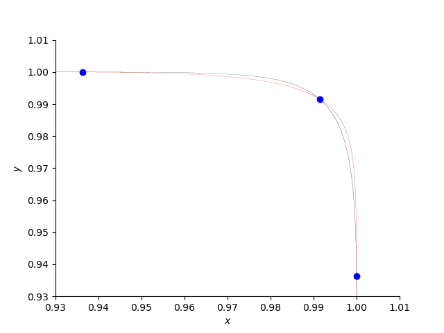
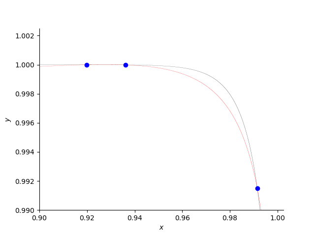
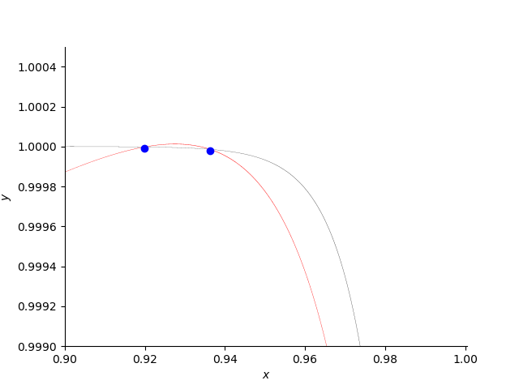

A Counter Example to Koushnirenko's Conjecture
==============================================

This chapter illustrates the
counter example of Bertrand Haas, against the Koushnirenko conjecture,
executed on one core and on many cores.
For the mathematical background, consult:

Bertrand Haas: **A simple counterexample to Kouchnirenko's conjecture.**,
*Beitraege zur Algebra und Geometrie/Contributions to Algebra and Geometry*, 
volume 43, number 1, pages 1 to 8, 2002.

Bertrand constructed a polynomial system with three monomials in every
equation and with five positive real roots.  Kouchnirenko's conjecture
predicted there could only four positive real roots for such a system.

To get the proper wall clock time, we have to be mindful 
that the Python code calls the compiled functions in the PHCpack library.  
Therefore, the Python timers will not give accurate timings.  
Instead, we have to rely on the actual date and time, 
from the package ``datetime`` in Python.

::

    from datetime import datetime

For the plot, the implicit plotting of ``sympy`` will be used.

::

    from sympy import plot_implicit, symbols, Eq

From ``phcpy`` we import the following functions:

::

    from phcpy.dimension import get_core_count
    from phcpy.solver import solve
    from phcpy.solutions import filter_real

solving the system on many cores
--------------------------------

The example of Bertrand Haas is defined as

::

    H = [ 'x**108 + 1.1*y**54 - 1.1*y;',
          'y**108 + 1.1*x**54 - 1.1*x;' ]

According to the theorem of Bézout, we may expect a number of 
complex solutions equals to the product of the degrees of the polynomials.
The square of 108 equals 11664.
As the solver computes all complex solutions,
executing the following code block takes some time ...

::

    print('Solving on one core ...')
    wstart = datetime.now()
    sols = solve(H)
    wstop = datetime.now()
    print('  Number of solutions :', len(sols))
    print('start time :', wstart)
    print(' stop time :', wstop)
    print('   elapsed :', wstop - wstart)

The output of the above code cell is

::

     Solving on one core ...
       Number of solutions : 11664
     start time : 2024-01-28 11:57:53.061707
      stop time : 2024-01-28 11:57:59.223344
        elapsed : 0:00:06.161637

We can significantly speed up this computation if the computer has many cores.

::

    nbcores = get_core_count()
    print('Solving on', nbcores, 'cores ...')
    wstart = datetime.now()
    sols = solve(H, tasks=nbcores)
    wstop = datetime.now()
    print('  Number of solutions :', len(sols))
    print('start time :', wstart)
    print(' stop time :', wstop)
    print('   elapsed :', wstop - wstart)

The output of the above code cell is

::

    Solving on 32 cores ...
      Number of solutions : 11664
    start time : 2024-01-28 11:58:07.241324
     stop time : 2024-01-28 11:58:08.747874
       elapsed : 0:00:01.506550

Compared the `elapsed :` above with the previous one.

extracting the real roots
-------------------------

Rather than eyeballing all 11,664 complex solutions ourselves, 
we ask to filter the real solutions.

::

    realsols = filter_real(sols, tol=1.0e-8, oper='select')

The code cell below prints the solutions in `realsols`:

::

    for (idx, sol) in enumerate(realsols):
        print('Solution', idx+1, ':')
        print(sol)

The output is

::

     Solution 1 :
     t :  0.00000000000000E+00   0.00000000000000E+00
     m : 1
     the solution for t :
      x :  0.00000000000000E+00   0.00000000000000E+00
      y :  0.00000000000000E+00   0.00000000000000E+00
     == err :  0.000E+00 = rco :  1.000E+00 = res :  0.000E+00 =
     Solution 2 :
     t :  1.00000000000000E+00   0.00000000000000E+00
     m : 1
     the solution for t :
      x :  9.91489402484465E-01  -2.94004118110142E-49
      y :  9.91489402484465E-01   2.96676882820234E-49
     == err :  7.704E-17 = rco :  8.274E-02 = res :  5.773E-15 =
     Solution 3 :
     t :  1.00000000000000E+00   0.00000000000000E+00
     m : 1
     the solution for t :
      x :  9.99997917489999E-01   9.52445049970774E-46
      y :  9.19904793199125E-01  -1.72639970804817E-42
     == err :  2.708E-16 = rco :  1.601E-03 = res :  8.677E-15 =
     Solution 4 :
     t :  1.00000000000000E+00   0.00000000000000E+00
     m : 1
     the solution for t :
      x :  9.99986016402972E-01   1.19248391761152E-37
      y :  9.36266084294562E-01  -2.97164971887874E-34
     == err :  2.240E-15 = rco :  2.070E-03 = res :  3.610E-15 =
     Solution 5 :
     t :  1.00000000000000E+00   0.00000000000000E+00
     m : 1
     the solution for t :
      x :  9.19904793199125E-01  -2.01786978862774E-41
      y :  9.99997917489999E-01   1.02032044433651E-44
     == err :  4.384E-16 = rco :  1.601E-03 = res :  8.564E-15 =
     Solution 6 :
     t :  1.00000000000000E+00   0.00000000000000E+00
     m : 1
     the solution for t :
      x :  9.36266084294562E-01  -4.40471624223194E-48
      y :  9.99986016402972E-01   3.13214614463929E-51
     == err :  9.256E-17 = rco :  2.070E-03 = res :  3.730E-15 =

We observe (0, 0) and five additional real positive roots.
According to the Koushnirenko conjecture, we would expect
no more than four real positive roots.

plotting the curves
-------------------

In converting the strings in the polynomial system ``H`` 
we have to remove the trailing semicolon

::

    x, y = symbols('x y')
    p0 = eval(H[0][:-1])
    p1 = eval(H[1][:-1])

Without knowing the precise location of the intersection points, 
the curves are hard to plot.
The code below produces the plot :numref:`haasfig1`.

::

    plot0 = plot_implicit(Eq(p0, 0), (x, 0.93, 1.01), (y, 0.93, 1.01),
                          line_color='black', depth=1,
        markers=[{'args': [[0.99148, 0.93626, 0.99998],
                           [0.99148, 0.99998, 0.93626], 'bo']}],
                          axis_center=(0.93, 0.93), show=False)

    plot1 = plot_implicit(Eq(p1, 0), (x, 0.93, 1.01), (y, 0.93, 1.01),
                          line_color='red', depth=1,
                          axis_center=(0.93, 0.93), show=False)

    plot0.append(plot1[0])
    plot0.show()

.. _haasfig1:

    
   Three positive roots of the counterexample.

Let us zoom in to another root ...
:numref:`haasfig2` is made executing the code below:

::

    plot3 = plot_implicit(Eq(p0, 0), (x, 0.9, 1.0025), (y, 0.99, 1.0025),
                          line_color='black', depth=1,
        markers=[{'args': [[0.99148, 0.93626, 0.91990],
                           [0.99148, 0.99998, 0.99999], 'bo']}],
                          axis_center=(0.9, 0.99), show=False)

    plot4 = plot_implicit(Eq(p1, 0), (x, 0.9, 1.0025), (y, 0.99, 1.0025),
                          line_color='red', depth=1,
                          axis_center=(0.9, 0.99), show=False)

    plot3.append(plot4[0])
    plot3.show()

.. _haasfig2:

    
   Other positive roots of the counterexample.

The third plot (in :numref:`haasfig3`)
is produced by the following code:

::

    plot5 = plot_implicit(Eq(p0, 0), (x, 0.9, 1.0005), (y, 0.999, 1.0005),
                          line_color='black', depth=1,
        markers=[{'args': [[0.93626, 0.91990],
                           [0.99998, 0.99999], 'bo']}],
                          axis_center=(0.9, 0.999), show=False)

    plot6 = plot_implicit(Eq(p1, 0), (x, 0.9, 1.0005), (y, 0.999, 1.0005),
                          line_color='red', depth=1,
                          axis_center=(0.9, 0.999), show=False)

    plot5.append(plot6[0])
    plot5.show()

.. _haasfig3:

    
   Two close positive roots of the counterexample.
