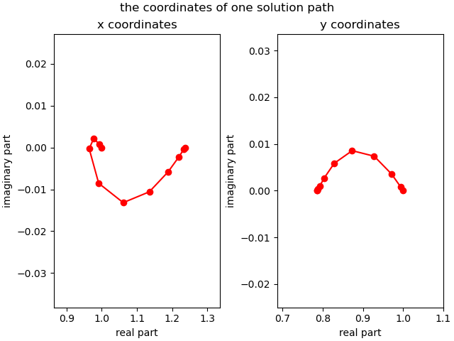

Increment-and-Fix Aposteriori Step Control
==========================================

An *artificial-parameter homotopy* to solve

.. math::

   \left\{
   \begin{array}{rcl}
   x^2 + 4 y^2 - 4 & = & 0 \\
   2 y^2 - x & = & 0
   \end{array}
   \right.

with the total degree start system

.. math::

   \left\{
   \begin{array}{rcl}
   x^2 - 1 & = & 0 \\
   y^2 - 1 & = & 0
   \end{array}
   \right.

uses a random complex constant :math:`\gamma` in

.. math::

   \gamma (1 - t)
   \left(
   \begin{array}{r}
   x^2 + 4 y^2 - 4 \\
   2 y^2 - x
   \end{array}
   \right)
   +
   t
   \left(
   \begin{array}{c}
   x^2 - 1 \\
   y^2 - 1
   \end{array}
   \right)
   =
   \left(
   \begin{array}{c}
   0 \\\\ 0
   \end{array}
   \right)

where :math:`t` is an artificial parameter to define the deformation
of the start system into the target system.

During the continuation, a predictor-corrector method is applied.
The predictor advances the value of :math:`t`, predicts the corresponding 
solution for the new value of :math:`t`, and then fixes the value 
of :math:`t` in the corrector stage.  Because :math:`t` is fixed 
during the corrector stage, this type of continuation 
is called *increment-and-fix continuation*.

An *aposteriori step size control algorithm* uses the performance 
of the corrector to determine the step size for the continuation
parameter :math:`t`.

Let us first define the target and start system for the running example.

::

    target = ['x^2 + 4*y^2 - 4;', '2*y^2 - x;']

A start system based on the total degree is constructed.

::

    from phcpy.starters import total_degree_start_system
    start, startsols = total_degree_start_system(target)

The ``len(startsols)`` returns ``4`` and thus we have 4 paths.

For deterministic runs, we set the seed of the random number generators:

::

    from phcpy.dimension import set_seed
    set_seed(2024)

let the path trackers run
-------------------------

To run the path trackers in double precision:

::

    from phcpy.trackers import double_track

and then call ``double_track`` as follows:

::

    gamma, sols = double_track(target, start, startsols)

By default, ``double_track`` will generate a random :math:`gamma` 
and return the generated value.  This value can then be used in a second run.

To print the solutions, execute the following code:

::

    for (idx, sol) in enumerate(sols):
        print('Solution', idx+1, ':')
        print(sol)

and what is then printed is

::

    Solution 1 :
    t :  1.00000000000000E+00   0.00000000000000E+00
    m : 1
    the solution for t :
     x :  1.23606797749979E+00   1.63132611699963E-55
     y :  7.86151377757423E-01  -1.62115537155392E-56
    == err :  1.383E-16 = rco :  1.998E-01 = res :  2.220E-16 =
    Solution 2 :
    t :  1.00000000000000E+00   0.00000000000000E+00
    m : 1
    the solution for t :
     x :  1.23606797749979E+00   1.63132611699963E-55
     y : -7.86151377757423E-01   1.62115537155392E-56
    == err :  1.383E-16 = rco :  1.998E-01 = res :  2.220E-16 =
    Solution 3 :
    t :  1.00000000000000E+00   0.00000000000000E+00
    m : 1
    the solution for t :
     x : -3.23606797749979E+00   1.06910588403688E-50
     y : -5.34552942018439E-51  -1.27201964951407E+00
    == err :  7.222E-35 = rco :  1.079E-01 = res :  3.130E-50 =
    Solution 4 :
    t :  1.00000000000000E+00   0.00000000000000E+00
    m : 1
    the solution for t :
     x : -3.23606797749979E+00   1.06910588403688E-50
     y :  5.34552942018439E-51   1.27201964951407E+00
    "== err :  7.222E-35 = rco :  1.079E-01 = res :  3.130E-50 =

Of the four solutions, observe that two are complex conjugated.
The start solutions are all real and if the :math:`\gamma` would
have been real as well (with a zero imaginary part), then the
transition from the real start solutions to the solutions with
nonzero imaginary parts would not have been possible.

Suppose we would want to recompute the first path 
in quad double precision.

::

    from phcpy.trackers import quad_double_track

Even if we track only one path, the start solution must be given 
in a list of one element.
Observe that we use the same value of ``gamma`` as before.

::

    gamma, qdsol = quad_double_track(target, start, [startsols[0]], gamma=gamma)
    print(qdsol[0])

and what is printed is

::

    t : 1.0000000000000000000000000000000000000000000000000000000000000000E+00      0.0000000000000000000000000000000000000000000000000000000000000000E+00    
    m : 1
    the solution for t :
     x : 1.2360679774997896964091736687116429937402734744492267964203321508E+00      3.5725407585478398168188068938476209257268222381106725605357869223E-29    
     y : 7.8615137775742328606955858582272987880739633619149401238232806827E-01      1.9775278344660286732240368562738254609143580079378403594856065932E-29    
    == err :  1.850E-14 = rco :  1.998E-01 = res :  3.884E-28 =

Observe that the values for the forward and backward error,
the ``err`` and ``res`` respectively, are still rather large 
for quad double precision.  For this example, we could as well 
run a couple of extra steps of Newton's method, but suppose 
that we want to track the complete path with much smaller tolerances.

tuning tolerances of the path trackers
--------------------------------------

Let us redo the last run, 
but now with much smaller tolerances on the corrector.
The output of

::

    from phcpy.trackers import write_parameters
    write_parameters()

is

::

    GLOBAL MONITOR :
      1. the condition of the homotopy           : 0
      2. number of paths tracked simultaneously  : 1
      3. maximum number of steps along a path    : 500
      4. distance from target to start end game  : 1.000e-01
      5. order of extrapolator in end game       : 0
      6. maximum number of re-runs               : 1
    STEP CONTROL (PREDICTOR) :                    along path : end game
      7: 8. type ( x:Cub,t:Rea ):( x:Cub,t:Rea ) : 8         : 8
      9:10. minimum step size                    : 1.000e-06 : 1.000e-08
     11:12. maximum step size                    : 1.000e-01 : 1.000e-02
     13:14. reduction factor for step size       : 7.000e-01 : 5.000e-01
     15:16. expansion factor for step size       : 1.250e+00 : 1.100e+00
     17:18. expansion threshold                  : 1         : 3
    PATH CLOSENESS (CORRECTOR) :                  along path : end game
     19:20. maximum number of iterations         : 3         : 3
     21:22. relative precision for residuals     : 1.000e-09 : 1.000e-11
     23:24. absolute precision for residuals     : 1.000e-09 : 1.000e-11
     25:26. relative precision for corrections   : 1.000e-09 : 1.000e-11
     27:28. absolute precision for corrections   : 1.000e-09 : 1.000e-11
    SOLUTION TOLERANCES :                         along path : end game,
     29:30. inverse condition of Jacobian        : 1.000e-04 : 1.000e-12
     31:32. clustering of solutions              : 1.000e-04 : 1.000e-12
     33:34. solution at infinity                 : 1.000e+08 : 1.000e+12

Let us tune of the parameters of the corrector.
To set the tolerance for the relative precision for the residuals 
along the path to ``1.0e-32``, the parameter at position ``21`` 
has to be set, as follows:

::

    set_parameter_value(21, 1.0e-32)

and then running ``write_parameters()`` again will show

::

    21:22. relative precision for residuals     : 1.000e-32 : 1.000e-11

as the line that has changed.

For this problem, the difference between absolute and relative 
does not matter, and neither does the difference between 
the residuals and corrections, as the paths are well conditioned.
Along the path, we set the tolerance to ``1.0e-32`` 
and at the end to ``1.0e-48``.

::

    for idx in [23, 25, 27]:
        set_parameter_value(idx, 1.0e-32)
    for idx in [22, 24, 26, 28]:
        set_parameter_value(idx, 1.0e-48)

Now we rerun the first path once more.

::

    gamma, qdsol = quad_double_track(target, start, [startsols[0]], gamma=gamma)
    print(qdsol[0])

and what is printed is

::

    t : 1.0000000000000000000000000000000000000000000000000000000000000000E+00      0.0000000000000000000000000000000000000000000000000000000000000000E+00    
    m : 1
    the solution for t :
     x : 1.2360679774997896964091736687312762354406183596115257242708972454E+00      -5.2497200000892523553940877198954046619454940726389357724082489942E-135  
     y : 7.8615137775742328606955858584295892952312205783772323766490197012E-01      -5.8637627799330186773963784283091100994566589683500740754044455987E-133  
    == err :  3.218E-66 = rco :  1.998E-01 = res :  2.018E-65 =

Observe that the values of ``err`` and ``res`` 
(forward and backward error respectively) are much smaller than before,
very close to the quad double precision.

For the experiments in the next section, the values of the continuation
parameters must be reset to their defaults.

::

    from phcpy.trackers import autotune_parameters
    autotune_parameters(0, 14)

The ``0`` stands for the default and ``14`` to take into account
the 14 decimal places of precision.

a step-by-step path tracker
---------------------------

When we run a path tracker, or let a path tracker run, 
then the path tracker has the control of the order of execution.  
In a step-by-step path tracker, we can ask the path tracker for the 
next point of the path, which is useful to plot the points along a path.

::

    from phcpy.trackers import initialize_double_tracker
    from phcpy.trackers import initialize_double_solution
    from phcpy.trackers import next_double_solution

The initialization of the tracker is separate from the
initialization of a solution, as the same homotopy is used
to track all paths.

::

    initialize_double_tracker(target, start)

The first parameter in ``initialize_double_solution``
is the number of variables, which equals the number
of polynomials in the target system.
::

    initialize_double_solution(len(target), startsols[0])

The first step

::
    nextsol = next_double_solution()
    print(nextsol)

shows

::

    t :  1.00000000000000E-01   0.00000000000000E+00
    m : 1
    the solution for t :
     x :  9.96326698649568E-01   4.70406409720798E-03
     y :  9.96408257454631E-01   4.95315220446915E-03
    == err :  2.375E-05 = rco :  1.000E+00 = res :  3.619E-10 =

and then the second step

::

    nextsol = next_double_solution()
    print(nextsol)

gives

::

    t :  2.00000000000000E-01   0.00000000000000E+00
    m : 1
    the solution for t :
     x :  9.79864035891029E-01   1.70985015865591E-02
     y :  9.81181263858417E-01   2.32157127720825E-02
    == err :  1.679E-08 = rco :  1.000E+00 = res :  2.760E-16 =

In a loop, we want to stop as soon as the value of ``t`` passes ``1.0``.
To get the value of ``t`` out of a solution string,
we convert the string into a dictionary, as done below:

::

    from phcpy.solutions import strsol2dict
    dictsol = strsol2dict(nextsol)
    dictsol['t']

shows

::

    (0.2+0j)

In the code cell below, the loop continues 
calling ``next_double_solution`` until the value 
of the continuation parameter is less than 1.0.
The real part and imaginary part of the gamma constant 
are set to the same value of ``gamma`` as in the first run.

::

    initialize_double_tracker(target, start, fixedgamma=False, \
                              regamma=gamma.real, imgamma=gamma.imag)
    initialize_double_solution(len(target), startsols[0])
    tval = 0.0
    path = [startsols[0]]
    while tval < 1.0:
        nextsol = next_double_solution()
        dictsol = strsol2dict(nextsol)
        tval = dictsol['t'].real
        path.append(nextsol)
   
All values of the x-coordinates of all points on the path:

::

    (1+0j)
    (0.996326698649568+0.00470406409720798j)
    (0.979864035891029+0.0170985015865591j)
    (0.943788099865787+0.00964655321202273j)
    (0.950990471736517-0.0674242744055464j)
    (1.06214893672862-0.108107883550403j)
    (1.15606754413692-0.0765694315601522j)
    (1.20399680236398-0.0383121382228797j)
    (1.2254591757779-0.0141573296657659j)
    (1.23400325696781-0.00289013787311083j)
    (1.23606797749301-4.13424477147656e-11j)

are obtained with

::

    for sol in path:
        print(strsol2dict(sol)['x'])

To put the real parts of the x-coordinates in a list:

::

    xre = [strsol2dict(sol)['x'].real for sol in path]

and likewise, the imaginary parts of the x-coordinates 
and the two parts of the y-coordinates are set by the code below:

::

    xim = [strsol2dict(sol)['x'].imag for sol in path]
    yre = [strsol2dict(sol)['y'].real for sol in path]
    yim = [strsol2dict(sol)['y'].imag for sol in path]

Let us plot the coordinates of this first solution path.

::

    import matplotlib.pyplot as plt

The coordinates of the solution path are then plotted
in :numref:`incfixaposteriorifig1` as follows.

::

    fig, axs = plt.subplots(1, 2, constrained_layout=True)
    fig.suptitle('the coordinates of one solution path')
    axs[0].set_title('x coordinates')
    axs[0].set_xlabel('real part')
    axs[0].set_ylabel('imaginary part')
    axs[0].set_xlim(min(xre)-0.1, max(xre)+0.1)
    axs[0].set_ylim(min(xim)-0.025, max(xim)+0.025)
    dots, = axs[0].plot(xre,xim,'r-')
    dots, = axs[0].plot(xre,xim,'ro')
    axs[1].set_title('y coordinates')
    axs[1].set_xlabel('real part')
    axs[1].set_ylabel('imaginary part')
    axs[1].set_xlim(min(yre)-0.1, max(yre)+0.1)
    axs[1].set_ylim(min(yim)-0.025, max(yim)+0.025)
    dots, = axs[1].plot(yre,yim,'r-')
    dots, = axs[1].plot(yre,yim,'ro')
    plt.savefig('incfixaposteriorifig1')
    plt.show()

.. _incfixaposteriorifig1:

    
   The coordinates of one solution path.

Why do the paths in such a simple homotopy curve so much?
