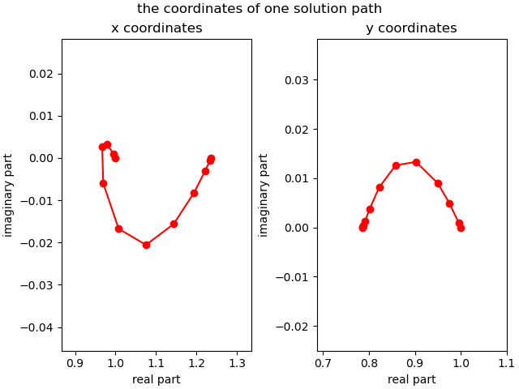
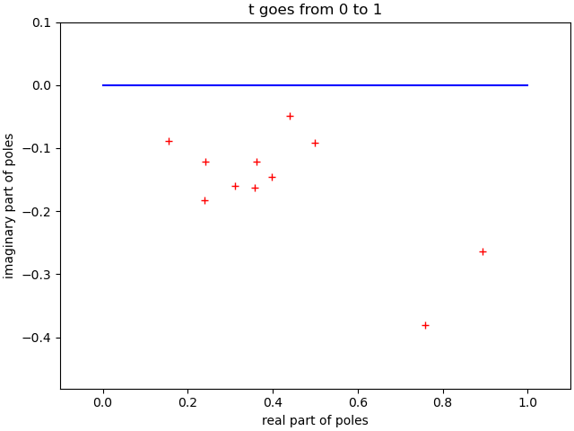

Increment-and-Fix Apriori Step Control
======================================

As in the previous section, an artificial-parameter homotopy 
is used with adaptive step size control.

In an *apriori step size control algorithm*, the predictor determines 
the step size for the continuation parameter :math:`t`.  
It is called apriori because the step size is decided *before* 
the corrector is applied, in contrast to the aposteriori step control 
algorithm, where the performance of the corrector determines the step size.

Let us first define the target and start system for the running example.

::

    target = ['x^2 + 4*y^2 - 4;', '2*y^2 - x;']

The start system is based on the total degree.

::

    from phcpy.starters import total_degree_start_system
    start, startsols = total_degree_start_system(target)

The ``len(qsols)`` returns ``4``, equal to the total degree 
of the target system.

let the path trackers run
-------------------------

To run the path trackers in double precision:

::

    from phcpy.curves import double_track

For reproducible run, the seed of the random numbers is set:

::

    from phcpy.dimension import set_seed
    set_seed(2024)

The output of

::
    gamma, sols = double_track(target, start, startsols)
    gamma

is 

::

    (-0.995051052069111-0.09936500277338699j)

By default, ``double_track`` generates a random :math:`\gamma` 
and returns the generated value.
This value can then be used in a second run.

The second result of ``double_track`` are the end points
of the solution paths, printed by

::

    for (idx, sol) in enumerate(sols):
        print('Solution', idx+1, ':')
        print(sol)

which has as output

::

    Solution 1 :
    t :  1.00000000000000E+00   0.00000000000000E+00
    m : 1
    the solution for t :
     x :  1.23606797749979E+00   0.00000000000000E+00
     y :  7.86151377757423E-01   0.00000000000000E+00
    == err :  9.930E-17 = rco :  1.998E-01 = res :  1.274E-17 =
    Solution 2 :
    t :  1.00000000000000E+00   0.00000000000000E+00
    m : 1
    the solution for t :
     x :  1.23606797749979E+00   0.00000000000000E+00
     y : -7.86151377757423E-01   0.00000000000000E+00
    == err :  9.930E-17 = rco :  1.998E-01 = res :  1.274E-17 =
    Solution 3 :
    t :  1.00000000000000E+00   0.00000000000000E+00
    m : 1
    the solution for t :
     x : -3.23606797749979E+00   0.00000000000000E+00
     y :  0.00000000000000E+00   1.27201964951407E+00
    == err :  0.000E+00 = rco :  1.079E-01 = res :  0.000E+00 =
    Solution 4 :
    t :  1.00000000000000E+00   0.00000000000000E+00
    m : 1
    the solution for t :
     x : -3.23606797749979E+00   0.00000000000000E+00
     y :  0.00000000000000E+00  -1.27201964951407E+00
    == err :  0.000E+00 = rco :  1.079E-01 = res :  0.000E+00 =

Suppose we would want to recompute the first path 
in quad double precision.

::

    from phcpy.curves import quad_double_track

Even if we track only one path, the start solution must 
be given in a list of one element.

::

    gamma, qdsol = quad_double_track(target, start, [startsols[0]])
    gamma

The first output is again the generated gamma constant :

::

    (-0.995051052069111-0.09936500277338699j)

and the solution is printed with ``print(qdsol[0])``

::

    t : 1.0000000000000000000000000000000000000000000000000000000000000000E+00      0.0000000000000000000000000000000000000000000000000000000000000000E+00    
    m : 1
    the solution for t :
     x : 1.2360679774997896964091736687312762354406183596115257242708972454E+00      6.5642436311782035838428757620506362271925806587869959161667835617E-197   
     y : 7.8615137775742328606955858584295892952312205783772323766490197011E-01      7.7794941850937841850195885945247107364034811096136093162063963605E-198   
    == err :  2.654E-67 = rco :  1.998E-01 = res :  4.175E-68 =

For this example, we could as well run a couple of extra steps 
of Newton's method at the end, but suppose that we wanted 
to track the paths with much smaller tolerances.

tuning tolerances of the path trackers
--------------------------------------

Let us redo the last run, 
but now with much smaller tolerances on the corrector.

::

   from phcpy.curves import write_parameters
   write_parameters()

which shows the current values of the parameters and tolerances:

::

    Values of the HOMOTOPY CONTINUATION PARAMETERS :
     1. gamma : (-0.995051052069111-0.09936500277338699j)
     2. degree of numerator of Pade approximant    : 5
     3. degree of denominator of Pade approximant  : 1
     4. maximum step size                          : 0.1
     5. minimum step size                          : 1e-06
     6. multiplication factor for the pole radius  : 0.5
     7. multiplication factor for the curvature    : 0.005
     8. tolerance on the residual of the predictor : 0.001
     9. tolerance on the residual of the corrector : 1e-08
    10. tolerance on zero series coefficients      : 1e-12
    11. maximum number of corrector steps          : 4
    12. maximum steps on a path                    : 1000

To set a particular value of a tolerance, we use

::

    from phcpy.curves import set_parameter_value

To set the tolerance for the relative precision for the residuals
along the path to ``1.0e-32``, the parameter at position ``9`` 
has to be set, as follows:

::

    set_parameter_value(9, 1.0e-32)

and then ``write_parameters()`` shows

::

    Values of the HOMOTOPY CONTINUATION PARAMETERS :
     1. gamma : (-0.995051052069111-0.09936500277338699j)
     2. degree of numerator of Pade approximant    : 5
     3. degree of denominator of Pade approximant  : 1
     4. maximum step size                          : 0.1
     5. minimum step size                          : 1e-06
     6. multiplication factor for the pole radius  : 0.5
     7. multiplication factor for the curvature    : 0.005
     8. tolerance on the residual of the predictor : 0.001
     9. tolerance on the residual of the corrector : 1e-32
    10. tolerance on zero series coefficients      : 1e-12
    11. maximum number of corrector steps          : 4
    12. maximum steps on a path                    : 1000

Now we rerun the first path once more.

::

    gamma, qdsol = quad_double_track(target, start, [startsols[0]])
    gamma

with value for ``gamma`` equal to 

::

    (-0.995051052069111-0.09936500277338699j)

and ``print(qsol[0])`` shows

::

    t : 1.0000000000000000000000000000000000000000000000000000000000000000E+00      0.0000000000000000000000000000000000000000000000000000000000000000E+00    
    m : 1
    the solution for t :
     x : 1.2360679774997896964091736687312762354406183596115257242708972454E+00      -5.7386297539289851571931574133873760183334861888133361201230324073E-262  
     y : 7.8615137775742328606955858584295892952312205783772323766490197011E-01      9.0738364123547551304527345081571298166307030696790330748996811880E-262   
    == err :  2.654E-67 = rco :  1.998E-01 = res :  4.175E-68 =

Observe that the small values of ``err`` and ``res`` 
(forward and backward error respectively) 
are very close to the quad double precision.

For the experiments in the next section, the values of the 
continuation parameters must be reset to their defaults.

::

    from phcpy.curves import set_default_parameters
    set_default_parameters()
    write_parameters()

which then writes 

::

    Values of the HOMOTOPY CONTINUATION PARAMETERS :
     1. gamma : (-0.10983921948171692-0.9939493678571596j)
     2. degree of numerator of Pade approximant    : 5
     3. degree of denominator of Pade approximant  : 1
     4. maximum step size                          : 0.1
     5. minimum step size                          : 1e-06
     6. multiplication factor for the pole radius  : 0.5
     7. multiplication factor for the curvature    : 0.005
     8. tolerance on the residual of the predictor : 0.001
     9. tolerance on the residual of the corrector : 1e-08
    10. tolerance on zero series coefficients      : 1e-12
    11. maximum number of corrector steps          : 4
    12. maximum steps on a path                    : 1000

The first parameter is the ``gamma`` parameter.  
Let us fix this parameter as well.

::

    set_parameter_value(1, complex(0.977935486240886, 0.20890711991409452)) 
    write_parameters()

and as confirmation, we then see:

::

    Values of the HOMOTOPY CONTINUATION PARAMETERS :
     1. gamma : (0.977935486240886+0.20890711991409452j)
     2. degree of numerator of Pade approximant    : 5
     3. degree of denominator of Pade approximant  : 1
     4. maximum step size                          : 0.1
     5. minimum step size                          : 1e-06
     6. multiplication factor for the pole radius  : 0.5
     7. multiplication factor for the curvature    : 0.005
     8. tolerance on the residual of the predictor : 0.001
     9. tolerance on the residual of the corrector : 1e-08
    10. tolerance on zero series coefficients      : 1e-12
    11. maximum number of corrector steps          : 4
    12. maximum steps on a path                    : 1000

a step-by-step path tracker
---------------------------

When we run a path tracker, or let a path tracker run, 
then the path tracker has the control of the order of execution.
In a step-by-step path tracker, we can ask the path tracker for 
the next point of the path, which is useful to plot the points
along a path.

::

    from phcpy.curves import initialize_double_artificial_homotopy
    from phcpy.curves import set_double_solution, get_double_solution
    from phcpy.curves import double_predict_correct
    from phcpy.curves import double_t_value, double_closest_pole

We first initialize the artificial-parameter homotopy
with the target and start system as follows:

::

    initialize_double_artificial_homotopy(target, start)

and then set the first start solution:

::

    set_double_solution(len(target), startsols[0])

The first predictor-corrector step is executed by

::

    double_predict_correct()
    pole = double_closest_pole()
    pole

and we see the coordinates of the closest pole:

::

    (0.15514554922219997, -0.08850786865995859)

and the next value for the continuation parameter is
retrieved by

::

    tval = double_t_value()
    tval

which shows ``0.089308152284921``.
The corresponding point on the path is obtained by

::

    nextsol = get_double_solution()
    print(nextsol)

which prints

::

    t :  8.93081522849210E-02   0.00000000000000E+00
    m : 1
    the solution for t :
     x :  9.95494997861267E-01   9.17030925125147E-04
     y :  9.95350349513970E-01   9.80921487331958E-04
    == err :  8.233E-17 = rco :  9.210E-01 = res :  2.265E-17 =

To continue, run the statements

::

    double_predict_correct()
    pole = double_closest_pole()
    print('closest pole :', pole)
    nextsol = get_double_solution()
    print(nextsol)"

and the output is

::

    closest pole : (0.35111736232319435, -0.048143303085946214)
    t :  1.89308152284921E-01   0.00000000000000E+00
    m : 1
    the solution for t :
     x :  9.79230904940275E-01   3.20751244815921E-03
     y :  9.75023847993341E-01   4.94652202413876E-03
    == err :  1.146E-16 = rco :  7.493E-01 = res :  8.934E-18 =

To select the coordinates of the solutions,
we convert to a dictionary, so we need the ``strsol2dict`` function.

::

    from phcpy.solutions import strsol2dict

::

    dictsol = strsol2dict(nextsol)
    dictsol['t']

which shows ``(0.189308152284921+0j)``.

In the code cell below, the loop continues 
calling ``get_double_solution`` until the value of 
the continuation parameter is less than 1.0.  
The real part and imaginary part of the gamma constant 
are fixed for a deterministic run.

::

    initialize_double_artificial_homotopy(target, start)
    set_double_solution(len(target), startsols[0])
    tval = 0.0
    poles = []
    path = [startsols[0]]
    while tval < 1.0:
        double_predict_correct()
        pole = double_closest_pole()
        locp = (tval+pole[0], pole[1])
        poles.append(locp)
        nextsol = get_double_solution()
        dictsol = strsol2dict(nextsol)
        tval = dictsol['t'].real
        path.append(nextsol)

To see the values of the ``x``-coordinate of the points
on the path:

::

    for sol in path:
        print(strsol2dict(sol)['x'])

which prints

::

    (1+0j)
    (0.995494997861267+0.000917030925125147j)
    (0.979230904940275+0.00320751244815921j)
    (0.967072243680787+0.00258238975580037j)
    (0.969688665229834-0.00601218730792353j)
    (1.00775870703128-0.016752186008432j)
    (1.07530651742827-0.0205585999286002j)
    (1.14379875229794-0.0156022327531589j)
    (1.19382074878865-0.00821447396701445j)
    (1.22145462283616-0.00302771209969062j)
    (1.23348940570526-0.000547947192401931j)
    (1.23606797749979+0j)

For plotting, the real parts are separated from the imaginary parts,
for ``x`` and for ``y``.

::

    xre = [strsol2dict(sol)['x'].real for sol in path]
    xim = [strsol2dict(sol)['x'].imag for sol in path]
    yre = [strsol2dict(sol)['y'].real for sol in path]
    yim = [strsol2dict(sol)['y'].imag for sol in path]

Let us plot the coordinates of this first solution path.

::
    import matplotlib.pyplot as plt
  
Then :numref:`incfixapriorifig1` is produced by the code below:

::

    fig, axs = plt.subplots(1, 2, constrained_layout=True)
    fig.suptitle('the coordinates of one solution path')
    axs[0].set_title('x coordinates')
    axs[0].set_xlabel('real part')
    axs[0].set_ylabel('imaginary part')
    axs[0].set_xlim(min(xre)-0.1, max(xre)+0.1)
    axs[0].set_ylim(min(xim)-0.025, max(xim)+0.025)
    dots, = axs[0].plot(xre,xim,'r-')
    dots, = axs[0].plot(xre,xim,'ro')
    axs[1].set_title('y coordinates')
    axs[1].set_xlabel('real part')
    axs[1].set_ylabel('imaginary part')
    axs[1].set_xlim(min(yre)-0.1, max(yre)+0.1)
    axs[1].set_ylim(min(yim)-0.025, max(yim)+0.025)
    dots, = axs[1].plot(yre,yim,'r-')
    dots, = axs[1].plot(yre,yim,'ro')
    plt.savefig('incfixapriorifig1')
    plt.show()

.. _incfixapriorifig1:

    
   The coordinates of one solution path.

Why do the paths in such a simple homotopy curve so much?

Let us look at the plot of the poles.

After separating real from imaginary parts

::

    repoles = [p[0] for p in poles]
    impoles = [p[1] for p in poles]

the plot in :numref:`incfixapriorifig2` is made by the code below.

::

    fig, axs = plt.subplots(1, 1, constrained_layout=True)
    axs.set_title('t goes from 0 to 1')
    axs.set_xlabel('real part of poles')
    axs.set_ylabel('imaginary part of poles')
    dots, = axs.plot([0.0, 1.0],[0.0, 0.0],'b-')
    axs.set_xlim(-0.1, 1.1)
    axs.set_ylim(min(min(impoles)-0.1,-0.1), max(max(impoles)+0.1, 0.1))
    dots, = axs.plot(repoles,impoles,'r+')
    plt.savefig('incfixapriorifig2')
    plt.show()

.. _incfixapriorifig2:

    
   The closest poles to one solution path.

For this plot, the closest poles appear towards the middle 
of the interval :math:`[0,1]` 
where the continuation parameter :math:`t` lives.
