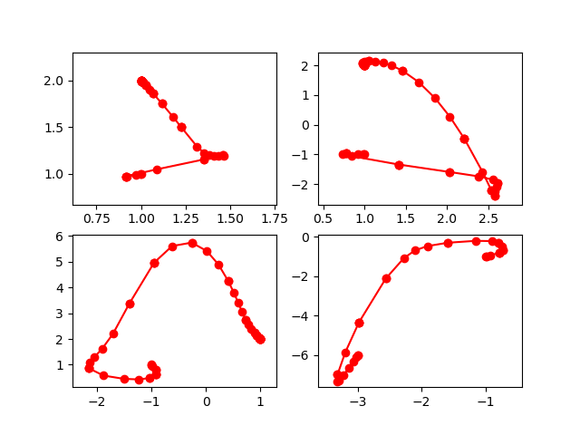
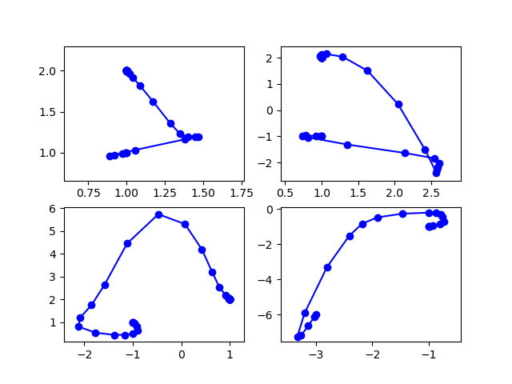
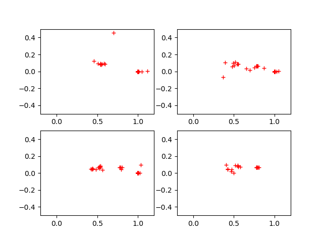

Tracking Paths Step by Step
===========================

One main benefit of phcpy is the interactivity and the inversion of control.
Instead of the path tracker deciding the pace of computing points on the path,
the user can ask for the next point on the path,
which is convenient to plot the points on the path.

plotting solutions paths
------------------------

In the example below, the real parts of the solution paths are plotted,
in :numref:`showpathsfig1`.

::

    from phcpy.dimension import set_seed, get_seed
    from phcpy.solutions import strsol2dict
    from phcpy.starters import total_degree_start_system
    from phcpy.trackers import initialize_double_tracker
    from phcpy.trackers import initialize_double_solution
    from phcpy.trackers import next_double_solution

The construction of the homotopy depends on the generation 
of random numbers.  To obtain consistently the same plots, 
the seed of the random number generator is fixed.

::

    set_seed(12871)
    print('the seed :', get_seed())

What is printed is ``the seed : 12871``.

The system that will be solved is defined as follows:

::

    p = ['x^2 + y - 3;', 'x + 0.125*y^2 - 1.5;']

For this intersection of two quadrics, we construct 
a total degree start system and compute four start solutions:

::

    q, qsols = total_degree_start_system(p)
    for pol in q:
        print(pol)

Then here is the start system:

::

    x^2 - 1;
    y^2 - 1;
 
::

    print('number of start solutions :', len(qsols))

and ``4`` is printed.

::

    initialize_double_tracker(p, q, False)

    plt.ion()

The code

::

    fig = plt.figure()
    for k in range(len(qsols)):
        if(k == 0):
            axs = fig.add_subplot(221)
        elif(k == 1):
            axs = fig.add_subplot(222)
        elif(k == 2):
            axs = fig.add_subplot(223)
        elif(k == 3):
            axs = fig.add_subplot(224)
        startsol = qsols[k]
        initialize_double_solution(len(p),startsol)
        dictsol = strsol2dict(startsol)
        xpoints =  [dictsol['x']]
        ypoints =  [dictsol['y']]
        for k in range(300):
            ns = next_double_solution()
            dictsol = strsol2dict(ns)
            xpoints.append(dictsol['x'])
            ypoints.append(dictsol['y'])
            tval = dictsol['t'].real
            if(tval == 1.0):
                break
        print(ns)
        xre = [point.real for point in xpoints]
        yre = [point.real for point in ypoints]
        axs.set_xlim(min(xre)-0.3, max(xre)+0.3)
        axs.set_ylim(min(yre)-0.3, max(yre)+0.3)
        dots, = axs.plot(xre,yre,'r-')
        dots, = axs.plot(xre,yre,'ro')
        fig.canvas.draw()
    fig.canvas.draw()

prints the solutions at the end of the paths

::

    t :  1.00000000000000E+00   0.00000000000000E+00
    m : 1
    the solution for t :
     x :  1.00000071115204E+00  -4.02767598012276E-06
     y :  1.99999857771171E+00   8.05535854116567E-06
    = err :  2.614E-06 = rco :  1.000E+00 = res :  9.361E-13 =
    t :  1.00000000000000E+00   0.00000000000000E+00
    m : 1
    the solution for t :
     x :  9.99994847664516E-01  -1.64638311049799E-06
     y :  2.00001030465627E+00   3.29275198635159E-06
    == err :  7.006E-06 = rco :  1.000E+00 = res :  1.187E-11 =
    t :  1.00000000000000E+00   0.00000000000000E+00
    m : 1
    the solution for t :
     x :  9.99999462998807E-01   3.01282709881038E-06
     y :  2.00000107400770E+00  -6.02565521719758E-06
    == err :  6.245E-06 = rco :  1.000E+00 = res :  7.729E-12 =
    t :  1.00000000000000E+00   0.00000000000000E+00
    m : 1
    the solution for t :
     x : -3.00000000000000E+00   1.39180902310149E-15
     y : -6.00000000000001E+00   5.55716009286787E-15
    == err :  4.185E-07 = rco :  1.000E+00 = res :  2.071E-14 =

and shows then the plot

.. _showpathsfig1:

    
   The real parts of four solution paths.

Typically, with an adaptive step size control, 
the points are closer to each other at the start 
and end of the paths, and where the paths turn.
The ``trackers`` module exports the original path trackers, 
which use *aposteriori step size control*.  
An aposteriori step size control algorithm 
determines the step size based on the performance of the corrector.

plotting paths and poles
------------------------

The *apriori step size control* determines the step size based
on the location of the nearest pole and the curvature.  
In addition to the (real parts of the paths),
the location of the nearest poles is plotted.

::

   import matplotlib.pyplot as plt

   from phcpy.dimension import set_seed, get_seed
   from phcpy.solutions import strsol2dict
   from phcpy.starters import total_degree_start_system
   from phcpy.curves import set_default_parameters, write_parameters
   from phcpy.curves import initialize_double_artificial_homotopy
   from phcpy.curves import set_double_solution, get_double_solution
   from phcpy.curves import double_predict_correct
   from phcpy.curves import double_t_value, double_closest_pole

The seed is fixed to obtain the same plots in each run.

::

    set_seed(12871)

The system that will be solved is defined as

::

    p = ['x^2 + y - 3;', 'x + 0.125*y^2 - 1.5;']

and a start system based on the total degree is constructed:

::

    x^2 - 1;
    y^2 - 1;

as the output of the code

::

    q, qsols = total_degree_start_system(p)
    for pol in q:
        print(pol)

The list `qsols` has the four solutions of 
the start system `q`.

Before lauching the path trackers,
the parameters must be set.
Default values are used 

::

   set_default_parameters()
   write_parameters()

and shown below:

::

   Values of the HOMOTOPY CONTINUATION PARAMETERS :
    1. gamma : (-0.8063005962200716-0.5915060004219376j)
    2. degree of numerator of Pade approximant    : 5
    3. degree of denominator of Pade approximant  : 1
    4. maximum step size                          : 0.1
    5. minimum step size                          : 1e-06
    6. multiplication factor for the pole radius  : 0.5
    7. multiplication factor for the curvature    : 0.005
    8. tolerance on the residual of the predictor : 0.001
    9. tolerance on the residual of the corrector : 1e-08
   10. tolerance on zero series coefficients      : 1e-12
   11. maximum number of corrector steps          : 4
   12. maximum steps on a path                    : 1000

Then the homotopy is constructed:

::

    initialize_double_artificial_homotopy(p, q, False)

Then the code below

::

    plt.ion()
    fig1 = plt.figure()
    allpoles = []
    for k in range(len(qsols)):
        if(k == 0):
            axs = fig1.add_subplot(221)
        elif(k == 1):
            axs = fig1.add_subplot(222)
        elif(k == 2):
            axs = fig1.add_subplot(223)
        elif(k == 3):
            axs = fig1.add_subplot(224)
        startsol = qsols[k]
        set_double_solution(len(p), startsol)
        dictsol = strsol2dict(startsol)
        xpoints =  [dictsol['x']]
        ypoints =  [dictsol['y']]
        poles = []
        for k in range(100):
            ns = get_double_solution()
            dictsol = strsol2dict(ns)
            xpoints.append(dictsol['x'])
            ypoints.append(dictsol['y'])
            tval = dictsol['t'].real
            if(tval == 1.0):
                break
            double_predict_correct()
            pole = double_closest_pole()
            tval = double_t_value()
            locp = (tval+pole[0], pole[1])
            poles.append(locp)
        print(ns)
        xre = [point.real for point in xpoints]
        yre = [point.real for point in ypoints]
        axs.set_xlim(min(xre)-0.3, max(xre)+0.3)
        axs.set_ylim(min(yre)-0.3, max(yre)+0.3)
        dots, = axs.plot(xre,yre,'b-')
        dots, = axs.plot(xre,yre,'bo')
        fig1.canvas.draw()
        allpoles.append(poles)
    fig1.canvas.draw()

prints the solutions at the end of the path:

::

    t :  1.00000000000000E+00   0.00000000000000E+00
    m : 1
    the solution for t :
     x :  1.00000458683462E+00   7.95321001653953E-06
     y :  1.99999082635867E+00  -1.59064683422953E-05
    == err :  1.458E-05 = rco :  3.155E-12 = res :  1.529E-12 =
    t :  1.00000000000000E+00   0.00000000000000E+00
    m : 1
    the solution for t :
     x :  9.99999434968695E-01   9.78667863138325E-07
     y :  2.00000113004483E+00  -1.95736651949408E-06
    == err :  1.658E-05 = rco :  6.664E-12 = res :  1.976E-12 =
    t :  1.00000000000000E+00   0.00000000000000E+00\
    m : 1
    the solution for t :
     x :  1.00000600449478E+00   2.32224203692682E-07
     y :  1.99998799104108E+00  -4.64448075210226E-07
    == err :  1.671E-05 = rco :  9.377E-13 = res :  3.579E-12 =
    t :  1.00000000000000E+00   0.00000000000000E+00
    m : 1
    the solution for t :
     x : -3.00000000000000E+00   0.00000000000000E+00
     y : -6.00000000000000E+00   0.00000000000000E+00
    == err :  5.551E-16 = rco :  1.965E-01 = res :  0.000E+00 =

and produces the plot in :numref:`showpolesfig1`.

.. _showpolesfig1:

    
   The real parts of four solution paths.

The poles are shown in :numref:`showpolesfig2`
plotted with the code in

::

    fig2 = plt.figure()
    for k in range(len(qsols)):
        if(k == 0):
            axs = fig2.add_subplot(221)
        elif(k == 1):
            axs = fig2.add_subplot(222)
        elif(k == 2):
            axs = fig2.add_subplot(223)
        elif(k == 3):
            axs = fig2.add_subplot(224)
        poles = allpoles[k]
        pl0 = [pole[0] for pole in poles]
        pl1 = [pole[1] for pole in poles]
        axs.set_xlim(-0.2, 1.2)
        axs.set_ylim(-0.5, 0.5)
        dots, = axs.plot(pl0,pl1,'r+')
        fig2.canvas.draw()
    fig2.canvas.draw()

.. _showpolesfig2:

    
   The nearest poles of four solution paths.

Observe that for this example, more poles are located closer 
to the middle and the end of the paths.
