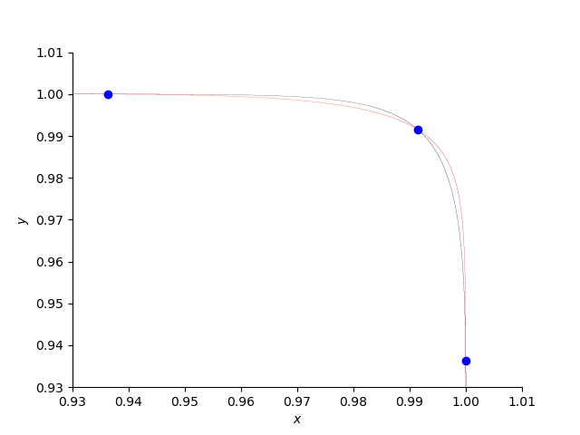
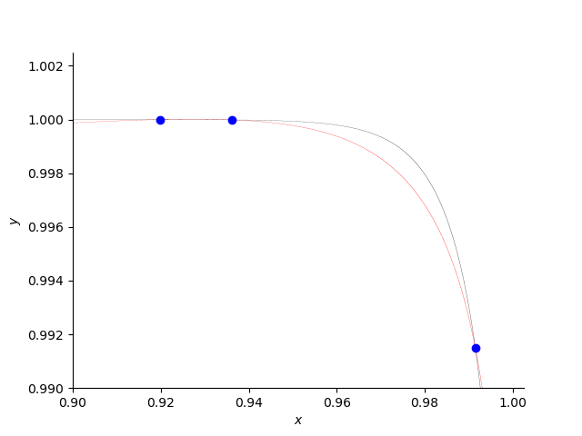
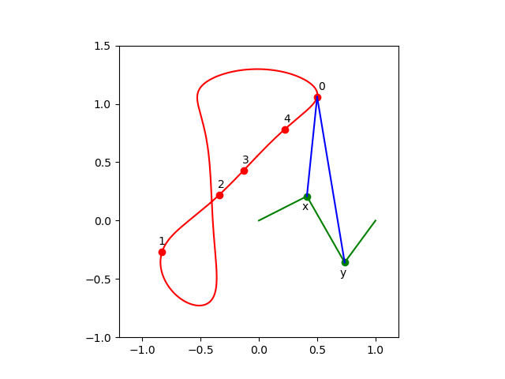

********
Tutorial
********

Via some interesting use cases, several features are introduced.

1. If one can solve polynomial systems,
   then one can solve many problems.

2. The use cases illustrate the formulation of the polynomial systems
   via the packages in Python's computational ecosystem,
   in particular sympy and numpy.

3. The interpretation of the output often happens via plots.

For the plots, Jupyter notebooks are available in the ``tests`` folder.
The development of the use cases happened via short Python scripts.

A Counter Example to Koushnirenko's Conjecture
==============================================

This chapter illustrates the
counter example of Bertrand Haas, against the Koushnirenko conjecture,
executed on one core and on many cores.
For the mathematical background, consult:

Bertrand Haas: **A simple counterexample to Kouchnirenko's conjecture.**,
*Beitraege zur Algebra und Geometrie/Contributions to Algebra and Geometry*, 
volume 43, number 1, pages 1 to 8, 2002.

Bertrand constructed a polynomial system with three monomials in every
equation and with five positive real roots.  Kouchnirenko's conjecture
predicted there could only four positive real roots for such a system.

To get the proper wall clock time, we have to be mindful 
that the Python code calls the compiled functions in the PHCpack library.  
Therefore, the Python timers will not give accurate timings.  
Instead, we have to rely on the actual date and time, 
from the package `datetime` in Python."

::

    from datetime import datetime

For the plot, the implicit plotting of `sympy` will be used.

::

    from sympy import plot_implicit, symbols, Eq

From `phcpy` we import the following functions:

::

    from phcpy.dimension import get_core_count
    from phcpy.solver import solve
    from phcpy.solutions import filter_real

Solving the System on Many Cores
--------------------------------

The example of Bertrand Haas is defined as

::

    H = [ 'x**108 + 1.1*y**54 - 1.1*y;',
          'y**108 + 1.1*x**54 - 1.1*x;' ]

According to the theorem of Bézout, we may expect a number of 
complex solutions equals to the product of the degrees of the polynomials.
The square of 108 equals 11664.
As the solver computes all complex solutions,
executing the following code block takes some time ...

::

    print('Solving on one core ...')
    wstart = datetime.now()
    sols = solve(H)
    wstop = datetime.now()
    print('  Number of solutions :', len(sols))
    print('start time :', wstart)
    print(' stop time :', wstop)
    print('   elapsed :', wstop - wstart)

The output of the above code cell is

::

     Solving on one core ...
       Number of solutions : 11664
     start time : 2024-01-28 11:57:53.061707
      stop time : 2024-01-28 11:57:59.223344
        elapsed : 0:00:06.161637

We can significantly speed up this computation if the computer has many cores.

::

    nbcores = get_core_count()
    print('Solving on', nbcores, 'cores ...')
    wstart = datetime.now()
    sols = solve(H, tasks=nbcores)
    wstop = datetime.now()
    print('  Number of solutions :', len(sols))
    print('start time :', wstart)
    print(' stop time :', wstop)
    print('   elapsed :', wstop - wstart)

The output of the above code cell is

::

    Solving on 32 cores ...
      Number of solutions : 11664
    start time : 2024-01-28 11:58:07.241324
     stop time : 2024-01-28 11:58:08.747874
       elapsed : 0:00:01.506550

Compared the `elapsed :` above with the previous one.

Extracting the Real Roots
-------------------------

Rather than eyeballing all 11,664 complex solutions ourselves, 
we ask to filter the real solutions.

::

    realsols = filter_real(sols, tol=1.0e-8, oper='select')

The code cell below prints the solutions in `realsols`:

::

    for (idx, sol) in enumerate(realsols):
        print('Solution', idx+1, ':')
        print(sol)

The output is

::

     Solution 1 :
     t :  0.00000000000000E+00   0.00000000000000E+00
     m : 1
     the solution for t :
      x :  0.00000000000000E+00   0.00000000000000E+00
      y :  0.00000000000000E+00   0.00000000000000E+00
     == err :  0.000E+00 = rco :  1.000E+00 = res :  0.000E+00 =
     Solution 2 :
     t :  1.00000000000000E+00   0.00000000000000E+00
     m : 1
     the solution for t :
      x :  9.91489402484465E-01  -2.94004118110142E-49
      y :  9.91489402484465E-01   2.96676882820234E-49
     == err :  7.704E-17 = rco :  8.274E-02 = res :  5.773E-15 =
     Solution 3 :
     t :  1.00000000000000E+00   0.00000000000000E+00
     m : 1
     the solution for t :
      x :  9.99997917489999E-01   9.52445049970774E-46
      y :  9.19904793199125E-01  -1.72639970804817E-42
     == err :  2.708E-16 = rco :  1.601E-03 = res :  8.677E-15 =
     Solution 4 :
     t :  1.00000000000000E+00   0.00000000000000E+00
     m : 1
     the solution for t :
      x :  9.99986016402972E-01   1.19248391761152E-37
      y :  9.36266084294562E-01  -2.97164971887874E-34
     == err :  2.240E-15 = rco :  2.070E-03 = res :  3.610E-15 =
     Solution 5 :
     t :  1.00000000000000E+00   0.00000000000000E+00
     m : 1
     the solution for t :
      x :  9.19904793199125E-01  -2.01786978862774E-41
      y :  9.99997917489999E-01   1.02032044433651E-44
     == err :  4.384E-16 = rco :  1.601E-03 = res :  8.564E-15 =
     Solution 6 :
     t :  1.00000000000000E+00   0.00000000000000E+00
     m : 1
     the solution for t :
      x :  9.36266084294562E-01  -4.40471624223194E-48
      y :  9.99986016402972E-01   3.13214614463929E-51
     == err :  9.256E-17 = rco :  2.070E-03 = res :  3.730E-15 =

We observe (0, 0) and five additional real positive roots.
According to the Koushnirenko conjecture, we would expect
no more than four real positive roots.

Plotting the Curves
-------------------

In converting the strings in the polynomial system `H` 
we have to remove the trailing semicolon

::

    x, y = symbols('x y')
    p0 = eval(H[0][:-1])
    p1 = eval(H[1][:-1])

Without knowing the precise location of the intersection points, 
the curves are hard to plot.
The code below produces the plot :numref:`haasfig1`.

::

    plot0 = plot_implicit(Eq(p0, 0), (x, 0.93, 1.01), (y, 0.93, 1.01),
                          line_color='black', depth=1,
        markers=[{'args': [[0.99148, 0.93626, 0.99998],
                           [0.99148, 0.99998, 0.93626], 'bo']}],
                          axis_center=(0.93, 0.93), show=False)

    plot1 = plot_implicit(Eq(p1, 0), (x, 0.93, 1.01), (y, 0.93, 1.01),
                          line_color='red', depth=1,
                          axis_center=(0.93, 0.93), show=False)

    plot0.append(plot1[0])
    plot0.show()

.. _haasfig1:

    
   Three positive roots of the counterexample.

Let us zoom in to another root ...
:numref:`haasfig2` is made executing the code below:

::

    plot3 = plot_implicit(Eq(p0, 0), (x, 0.9, 1.0025), (y, 0.99, 1.0025),
                          line_color='black', depth=1,
        markers=[{'args': [[0.99148, 0.93626, 0.91990],
                           [0.99148, 0.99998, 0.99999], 'bo']}],
                          axis_center=(0.9, 0.99), show=False)

    plot4 = plot_implicit(Eq(p1, 0), (x, 0.9, 1.0025), (y, 0.99, 1.0025),
                          line_color='red', depth=1,
                          axis_center=(0.9, 0.99), show=False)

    plot3.append(plot4[0])
    plot3.show()

.. _haasfig2:

    
   Other positive roots of the counterexample.

The third plot (in :numref:`haasfig3`)
is produced by the following code:

::

    plot5 = plot_implicit(Eq(p0, 0), (x, 0.9, 1.0005), (y, 0.999, 1.0005),
                          line_color='black', depth=1,
        markers=[{'args': [[0.93626, 0.91990],
                           [0.99998, 0.99999], 'bo']}],
                          axis_center=(0.9, 0.999), show=False)

    plot6 = plot_implicit(Eq(p1, 0), (x, 0.9, 1.0005), (y, 0.999, 1.0005),
                          line_color='red', depth=1,
                          axis_center=(0.9, 0.999), show=False)

    plot5.append(plot6[0])
    plot5.show()

.. _haasfig3:

.. figure:: ./haasfig3.png
   :align: center
    
   Two close positive roots of the counterexample.

A 4-Bar Mechanism
=================

The equations to design a 4-bar mechanism are defined with sympy.

The system appears in a paper by A.P. Morgan and C.W. Wampler on
**Solving a Planar Four-Bar Design Using Continuation**, published in
*the Journal of Mechanical Design*, volume 112, pages 544-550, 1990.

The solutions for a straight-line confirmation are shown with matplotlib.
Random numbers will be generated.

::

    from math import sqrt
    from random import uniform

From `sympy` we import the following:

::

    from sympy import var
    from sympy.matrices import Matrix

For the plotting, we import `pyplot` of `matplotlib`.

::

    import matplotlib.pyplot as plt

And then, last an not least, the blackbox solver
of `phcpy` is imported.

::

    from phcpy.solver import solve

As `phcpy` is an API, the problem is solved
via a sequence of functions.

solving a polynomial system
---------------------------

The system of polynomial equations is formulated
by the function in the code cell below.

::

    def polynomials(d0, d1, d2, d3, d4, a):
        """
        Given in d0, d1, d2, d3, d4 are the coordinates of
        the precision points, given as Matrix objects.
        Also the coordinates of the pivot in a are stored in a Matrix.
        Returns the system of polynomials to design the 4-bar
        mechanism with a coupler passing through the precision points.
        """
        # the four rotation matrices
        c1, s1, c2, s2 = var('c1, s1, c2, s2')
        c3, s3, c4, s4 = var('c3, s3, c4, s4')
        R1 = Matrix([[c1, -s1], [s1, c1]])
        R2 = Matrix([[c2, -s2], [s2, c2]])
        R3 = Matrix([[c3, -s3], [s3, c3]])
        R4 = Matrix([[c4, -s4], [s4, c4]])
        # the first four equations reflecting cos^2(t) + sin^(t) = 1
        p1, p2 = 'c1^2 + s1^2 - 1;', 'c2^2 + s2^2 - 1;'
        p3, p4 = 'c3^2 + s3^2 - 1;', 'c4^2 + s4^2 - 1;'
        # the second four equations on X
        x1, x2 = var('x1, x2')
        X = Matrix([[x1], [x2]])
        c1x = 0.5*(d1.transpose()*d1 - d0.transpose()*d0)
        c2x = 0.5*(d2.transpose()*d2 - d0.transpose()*d0)
        c3x = 0.5*(d3.transpose()*d3 - d0.transpose()*d0)
        c4x = 0.5*(d4.transpose()*d4 - d0.transpose()*d0)
        e1x = (d1.transpose()*R1 - d0.transpose())*X + c1x
        e2x = (d2.transpose()*R2 - d0.transpose())*X + c2x
        e3x = (d3.transpose()*R3 - d0.transpose())*X + c3x
        e4x = (d4.transpose()*R4 - d0.transpose())*X + c4x
        s1, s2 = str(e1x[0]) + ';', str(e2x[0]) + ';'
        s3, s4 = str(e3x[0]) + ';', str(e4x[0]) + ';'
        # the third group of equations on Y
        y1, y2 = var('y1, y2')
        Y = Matrix([[y1], [y2]])
        c1y = c1x - a.transpose()*(d1 - d0)
        c2y = c2x - a.transpose()*(d2 - d0)
        c3y = c3x - a.transpose()*(d3 - d0)
        c4y = c4x - a.transpose()*(d4 - d0)
        e1y = ((d1.transpose() - a.transpose())*R1 \
             - (d0.transpose() - a.transpose()))*Y + c1y
        e2y = ((d2.transpose() - a.transpose())*R2 \
             - (d0.transpose() - a.transpose()))*Y + c2y
        e3y = ((d3.transpose() - a.transpose())*R3 \
             - (d0.transpose() - a.transpose()))*Y + c3y
        e4y = ((d4.transpose() - a.transpose())*R4 \
             - (d0.transpose() - a.transpose()))*Y + c4y
        s5, s6 = str(e1y[0]) + ';', str(e2y[0]) + ';'
        s7, s8 = str(e3y[0]) + ';', str(e4y[0]) + ';'
        return [p1, p2, p3, p4, s1, s2, s3, s4, s5, s6, s7, s8]

Let us generate random points and define the polynomial system.

::

    pt0 = Matrix(2, 1, lambda i,j: uniform(-1,+1))
    pt1 = Matrix(2, 1, lambda i,j: uniform(-1,+1))
    pt2 = Matrix(2, 1, lambda i,j: uniform(-1,+1))
    pt3 = Matrix(2, 1, lambda i,j: uniform(-1,+1))
    pt4 = Matrix(2, 1, lambda i,j: uniform(-1,+1))
    # the pivot is a
    piv = Matrix([[1], [0]])
    equ = polynomials(pt0,pt1,pt2,pt3,pt4,piv)
    for pol in equ:
        print(pol)

Then the output for random numbers as the parameters is

::

      c1^2 + s1^2 - 1;
      c2^2 + s2^2 - 1;
      c3^2 + s3^2 - 1;
      c4^2 + s4^2 - 1;
      x1*(-0.275586755195824*c1 + 0.325788266703467*s1 + 0.676839821431551) + x2*(0.325788266703467*c1 + 0.275586755195824*s1 - 0.0938422352018522) - 0.142416227311081;\n",
      x1*(0.902513020087508*c2 - 0.151712455719013*s2 + 0.676839821431551) + x2*(-0.151712455719013*c2 - 0.902513020087508*s2 - 0.0938422352018522) + 0.185313955832297;\n",
      x1*(-0.44237719048943*c3 - 0.542955104453471*s3 + 0.676839821431551) + x2*(-0.542955104453471*c3 + 0.44237719048943*s3 - 0.0938422352018522) + 0.0117896575671138;\n",
      x1*(-0.319438148253377*c4 - 0.397350378412077*s4 + 0.676839821431551) + x2*(-0.397350378412077*c4 + 0.319438148253377*s4 - 0.0938422352018522) - 0.103495227599703;\n",
      y1*(-1.27558675519582*c1 + 0.325788266703467*s1 + 1.67683982143155) + y2*(0.325788266703467*c1 + 1.27558675519582*s1 - 0.0938422352018522) - 0.543669293546807;\n",
      y1*(-0.0974869799124924*c2 - 0.151712455719013*s2 + 1.67683982143155) + y2*(-0.151712455719013*c2 + 0.0974869799124924*s2 - 0.0938422352018522) - 1.39403888568676;\n",
      y1*(-1.44237719048943*c3 - 0.542955104453471*s3 + 1.67683982143155) + y2*(-0.542955104453471*c3 + 1.44237719048943*s3 - 0.0938422352018522) - 0.222672973375007;\n",
      y1*(-1.31943814825338*c4 - 0.397350378412077*s4 + 1.67683982143155) + y2*(-0.397350378412077*c4 + 1.31943814825338*s4 - 0.0938422352018522) - 0.460896900777877;\n"

The solutions of the polynomial system define a mechanism
of which the coupler passes through the five points.

::

    sols = solve(equ)
    len(sols)

The number is `36` which is invariant for this problem.
Solving a general problem, for random precision points, 
shows that the number of solutions is 36.

a straight-line configuration
-----------------------------

Let us consider a special problem.
Observe the extraction of real solutions in the function below.

::

    def straight_line(verbose=True):
        """
        This function solves an instance where the five precision
        points lie on a line.  The coordinates are taken from Problem 7
        of the paper by A.P. Morgan and C.W. Wampler.
        Returns a list of solution dictionaries for the real solutions.
        """
        from phcpy.solutions import strsol2dict, is_real
        pt0 = Matrix([[ 0.50], [ 1.06]])
        pt1 = Matrix([[-0.83], [-0.27]])
        pt2 = Matrix([[-0.34], [ 0.22]])
        pt3 = Matrix([[-0.13], [ 0.43]])
        pt4 = Matrix([[ 0.22], [ 0.78]])
        piv = Matrix([[1], [0]])
        equ = polynomials(pt0,pt1,pt2,pt3,pt4,piv)
        if verbose:
            print('the polynomial system :')
            for pol in equ:
                print(pol)
        sols = solve(equ)
        if verbose:
            print('the solutions :')
            for (idx, sol) in enumerate(sols):
                print('Solution', idx+1, ':')
                print(sol)
            print('computed', len(sols), 'solutions')
        result = []
        for sol in sols:
            if is_real(sol, 1.0e-8):
                soldic = strsol2dict(sol)
                result.append(soldic)
        return result

Running the function

::

    sols = straight_line()

shows

::

    the polynomial system :
    c1^2 + s1^2 - 1;
    c2^2 + s2^2 - 1;
    c3^2 + s3^2 - 1;
    c4^2 + s4^2 - 1;
    x1*(-0.83*c1 - 0.27*s1 - 0.5) + x2*(-0.27*c1 + 0.83*s1 - 1.06) - 0.3059;
    x1*(-0.34*c2 + 0.22*s2 - 0.5) + x2*(0.22*c2 + 0.34*s2 - 1.06) - 0.6048;
    x1*(-0.13*c3 + 0.43*s3 - 0.5) + x2*(0.43*c3 + 0.13*s3 - 1.06) - 0.5859;
    x1*(0.22*c4 + 0.78*s4 - 0.5) + x2*(0.78*c4 - 0.22*s4 - 1.06) - 0.3584;
    y1*(-1.83*c1 - 0.27*s1 + 0.5) + y2*(-0.27*c1 + 1.83*s1 - 1.06) + 1.0241;
    y1*(-1.34*c2 + 0.22*s2 + 0.5) + y2*(0.22*c2 + 1.34*s2 - 1.06) + 0.2352;
    y1*(-1.13*c3 + 0.43*s3 + 0.5) + y2*(0.43*c3 + 1.13*s3 - 1.06) + 0.0440999999999999;
    y1*(-0.78*c4 + 0.78*s4 + 0.5) + y2*(0.78*c4 + 0.78*s4 - 1.06) - 0.0784;

and then continues with `the solutions :` which is skipped
as the output of the function gives the list of real solutions.

::

    for (idx, sol) in enumerate(sols):
        (x1v, x2v) = (sol['x1'].real, sol['x2'].real)
        (y1v, y2v) = (sol['y1'].real, sol['y2'].real)
        print('Solution', idx+1, ':')
        print('x = ', x1v, x2v)
        print('y = ', y1v, y2v)

The coordinates of the real solutions are shown below.

::

    Solution 1 :
    x =  -0.0877960434509403 -0.85138690751564
    y =  0.235837391307301 -1.41899202703639
    Solution 2 :
    x =  0.0193359267851516 -0.937757011012446
    y =  1.22226669109342 -1.08285087742709
    Solution 3 :
    x =  -0.595728628822183 -0.617010917712341
    y =  0.118171353650905 -1.82939267557673
    Solution 4 :
    x =  -0.158077261086826 -0.793782551346416
    y =  -0.548761782690284 0.278116829722178
    Solution 5 :
    x =  14.265306631912 -6.51576530896231
    y =  -0.621791031677556 -0.0713939584963069
    Solution 6 :
    x =  -1.79178664902321 1.04613207405924
    y =  -1.46486338398045 1.21676347168425
    Solution 7 :
    x =  0.130643755560844 -0.942516053801942
    y =  0.963729735050218 -1.01577587226827
    Solution 8 :
    x =  -0.358757861563373 -0.537230434093211
    y =  0.0870595124133798 1.5543474028655
    Solution 9 :
    x =  -11.0926159017278 0.450863935272926
    y =  -0.396207302280832 -1.04172821286545
    Solution 10 :
    x =  -0.154697709323186 -0.812626279169727
    y =  3.30145715645532 -2.31860323051595
    Solution 11 :
    x =  -0.0801573081756841 -0.855275240173407
    y =  -0.297321862562434 -2.18414388671793
    Solution 12 :
    x =  0.676178657404253 -0.613650952963839
    y =  0.356055523659319 0.310794500797803
    Solution 13 :
    x =  1.4739209688177 -1.71128474823024
    y =  -0.654679846479676 0.028907166911727
    Solution 14 :
    x =  -0.264640920049152 -0.69691152780256
    y =  0.370368746423895 -1.54221173415608
    Solution 15 :
    x =  -1.0856845753759 -0.352998488913482
    y =  0.319028475056347 0.687883260707162

a four-bar mechanism
--------------------

The code in the function below are applied to make the plots.

::

    def angle(csa, sna):
        """
        Given in csa and sna are the cosine and sine of an angle a,
        that is: csa = cos(a) and sna = sin(a).
        On return is the angle a, with the proper orientation.
        """
        from math import acos, pi
        agl = acos(csa)
        if sna >= 0:
            return agl
        else:
            dlt = pi - agl
            return pi + dlt

::
   
    def angles(soldic):
        """
        Given a solution dictionary, extracts the angles from
        the four cosines and sines of the angles.
        Returns None if the angles are not ordered increasingly.
        Otherwise, returns the sequence of ordered angles.
        """
        from math import acos, asin
        c1v, s1v = soldic['c1'].real, soldic['s1'].real
        c2v, s2v = soldic['c2'].real, soldic['s2'].real
        c3v, s3v = soldic['c3'].real, soldic['s3'].real
        c4v, s4v = soldic['c4'].real, soldic['s4'].real
        ag1 = angle(c1v, s1v)
        ag2 = angle(c2v, s2v)
        ag3 = angle(c3v, s3v)
        ag4 = angle(c4v, s4v)
        ordered = (ag1 > ag2) and (ag2 > ag3) and (ag3 > ag4)
        if ordered:
            print(ag1, ag2, ag3, ag4, 'ordered angles')
            return (ag1, ag2, ag3, ag4)
        return None

::

    def plotpoints(points):
        """
        Plots the precision points and the pivots.
        """
        xpt = [a for (a, b) in points]
        ypt = [b for (a, b) in points]
        plt.plot(xpt, ypt, 'ro')
        plt.text(xpt[0] - 0.01, ypt[0] + 0.08, \"0\")
        plt.text(xpt[1] - 0.01, ypt[1] + 0.08, \"1\")
        plt.text(xpt[2] - 0.01, ypt[2] + 0.08, \"2\")
        plt.text(xpt[3] - 0.01, ypt[3] + 0.08, \"3\")
        plt.text(xpt[4] - 0.01, ypt[4] + 0.08, \"4\")
        plt.plot([0, 1], [0, 0], 'w^') # pivots marked by white triangles
        plt.axis([-1.0, 1.5, -1.0, 1.5])

::

    def plotbar(fig, points, idx, x, y):
        """
        Plots a 4-bar with coordinates given in x and y,
        and the five precision points in the list points.
        The index idx is the position with respect to a point in points.
        """
        if idx < 0:
            fig.add_subplot(231, aspect='equal')
        if idx == 0:
            fig.add_subplot(232, aspect='equal')
        elif idx == 1:
            fig.add_subplot(233, aspect='equal')
        elif idx == 2:
            fig.add_subplot(234, aspect='equal')
        elif idx == 3:
            fig.add_subplot(235, aspect='equal')
        elif idx == 4:
            fig.add_subplot(236, aspect='equal')
        plotpoints(points)
        if idx >= 0:
            xpt = [a for (a, b) in points]
            ypt = [b for (a, b) in points]
            (xp0, xp1) = (x[0] + xpt[idx], x[1] + ypt[idx])
            (yp0, yp1) = (y[0] + xpt[idx], y[1] + ypt[idx])
            plt.plot([xp0, yp0], [xp1, yp1], 'go')
            plt.plot([xp0, yp0], [xp1, yp1], 'g')
            plt.text(xp0 - 0.04, xp1 - 0.22, \"x\")
            plt.text(yp0 - 0.04, yp1 - 0.22, \"y\")
            plt.plot([0, xp0], [0, xp1], 'g')
            plt.plot([yp0, 1], [yp1, 0], 'g')
            plt.plot([xp0, xpt[idx]], [xp1, ypt[idx]], 'b')
            plt.plot([yp0, xpt[idx]], [yp1, ypt[idx]], 'b')

::

    def rotate(x, y, a):
        """
        Applies a planar rotation defined by the angle a
        to the points x and y.
        """
        from sympy.matrices import Matrix
        from math import cos, sin
        rot = Matrix([[cos(a), -sin(a)], [sin(a), cos(a)]])
        xmt = Matrix([[x[0]], [x[1]]])
        ymt = Matrix([[y[0]], [y[1]]])
        rxm = rot*xmt
        rym = rot*ymt
        rox = (rxm[0], rxm[1])
        roy = (rym[0], rym[1])
        return (rox, roy)

::

    def show4bar():
        """
        Plots a 4-bar design, for the five precision points
        on a straight line, with coordinates taken from Problem 7
        of the Morgan-Wampler paper.
        """
        pt0 = ( 0.50,  1.06)
        pt1 = (-0.83, -0.27)
        pt2 = (-0.34,  0.22)
        pt3 = (-0.13,  0.43)
        pt4 = ( 0.22,  0.78)
        points = [pt0, pt1, pt2, pt3, pt4]
        ags = [1.44734213756, 0.928413708131, 0.751699211109, 0.387116282208]
        x =  (-0.0877960434509, -0.851386907516)
        y =  (0.235837391307, -1.41899202704)
        fig = plt.figure()
        plotbar(fig,points, -1, x, y)
        plotbar(fig,points, 0, x, y)
        rx1, ry1 = rotate(x, y, ags[0])
        plotbar(fig,points, 1, rx1, ry1)
        rx2, ry2 = rotate(x, y, ags[1])
        plotbar(fig,points, 2, rx2, ry2)
        rx3, ry3 = rotate(x, y, ags[2])
        plotbar(fig,points, 3, rx3, ry3)
        rx4, ry4 = rotate(x, y, ags[3])
        plotbar(fig,points, 4, rx4, ry4)
        fig.canvas.draw()
        plt.savefig('fourbarfig1')

The mechanism which passes through the precision points is shown in
:numref:`fourbarfig1` obtained as the output of

::

    show4bar()

.. _fourbarfig1:

.. figure:: ./fourbarfig1.png
   :align: center
    
   A mechanism passing through precision points.

::

    for sol in sols:
        agl = angles(sol)
        if agl != None:
            (x1v, x2v) = (sol['x1'].real, sol['x2'].real)
            (y1v, y2v) = (sol['y1'].real, sol['y2'].real)
            print('x = ', x1v, x2v)
            print('y = ', y1v, y2v)

The output is

::

    1.4473421375642717 0.9284137081314461 0.75169921110931 0.3871162822082786 ordered angles
    x =  -0.0877960434509403 -0.85138690751564
    y =  0.235837391307301 -1.41899202703639
    2.524711332238134 0.9038272905536054 0.7498546795650226 0.38277375732994035 ordered angles
    x =  -0.0801573081756841 -0.855275240173407
    y =  -0.297321862562434 -2.18414388671793
    5.771983513802544 3.9629563185486125 3.442223836627024 0.5242754656511442 ordered angles
    x =  0.676178657404253 -0.613650952963839
    y =  0.356055523659319 0.310794500797803

Observe that one of the lists of ordered angles is used in the `showbar()`.

the coupler curve
-----------------

The coupler curve is the curve drawn by the coupler point.

::
   
    def plotpoints2(points):
        """
        Plots the precision points and the pivots.
        """
        xpt = [a for (a, b) in points]
        ypt = [b for (a, b) in points]
        plt.plot(xpt, ypt, 'ro')
        plt.text(xpt[0] + 0.01, ypt[0] + 0.06, \"0\")
        plt.text(xpt[1] - 0.03, ypt[1] + 0.06, \"1\")
        plt.text(xpt[2] - 0.01, ypt[2] + 0.06, \"2\")
        plt.text(xpt[3] - 0.01, ypt[3] + 0.06, \"3\")
        plt.text(xpt[4] - 0.01, ypt[4] + 0.06, \"4\")
        plt.plot([0, 1], [0, 0], 'w^') # pivots marked by white triangles
        plt.axis([-1.2, 1.2, -1.0, 1.5])

::

    def plotbar2(fig, points, idx, x, y):
        """
        Plots a 4-bar with coordinates given in x and y,
        and the five precision points in the list points.
        The index idx is the position with respect to a point in points.
        """
        plotpoints2(points)
        xpt = [a for (a, b) in points]
        ypt = [b for (a, b) in points]
        (xp0, xp1) = (x[0] + xpt[0], x[1] + ypt[0])
        (yp0, yp1) = (y[0] + xpt[0], y[1] + ypt[0])
        if idx >= 0:
            (xp0, xp1) = (x[0] + xpt[idx], x[1] + ypt[idx])
            (yp0, yp1) = (y[0] + xpt[idx], y[1] + ypt[idx])
            plt.plot([xp0, yp0], [xp1, yp1], 'go')
            plt.plot([xp0, yp0], [xp1, yp1], 'g')
            plt.text(xp0 - 0.04, xp1 - 0.12, \"x\")
            plt.text(yp0 - 0.04, yp1 - 0.12, \"y\")
            plt.plot([0, xp0], [0, xp1], 'g')
            plt.plot([yp0, 1], [yp1, 0], 'g')
            plt.plot([xp0, xpt[idx]], [xp1, ypt[idx]], 'b')
            plt.plot([yp0, xpt[idx]], [yp1, ypt[idx]], 'b')

::

    def lenbar(pt0, x, y):
        """
        In pt0 are the coordinates of the first precision point
        and in x and y the coordinates of the solution design.
        Returns the length of the bar between x and y.
        """
        (xp0, xp1) = (x[0] + pt0[0], x[1] + pt0[1])
        (yp0, yp1) = (y[0] + pt0[0], y[1] + pt0[1])
        result = sqrt((xp0 - yp0)**2 + (xp1 - yp1)**2)
        return result

::

    def coupler(x, y, xr, yr):
        """
        In x and y are the coordinates of the solution design.
        In xr and yr are the distances to the coupler point.
        Computes the intersection between two circles, centered
        at x and y, with respective radii in xr and yr.
        """
        A = -2*x[0] + 2*y[0]
        B = -2*x[1] + 2*y[1]
        C = x[0]**2 + x[1]**2 - xr**2 - y[0]**2 - y[1]**2 + yr**2
        fail = True
        if A + 1.0 != 1.0: # eliminate z1
            (alpha, beta) = (-C/A, -B/A)
            a = beta**2 + 1
            b = 2*alpha*beta - 2*x[1] - 2*x[0]*beta
            c = alpha**2 + x[0]**2 + x[1]**2 - xr**2 - 2*x[0]*alpha
            if b**2 - 4*a*c >= 0:
                fail = False
                disc = sqrt(b**2 - 4*a*c)
                z2 = (-b + disc)/(2*a)
                z1 = alpha + beta*z2
        if fail:
            (alpha, beta) = (-C/B, -A/B)
            a = beta**2 + 1
            b = 2*alpha*beta - 2*y[1] - 2*y[0]*beta
            c = alpha**2 + y[0]**2 + y[1]**2 - yr**2 - 2*y[0]*alpha
            disc = sqrt(b**2 - 4*a*c)
            z1 = (-b + disc)/(2*a)
            z2 = alpha + beta*z1
            dxz = sqrt((x[0]-z1)**2 + (x[1]-z2)**2)
        return (z1, z2)

::

    def xcrank(pt0, x):
        """
        In pt0 are the coordinates of the first precision point
        and in x the coordinates of the solution design.
        This function computes the length of the crank
        and its initial angle with respect to the first point.
        """
        from math import atan
        (xp0, xp1) = (x[0] + pt0[0], x[1] + pt0[1])
        crklen = sqrt(xp0**2 + xp1**2)
        crkagl = atan(xp1/xp0)
        return (crklen, crkagl)

::

    def ycrank(pt0, y):
        """
        In pt0 are the coordinates of the first precision point
        and in y the coordinates of the solution design.
        This function computes the length of the crank
        and its initial angle with respect to the first point.
        """
        from math import cos, sin, acos, pi
        (yp0, yp1) = (y[0] + pt0[0], y[1] + pt0[1])
        crklen = sqrt((yp0 - 1)**2 + yp1**2)
        crkagl = acos((yp0-1)/crklen)
        if yp1 < 0:
            dlt = pi - crkagl
            crkagl = pi + dlt
        cx = 1 + crklen*cos(crkagl)
        cy = crklen*sin(crkagl)
        return (crklen, crkagl)

::

    def xpos(y1, y2, dxy, rad):
        """
        Given in y1 and y2 are the coordinates of the point y,
        in dxy is the distance between the points x and y,
        and rad is the distance between x and (1, 0).
        The coordinates of the point x are returned in a tuple.
        """
        A = -2*y1  # coefficient with y1
        B = -2*y2  # coefficient with y2
        C = y1**2 + y2**2 - dxy**2 + rad**2 # constant
        fail = True
        if abs(y2) < 1.0e-8:
            x1 = -C/A
            x2sqr = rad**2 - x1**2
            x2 = sqrt(x2sqr)
            fail = False
        else: # eliminate x2
            (alpha, beta) = (-C/B, -A/B)
            (a, b, c) = (1+beta**2, 2*alpha*beta, alpha**2 - rad**2)
            b4ac = b**2 - 4*a*c
            disc = sqrt(b4ac)
            x1m = (-b - disc)/(2*a)
            x2m = alpha + beta*x1m
            x1p = (-b + disc)/(2*a)
            x2p = alpha + beta*x1p
        return ((x1m, x2m), (x1p, x2p))

::

    def plotcrank(crk, agl, dxy, rad, xrd, yrd):
        """
        Plots several positions of the crank.  On input are:
        crk : length of the crank from the point y to (1, 0),
        agl : start angle,
        rad : length of the crank from (0, 0) to the point x,
        xrd : length from the point x to the coupler point,
        yrd : length from the point y to the coupler point.
        """
        from math import sin, cos, pi
        (xzm, yzm) = ([], [])
        (xzp, yzp) = ([], [])
        nbr = 205
        inc = (pi+0.11763)/nbr
        b = agl - 2.558 # 125
        for k in range(nbr):
            (y1, y2) = (1 + crk*cos(b), crk*sin(b))
            (xm, xp) = xpos(y1, y2, dxy, rad)
            (x1m, x2m) = xm
            (x1p, x2p) = xp
            (z1m, z2m) = coupler([x1m, x2m], [y1, y2], xrd, yrd)
            (z1p, z2p) = coupler([x1p, x2p], [y1, y2], xrd, yrd)
            xzm.append(z1m)
            yzm.append(z2m)
            xzp.append(z1p)
            yzp.append(z2p)
            if k < 0: # selective plot
                plt.plot([0, x1m], [0, x2m], 'g')
                plt.plot([x1m, y1], [x2m, y2], 'g')
                plt.plot([y1, 1], [y2, 0], 'g')
                dyp = sqrt((y1-1)**2 + y2**2)
                dyx = sqrt((x1m-y1)**2 + (x2m-y2)**2)
                print('dxy =', dxy, 'dyp =', dyp)
            if k < 0:
                print('y2 =', y2)\
                plt.plot([x1m, z1m], [x2m, z2m], 'b')
                plt.plot([y1, z1m], [y2, z2m], 'b')
                plt.plot([x1p, z1p], [x2p, z2p], 'b')
                plt.plot([y1, z1p], [y2, z2p], 'b')
            b = b + inc
        plt.plot(xzp[:1]+xzm[:102]+xzp[102:], \
                 yzp[:1]+yzm[:102]+yzp[102:], 'r')
        plt.plot(xzp[:102]+xzm[102:], yzp[:102]+yzm[102:], 'r')

::

    def plotcoupler():
        """
        Plots the coupler curve for a straight line 4-bar mechanism.
        """
        pt0 = ( 0.50,  1.06)
        pt1 = (-0.83, -0.27)
        pt2 = (-0.34,  0.22)
        pt3 = (-0.13,  0.43)
        pt4 = ( 0.22,  0.78)
        points = [pt0, pt1, pt2, pt3, pt4]
        ags = [1.44734213756, 0.928413708131, 0.751699211109, 0.387116282208]
        x = (-0.0877960434509, -0.851386907516)
        y = (0.235837391307, -1.41899202704)
        (xcrk, xagl) = xcrank(pt0, x)
        (ycrk, yagl) = ycrank(pt0, y)
        dxy = lenbar(pt0, x, y)
        fig = plt.figure()
        fig.add_subplot(111, aspect='equal')
        xrd = sqrt(x[0]**2 + x[1]**2) # distance from x to pt0
        yrd = sqrt(y[0]**2 + y[1]**2) # distance from y to pt0
        plotcrank(ycrk, yagl, dxy, xcrk, xrd, yrd)
        plotbar2(fig, points, 0, x, y)
        fig.canvas.draw()
        plt.savefig('fourbarfig2')

Running the function

:: 

    plotcoupler()

produces the plot in :numref:`fourbarfig2`.

.. _fourbarfig2:

    
   The coupler curve of a 4-bar mechanism.

Two Lines Meeting Four Given Lines
==================================

Given four lines in general position,
there are two lines which meet all four given lines.
With Pieri homotopies we can solve this Schubert problem.
For the verification of the intersection conditions, `numpy` is used.
The plots are made with `matplotlib`.

We use random numbers and for reproducible plots, fix the seed.

::

   from random import seed

From `numpy` we import the following.

::

   from numpy import zeros, array, concatenate, matrix
   from numpy.linalg import det, solve

The plots are in 3-space.

::

   import matplotlib.pyplot as plt
   from mpl_toolkits.mplot3d import Axes3D

From `phcpy` we import the following functions:

::

    "from phcpy.solutions import coordinates
    "from phcpy.schubert import random_complex_matrix
    "from phcpy.schubert import pieri_root_count, run_pieri_homotopies
    "from phcpy.schubert import real_osculating_planes
    "from phcpy.schubert import make_pieri_system
    "from phcpy.trackers import double_track as track

solving a general instance
--------------------------

A random instance of the four given lines will lead to two solution lines.
The formal root count run as

::

    (mdim, pdim, deg) = (2, 2, 0)
    pcnt = pieri_root_count(mdim, pdim, deg, False)
    pcnt

and outputs `2`.

To setup the problem, some auxiliary functions are first defined.

::

    def indices(name):
        """
        For the string name in the format xij
        return (i, j) as two integer indices.
        """
        return (int(name[1]), int(name[2]))

::

    def solution_plane(rows, cols, sol):
        """
        Returns a sympy matrix with as many rows
        as the value of rows and with as many columns
        as the value of columns, using the string
        represention of a solution in sol.
        """
        result = zeros((rows, cols), dtype=complex)
        for k in range(cols):
            result[k][k] = 1
        (vars, vals) = coordinates(sol)
        for (name, value) in zip(vars, vals):
            i, j = indices(name)
            result[i-1][j-1] = value
        return result

::

    def verify_determinants(inps, sols, verbose=True):
        """
        Verifies the intersection conditions with determinants,
        concatenating the planes in inps with those in the sols.
        Both inps and sols are lists of numpy arrays.
        Returns the sum of the absolute values of all determinants.
        If verbose, then for all solutions in sols, the computed
        determinants are printed to screen.
        """
        checksum = 0
        for sol in sols:
            if verbose:
                print('checking solution\\n', sol)
            for plane in inps:
                cat = concatenate([plane, sol], axis=-1)
                mat = matrix(cat)
                dcm = det(mat)
                if verbose:
                    print('the determinant :', dcm)
                checksum = checksum + abs(dcm)
        return checksum

::

    def solve_general(mdim, pdim, qdeg):
        """
        Solves a general instance of Pieri problem, computing the
        p-plane producing curves of degree qdeg which meet a number
        of general m-planes at general interpolation points,
        where p = pdim and m = mdim on input.
        For the problem of computing the two lines which meet
        four general lines, mdim = 2, pdim = 2, and qdeg = 0.
        Returns a tuple with four lists.
        The first two lists contain matrices with the input planes
        and the solution planes respectively.
        The third list is the list of polynomials solved
        and the last list is the solution list.
        """
        dim = mdim*pdim + qdeg*(mdim+pdim)
        ranplanes = [random_complex_matrix(mdim+pdim, mdim) for _ in range(0, dim)]
        (pols, sols) = run_pieri_homotopies(mdim, pdim, qdeg, ranplanes)
        inplanes = [array(plane) for plane in ranplanes]
        outplanes = [solution_plane(mdim+pdim, pdim, sol) for sol in sols]
        return (inplanes, outplanes, pols, sols)

::

    (inp, otp, pols, sols) = solve_general(mdim, pdim, deg)

The four input lines are represented as matrices.

::

    for plane in inp:
        print(plane)

shows 

::

    [[ 0.98771734-0.15625123j  0.52929265-0.84843933j]
     [ 0.0108879 -0.99994073j  0.43271012+0.90153311j]
     [ 0.670366  +0.74203061j  0.84995049-0.52686257j]
     [-0.99870177+0.05093886j  0.55311134-0.83310735j]]
    [[ 0.1176291 +0.9930576j   0.73982601-0.67279824j]
     [-0.4096813 -0.91222872j  0.98222659+0.18769903j]
     [ 0.49367521+0.86964635j -0.00101345-0.99999949j]
     [ 0.99603164-0.0889999j   0.37233497-0.92809841j]]
    [[-0.86632581+0.49947932j  0.99954174-0.03027052j]
     [ 0.26897023+0.96314849j  0.29943145+0.95411781j]
     [ 0.77919846-0.62677728j  0.52235751-0.85272659j]
     [ 0.4481898 +0.89393842j  0.97691942+0.21360816j]]
    [[ 0.40705515-0.91340358j -0.66900116+0.74326136j]
     [-0.11164153+0.99374854j -0.51718407-0.8558742j ]
     [-0.01384859+0.9999041j  -0.38779064+0.92174748j]
     [ 0.32407475-0.94603148j  0.87995025-0.47506584j]]

::

    print('The solution planes :')
    for plane in otp:
        print(plane)

has as output

::

    The solution planes :
    [[ 1.        +0.j          0.        +0.j        ]
     [-0.64379718+0.67758706j  1.        +0.j        ]
     [ 0.69735824-0.15805905j -1.46030164-0.68747669j]
     [ 0.        +0.j         -1.74595349+0.00175246j]]
    [[ 1.        +0.j          0.        +0.j        ]
     [ 1.4746012 +0.78327696j  1.        +0.j        ]
     [ 1.20071164-2.11957742j  0.91569812-1.31875637j]
     [ 0.        +0.j         -1.04202682+0.09584754j]]

To check the solutions, we use `numpy` as follows:

::

    check = verify_determinants(inp, otp)
    print('Sum of absolute values of determinants :', check)

The output of the check is

::

    checking solution
    [[ 1.        +0.j          0.        +0.j        ]
     [-0.64379718+0.67758706j  1.        +0.j        ]
     [ 0.69735824-0.15805905j -1.46030164-0.68747669j]
     [ 0.        +0.j         -1.74595349+0.00175246j]]
    the determinant : (2.9667224835639593e-15+1.3550262739027277e-15j)
    the determinant : (4.195866422887001e-15-1.4293281742484199e-15j)
    the determinant : (-1.8017495082844853e-15-1.5770416093056093e-15j)
    the determinant : (-2.0927676352675787e-16+1.091663409852285e-15j)
    checking solution
    [[ 1.        +0.j          0.        +0.j        ]
     [ 1.4746012 +0.78327696j  1.        +0.j        ]
     [ 1.20071164-2.11957742j  0.91569812-1.31875637j]
     [ 0.        +0.j         -1.04202682+0.09584754j]]
    the determinant : (1.0002339027616943e-14-3.132413944024583e-14j)
    the determinant : (2.8791053191246284e-14-3.6564204184655514e-15j)
    the determinant : (-3.605052372912635e-14+5.874582883240587e-15j)
    the determinant : (-2.6498852748806624e-14-2.7706915851697867e-15j)
    Sum of absolute values of determinants : 1.362741358344356e-13

Observe that all determines evaluate to numbers close to machine precision.

four real lines
---------------

We can generate inputs for which all solutions are real.

::

    def solve_real(mdim, pdim, start, sols):
        """
        Solves a real instance of Pieri problem, for input planes
        of dimension mdim osculating a rational normal curve.
        On return are the planes of dimension pdim.
        """
        oscplanes = real_osculating_planes(mdim, pdim, 0)
        target = make_pieri_system(mdim, pdim, 0, oscplanes, is_real=True)
        gamma, rtsols = track(target, start, sols)
        print('The solutions to the real problem :')
        for (idx, sol) in enumerate(rtsols):
            print('Solution', idx+1, ':')
            print(sol)
        inplanes = [array(plane) for plane in oscplanes]
        outplanes = [solution_plane(mdim+pdim, pdim, sol) for sol in rtsols]
        return (inplanes, outplanes, target, rtsols)

For visualization, the seed of the random number generators is set fixed."

::

    seed(400)"

The output of

::

    (oscp, otp2, pols2, sols2) = solve_real(mdim, pdim, pols, sols)

is

::

    The solutions to the real problem :
    Solution 1 :
    t :  1.00000000000000E+00   0.00000000000000E+00
    m : 1
    the solution for t :
     x21 : -2.84638025557899E-02   1.31371731030452E-46
     x32 : -1.19348750548289E-01  -2.62743462060903E-46
     x42 : -4.99706612461873E+00   2.38220738935219E-44
     x31 : -1.06771882518925E+00   3.15292154473084E-45
    == err :  5.410E-15 = rco :  5.611E-03 = res :  5.551E-16 =
    Solution 2 :
    t :  1.00000000000000E+00   0.00000000000000E+00
    m : 1
    the solution for t :
     x21 : -5.52734869685360E-02   5.47382212626882E-48
     x32 : -1.19348750548290E-01   4.37905770101505E-47
     x42 : -2.57330433323918E+00   3.83167548838817E-47
     x31 : -6.60558824288729E-01   1.91583774419409E-47,
    == err :  6.174E-16 = rco :  1.324E-02 = res :  3.747E-16 =

::

    print('The input planes :')
    for plane in oscp:
        print(plane)

::

    The input planes :
    [[-0.63223829 -0.07958136]
     [ 0.24317589 -0.42625018]
     [ 0.44517428  0.75891681]
     [-0.58562795  0.48582185]]
    [[-0.63156273  0.07848797]
     [ 0.31098671 -0.49445305]
     [ 0.32529788  0.85734178]
     [-0.63134544  0.11966993]]
    [[-0.66765465 -0.21150281]
     [-0.41782225 -0.46153796]
     [ 0.14470336 -0.77816698]
     [ 0.59893469 -0.36973696]]
    [[-0.69033039  0.11246161]
     [-0.09104114 -0.32159814]
     [ 0.66631728 -0.28602371]
     [ 0.26678969  0.89561011]]

::

    print('The solution planes :')
    for plane in otp2:
        print(plane)

::

    The solution planes :
    [[ 1.        +0.00000000e+00j  0.        +0.00000000e+00j]
     [-0.0284638 +1.31371731e-46j  1.        +0.00000000e+00j]
     [-1.06771883+3.15292154e-45j -0.11934875-2.62743462e-46j]
     [ 0.        +0.00000000e+00j -4.99706612+2.38220739e-44j]]
    [[ 1.        +0.00000000e+00j  0.        +0.00000000e+00j]
     [-0.05527349+5.47382213e-48j  1.        +0.00000000e+00j]
     [-0.66055882+1.91583774e-47j -0.11934875+4.37905770e-47j]
     [ 0.        +0.00000000e+00j -2.57330433+3.83167549e-47j]]

Let us verify the real solution planes as well:

::

    check = verify_determinants(oscp, otp2)
    print('Sum of absolute values of determinants :', check)

Observe the output of the verification:

::

    checking solution
    [[ 1.        +0.00000000e+00j  0.        +0.00000000e+00j]
     [-0.0284638 +1.31371731e-46j  1.        +0.00000000e+00j]
     [-1.06771883+3.15292154e-45j -0.11934875-2.62743462e-46j]
     [ 0.        +0.00000000e+00j -4.99706612+2.38220739e-44j]]
    the determinant : (2.7334976213462325e-15-2.490244814186718e-45j)
    the determinant : (6.194410394095717e-15-2.4210378066256254e-45j)
    the determinant : (6.1256567148522274e-15-4.974841059851325e-47j)
    the determinant : (-1.7538510134158814e-15-1.6274706457865366e-45j)
    checking solution
    [[ 1.        +0.00000000e+00j  0.        +0.00000000e+00j]
     [-0.05527349+5.47382213e-48j  1.        +0.00000000e+00j]
     [-0.66055882+1.91583774e-47j -0.11934875+4.37905770e-47j]
     [ 0.        +0.00000000e+00j -2.57330433+3.83167549e-47j]]
    the determinant : (-6.163408511151722e-16-7.868415222942327e-49j)
    the determinant : (3.1253636658440115e-16-1.6674497687062525e-48j)
    the determinant : (-1.4639612348256832e-16-1.964057003033534e-47j)
    the determinant : (-1.3795665037633665e-15+8.091364203252659e-48j)
    Sum of absolute values of determinants : 1.926225558865557e-14

Observe the size of the values of the determinants.

visualization
-------------

The code in the functions below help visualizing the problem.

::

    def input_generators(plane):
        """
        Given in plane is a numpy matrix, with in its columns
        the coordinates of the points which span a line, in 4-space.
        The first coordinate must not be zero.
        Returns the affine representation of the line,
        after dividing each generator by its first coordinate.
        """
        pone = list(plane[:,0])
        ptwo = list(plane[:,1])
        aone = [x/pone[0] for x in pone]
        atwo = [x/ptwo[0] for x in ptwo]
        return (aone[1:], atwo[1:])

::

    def output_generators(plane):
        """
        Given in plane is a numpy matrix, with in its columns
        the coordinates of the points which span a line, in 4-space.
        The solution planes follow the localization pattern
        1, *, *, 0 for the first point and 0, 1, *, * for
        the second point, which means that the second point
        in standard projective coordinates lies at infinity.
        For the second generator, the sum of the points is taken.
        The imaginary part of each coordinate is omitted.
        """
        pone = list(plane[:,0])
        ptwo = list(plane[:,1])
        aone = [x.real for x in pone]
        atwo = [x.real + y.real for (x, y) in zip(pone, ptwo)]
        return (aone[1:], atwo[1:])

::

    def boxrange(inlines, outlines):
        """
        Returns a list of three lists with the [min, max]
        values of each coordinate of each generator in the lists
        inlines and outlines.
        The ranges are adjusted for the particular real case.
        """
        fst = inlines[0][0]
        result = {'xmin': fst[0], 'xmax': fst[0], \
                  'ymin': fst[1], 'ymax': fst[1], \
                  'zmin': fst[2], 'zmax': fst[2]} 
        pts = [x for (x, y) in inlines] + [y for (x, y) in inlines] \
            + [x for (x, y) in outlines] + [y for (x, y) in outlines]
        print('the points :\n', pts)
        for point in pts:
            result['xmin'] = min(result['xmin'], point[0])
            result['ymin'] = min(result['ymin'], point[1])
            result['zmin'] = min(result['zmin'], point[2])
            result['xmax'] = max(result['xmax'], point[0])
            result['ymax'] = max(result['ymax'], point[1])
            result['zmax'] = max(result['zmax'], point[2])
        return ((result['xmin']+3, result['xmax']-3), \
                (result['ymin']+8, result['ymax']-11), \
                (result['zmin']+3, result['zmax']-5))

::

    def inbox(point, lims):
        """
        Returns true if the coordinates of the point
        are in the box defined by the 3-tuple lims
        which contain the minima and maxima for the coordinates.
        """
        tol = 1.0e-8 # this is essential for roundoff
        (xlim, ylim, zlim) = lims
        if point[0] < xlim[0] - tol:
            return False
        elif point[0] > xlim[1] + tol:
            return False
        elif point[1] < ylim[0] - tol:
            return False
        elif point[1] > ylim[1] + tol:
            return False
        elif point[2] < zlim[0] - tol:
            return False
        elif point[2] > zlim[1] + tol:
            return False
        else:
            return True

::

    def equal(pt1, pt2):
        """
        Returns true if the all coordinates of pt1 and pt2
        match up to a tolerance of 1.0e-10.
        """
        tol = 1.0e-8
        if abs(pt1[0] - pt2[0]) > tol:
            return False
        elif abs(pt1[1] - pt2[1]) > tol:
            return False
        elif abs(pt1[2] - pt2[2]) > tol:
            return False
        return True

::

    def isin(points, pnt):
        """
        Returns true if pnt belongs to the list points.
        """
        if len(points) == 0:
            return False
        else:
            for point in points:
                if equal(point, pnt):
                    return True
            return False

::

    def plot_line(axs, line, lims, color):
        """
        Plots the line defined as a tuple of two points,
        using the axis object in axs.
        The 3-tuple lims contains three lists with limits [min, max]
        for the x, y, and z coordinates.
        """
        (fst, snd) = line
        axs.set_xlabel('x')
        axs.set_ylabel('y')
        axs.set_zlabel('z')
        axs.set_xlim(lims[0])
        axs.set_ylim(lims[1])
        axs.set_zlim(lims[2])
        dir = (fst[0] - snd[0], fst[1] - snd[1], fst[2] - snd[2])
        result = []
        for k in range(3):
            fac = (lims[k][1]-fst[k])/dir[k]
            pnt = (fst[0] + fac*dir[0], fst[1] + fac*dir[1], fst[2] + fac*dir[2])
            if inbox(pnt, lims):
                if not isin(result, pnt): result.append(pnt)
        for k in range(3):
            fac = (lims[k][0]-fst[k])/dir[k]
            pnt = (fst[0] + fac*dir[0], fst[1] + fac*dir[1], fst[2] + fac*dir[2])
            if inbox(pnt, lims):
                if not isin(result, pnt): result.append(pnt)
        (one, two) = (result[0], result[1])
        # axs.plot([fst[0], snd[0]], [fst[1], snd[1]], [fst[2], snd[2]], 'bo')
        # axs.plot([one[0], two[0]], [one[1], two[1]], [one[2], two[2]], 'ro')
        axs.plot([one[0], two[0]], [one[1], two[1]], [one[2], two[2]], color)
        plt.savefig('fourlinesfig1')

::

    def plot_lines(inlines, outlines, points, lims):
        """
        Generates coordinates of the points in a random line
        and then plots this line.  The intersection points are
        in the list points and limits for the bounding box in lims
        """
        fig = plt.figure()
        axs = fig.add_subplot(111, projection='3d')
        for line in inlines:
            plot_line(axs, line, lims, 'b')
        for line in outlines:
            plot_line(axs, line, lims, 'r')
        for point in points:
            axs.plot([point[0]], [point[1]], [point[2]], 'ro')
        axs.view_init(azim=5, elev=20)
        plt.show()
        plt.savefig('fourlinesfig2')

::

    def intersection_point(apl, bpl, check=True):
        """
        Given in apl the two points that define a line
        and in bpl the two points that define another line,
        returns the intersection point.
        If check, then additional tests are done
        and the outcome of the tests is written to screen.
        """
        (apt, bpt) = apl
        (cpt, dpt) = bpl
        mat = array([[apt[0], bpt[0], -cpt[0]], \
                     [apt[1], bpt[1], -cpt[1]], \
                     [apt[2], bpt[2], -cpt[2]]])
        rhs = array([[dpt[0]], [dpt[1]], [dpt[2]]])
        sol = solve(mat, rhs)
        cff = list(sol[:,0])
        csm = cff[0] + cff[1]
        result = ((cff[0]*apt[0] + cff[1]*bpt[0])/csm, \
                  (cff[0]*apt[1] + cff[1]*bpt[1])/csm, \
                  (cff[0]*apt[2] + cff[1]*bpt[2])/csm)
        if check:
            csm = cff[2] + 1.0
            verify = ((cff[2]*cpt[0] + dpt[0])/csm, \
                      (cff[2]*cpt[1] + dpt[1])/csm, \
                      (cff[2]*cpt[2] + dpt[2])/csm)
            print('the solution :\\n', result)
            print('the solution verified :\\n', verify)
            res = matrix(rhs) - matrix(mat)*matrix(sol)
            print('the residual :\n', res)
        return result

::

    def intersection_points(ipl, opl):
        """
        Returns the list of intersection points between
        the input planes in ipl and the output planes in opl.
        """
        result = []
        for inplane in ipl:
            for outplane in opl:
                result.append(intersection_point(inplane, outplane))
        return result

::

    def show_planes(ipl, opl):
        """
        Shows the input and the output planes.
        """
        (inlines, outlines) = ([], [])
        for plane in ipl:
            inlines.append(input_generators(plane))
        for plane in opl:
            outlines.append(output_generators(plane))
        print('The generators of the input lines :')
        for line in inlines:
            print(line)
        print('The generators of the output lines :')
        for line in outlines:
            print(line)
        brg = boxrange(inlines, outlines)
        print('the range:', brg)
        intpts = intersection_points(inlines, outlines)
        print('the intersection points :')
        for point in intpts:
            print(point)
        plot_lines(inlines, outlines, intpts, brg)
        plt.savefig('fourlinesfig3')

We end up with an interactive backend for the 3d plot.

::

    %matplotlib widget
    show_planes(oscp, otp2)

produces the following output:

::

    The generators of the input lines :
    ([-0.3846269613221122, -0.7041242012482366, 0.9262772651610497], [5.356155982058531, -9.53636379773747, -6.104719131981401])
    ([-0.4924082638753003, -0.5150682033346254, 0.9996559434380463], [-6.2997304815421655, 10.923225600528575, 1.5246914154709972])
    ([0.6258059455871108, -0.2167338369356443, -0.8970725931155779], [2.1821835337633937, 3.6792275561013374, 1.7481420529767318])
    ([0.13188052906200864, -0.9652150521086493, -0.3864666725234145], [-2.8596260453517486, -2.5433009310133032, 7.963696648872165])
    The generators of the output lines :
    ([-0.0284638025557899, -1.06771882518925, 0.0], [0.97153619744421, -1.187067575737539, -4.99706612461873])
    ([-0.055273486968536, -0.660558824288729, 0.0], [0.944726513031464, -0.779907574837019, -2.57330433323918])
    the points :
    [[-0.3846269613221122, -0.7041242012482366, 0.9262772651610497], [-0.4924082638753003, -0.5150682033346254, 0.9996559434380463], [0.6258059455871108, -0.2167338369356443, -0.8970725931155779], [0.13188052906200864, -0.9652150521086493, -0.3864666725234145], [5.356155982058531, -9.53636379773747, -6.104719131981401], [-6.2997304815421655, 10.923225600528575, 1.5246914154709972], [2.1821835337633937, 3.6792275561013374, 1.7481420529767318], [-2.8596260453517486, -2.5433009310133032, 7.963696648872165], [-0.0284638025557899, -1.06771882518925, 0.0], [-0.055273486968536, -0.660558824288729, 0.0], [0.97153619744421, -1.187067575737539, -4.99706612461873], [0.944726513031464, -0.779907574837019, -2.57330433323918]]
    the range: ((-3.2997304815421655, 2.3561559820585307), (-1.5363637977374704, -0.07677439947142517), (-3.104719131981401, 2.9636966488721654))
    the solution :
     (-0.15837537533646365, -1.052214041296111, 0.6491767195382462)
    the solution verified :
     (-0.15837537533646406, -1.0522140412961136, 0.6491767195382475)
    the residual :
     [[4.44089210e-16]
     [1.11022302e-15]
     [0.00000000e+00]]
    the solution :
     (-0.4430230234123302, -0.6142814015884848, 0.9977975623422988)
    the solution verified :
     (-0.44302302341232946, -0.6142814015884835, 0.997797562342297)
    the residual :
     [[ 0.00000000e+00]
     [-2.22044605e-16]
     [ 0.00000000e+00]]
    the solution :
     (-0.2236498742909531, -1.0444236114032255, 0.9753577070651858)
    the solution verified :
     (-0.22364987429095395, -1.0444236114032293, 0.9753577070651895)
    the residual :
     [[-1.11022302e-16]
     [-6.66133815e-16]
     [ 0.00000000e+00]]
    the solution :
     (-0.441973240857878, -0.6144066918247044, 0.9950961523459683)
    the solution verified :
     (-0.44197324085787826, -0.6144066918247048, 0.9950961523459688)
    the residual :
     [[1.11022302e-16]
     [2.22044605e-16]
     [0.00000000e+00]]
    the solution :
     (0.2715464337673154, -1.1035246720461052, -1.4991709889690488)
    the solution verified :
     (0.27154643376731663, -1.1035246720461096, -1.4991709889690552)
    the residual :
     [[1.11022302e-16]
     [2.22044605e-16]
     [0.00000000e+00]]
    the solution :
     (0.42557851238329614, -0.7179479096100174, -1.2373785335787928)
    the solution verified :
     (0.42557851238329597, -0.7179479096100173, -1.2373785335787926)
    the residual :
     [[-1.11022302e-16]
     [ 0.00000000e+00]
     [ 0.00000000e+00]]
    the solution :
     (-0.056164218290926694, -1.0644128151815966, 0.1384208091079073)
    the solution verified :
     (-0.05616421829092654, -1.0644128151815933, 0.1384208091079069)
    the residual :
     [[ 6.66133815e-16]
     [-2.44249065e-15]
     [-1.77635684e-15]]
    the solution :
     (0.5683194604437922, -0.7349838634131002, -1.6046944337535327)
    the solution verified :
     (0.5683194604438059, -0.7349838634131174, -1.6046944337535711)
    the residual :
     [[ 1.11022302e-16]
     [ 3.33066907e-16]
     [-4.44089210e-16]]
    the intersection points :
    (-0.15837537533646365, -1.052214041296111, 0.6491767195382462)
    (-0.4430230234123302, -0.6142814015884848, 0.9977975623422988)
    (-0.2236498742909531, -1.0444236114032255, 0.9753577070651858)
    (-0.441973240857878, -0.6144066918247044, 0.9950961523459683)
    (0.2715464337673154, -1.1035246720461052, -1.4991709889690488)
    (0.42557851238329614, -0.7179479096100174, -1.2373785335787928)
    (-0.056164218290926694, -1.0644128151815966, 0.1384208091079073)
    (0.5683194604437922, -0.7349838634131002, -1.6046944337535327)

The code produces :numref:`fourlinesfig3`.

.. _fourlinesfig3:

.. figure:: ./fourlinesfig3.png
   :align: center
    
   Two lines meeting four given lines.
