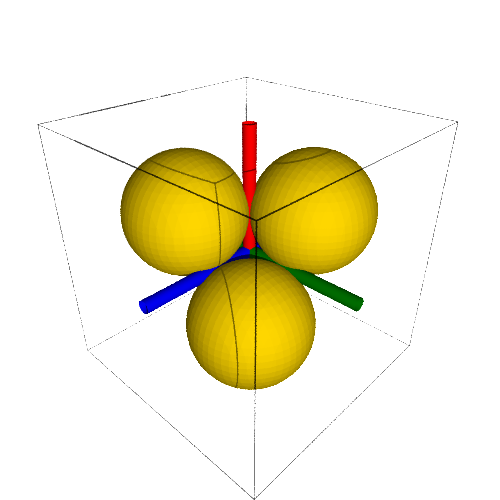

all lines tangent to four spheres
=================================

The problem is to find all lines that are tangent to four spheres.
In :numref:`figtangents4`,
the special case is shown where the four spheres are mutually
touching each other.  In this case, a tangent line goes from one pair
of touching spheres to another, opposite pair of touching spheres.

.. _figtangents4:

    Four mutually touching spheres and their common tangent lines.

Solving the polynomial system associated with the configuration
in :numref:`figtangents4` shows that each tangent line occurs
with multiplicity four.  Counting with multiplicities,
the number of tangent lines thus equals twelve.

four mutually touching spheres
------------------------------

The centers of the four mutually touching spheres in :numref:`figtangents4`
are :math:`(+1, +1, +1)`, :math:`(+1, -1, -1)`, :math:`(-1, +1, -1)`,
:math:`(-1, -1, +1)`, and the radius is the same for all 
four spheres: :math:`\sqrt{2}`.

The tangent lines are defined by a moment vector 
:math:`{\bf m} = (x_0, x_1, x_2)`
and a tangent vector :math:`{\bf t} = (x_3, x_4, x_5)`.
The moment vector :math:`\bf m` 
is perpendicular to the tangent vector :math:`\bf t`,
which gives the first equation: :math:`x_0 x_3 + x_1 x_4 + x_2 x_5 = 0`.
The tangent vector is normalized: :math:`||{\bf t}||_2 = 1`,
which gives the second equation :math:`x_3^2 + x_4^2 + x_5^2 = 1`.
For each center :math:`\bf c` and radius :math:`r` of a sphere,
the equation is

.. math::

   ({\bf m} - {\bf c} \times {\bf t})
   \cdot ({\bf m} - {\bf c} \times {\bf t}) - r^2 = 0,

where :math:`\times` is the cross product
and where :math:`\cdot` is the dot product
So we end up with a polynomial system of six equations in six unknowns.

The code in Sage to generate the polynomial system is below:

::

    x0, x1, x2 = var('x0, x1, x2')
    t = (x0, x1, x2) 
    vt = vector(t)   # tangent vector
    normt = vt.dot_product(vt) - 1
    x3, x4, x5 = var('x3, x4, x5')
    m = (x3, x4, x5)
    vm = vector(m)   # moment vector
    momt = vt.dot_product(vm)
    eqs = [normt, momt]
    for (ctr, rad) in zip(centers, radii):
        print 'the center :', ctr
        vc = vector(ctr)
        left = vm - vc.cross_product(vt)
        equ = left.dot_product(left) - rad**2
        eqs.append(equ)

Then the input system for the blackbox solver of phcpy is
the list of the string representations of the polynomials in ``eqs``.

::

    polsys = []
    for equ in eqs:
        pol = str(equ) + ';'
        polsys.append(pol)

Calling the blackbox solver then happens as

::

    from phcpy.solver import solve
    sols = solve(pols, silent=True)
    for sol in sols:
        print sol

and we see the multiplicity four solutions printed.

Lines are represented as :math:`{\bf m} = {\bf p} \times {\bf t}`,
where :math:`{\bf p}` is a point on the line.
The solutions of the polynomial system give values for the
components of the moment vector :math:`{\bf m} = (x_0, x_1, x_2)`
and the tangent vector :math:`{\bf t} = (x_3, x_4, x_5)`.
To draw the line defined by :math:`{\bf m}` and :math:`{\bf t}`
we need to compute the coordinates
of :math:`{\bf p} = (p_1, p_2, p_3)`
which can be done via the solution of a 3-by-3 linear system.
The equation :math:`{\bf m} = {\bf p} \times {\bf t}`
with the definition of the cross product and components:

.. math::
   {\bf m} =
   \left(
      \begin{array}{c}
         x_0 \\
          0  \\
          0 
      \end{array}
   \right) {\bf i}
   +
   \left(
      \begin{array}{c}
          0  \\
         x_1 \\
          0
      \end{array}
   \right) {\bf j}
   +
   \left(
      \begin{array}{c}
         0 \\
         0 \\
         x_2 
      \end{array}
   \right) {\bf k}, \quad
   {\bf p} \times {\bf t}
   =
   \left|
      \begin{array}{ccc}
         {\bf i} & {\bf j} & {\bf k} \\    
           p_1   &   p_2   &   p_3   \\
           x_3   &   x_4   &   x_5
      \end{array}
   \right|.

Expanding the cross product for :math:`{\bf p} \times {\bf t}`
and identifying its components with the components of :math:`{\bf m}`
gives the linear system

.. math::
   \left(
      \begin{array}{ccc}
         0 & x_5 & -x_4 \\
        -x_5 & 0 &  x_3 \\
         x_4 & -x_3 & 0
      \end{array}
   \right)
   \left(
      \begin{array}{c}
         p_1 \\ p_2 \\ p_3
      \end{array}
   \right)
   =
   \left(
      \begin{array}{c}
         x_0 \\ x_1 \\ x_2
      \end{array}
   \right)

in the unknown coordinates for the point :math:`{\bf p}`.

tangents lines of multiplicities two
------------------------------------

If the four spheres are centered at
:math:`(2, 2, 0)`,
:math:`(2, 0, 2)`, 
:math:`(0, 2, 2)`,
:math:`(0, 0, 0)`, and the radius of all four spheres 
is :math:`3/2`, then there are six lines tangents to
all four spheres, which are to be counted each with
multiplicity two, shown in :numref:`figtangents2`.

.. _figtangents2:

.. figure:: ./tangents2.png
    :align: center

    Six lines touching four spheres.

The reference for this case is the paper by Frank Sottile 
and Thorsten Theobald:
**Line problems in nonlinear computational geometry**,
published in *Computational Geometry - Twenty Years Later*, pages 411-432,
edited by J.E. Goodman, J. Pach, and R. Pollack, AMS, 2008.

The setup for the polynomial systems is identical to that
of the previous section.
