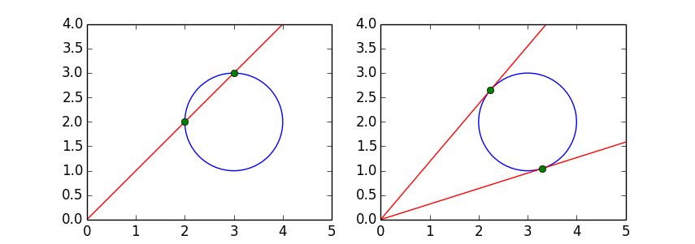

tangent lines to a circle
=========================

Given a fixed circle in the plane, compute the lines tangent to
the circle and passing through the origin.
In :numref:`figtouchcircle` we see a general line through the origin
and two lines touching the circle.

.. _figtouchcircle:

    A general line through a circle and two lines touching a circle.

The tangent lines are special: at the points where the lines touch
the circle, we have a double solution, a solution of multiplicity two.
One method is to consider the one parameter family of lines through
the origin and intersect this family with the polynomials which express
the singularity condition.

lines through the origin intersecting a circle
----------------------------------------------

The polynomials which express all lines through the origin
intersecting a fixed circle, fixed by its center and radius,
are returned by a function.

::

   def polynomials(a, b, r):
       """
       Returns string representations of two polynomials:
       1) a circle with radius r centered at (a, b);
       2) a line through the origin with slope s.
       """
       crc = '(x - %.15e)^2 + (y - %.15e)^2 - %.15e;' % (a, b, r**2)
       lin = 'y - s*x;'
       return [crc, lin]

There are two equations, one for the circle and one for the line.
The variables are two coordinates ``x``, ``y``, and the slope ``s``.
When given two equations in three variables we expect a one
dimensional solution set.  To represent this space curve,
we intersect the curve with a general hyperplane and compute
the points on the curve and on the hyperplane.

The code snippet below defines the problem for a circle
centered at ``(3, 2)`` with radius one.  The ``embed`` function
returns the original polynomials with one general hyperplane added
and also one slack variable.  
The blackbox solver computes the generic points.

::

   pols = polynomials(3, 2, 1)
   from phcpy.sets import embed
   from phcpy.solver import solve
   embpols = embed(3, 1, pols)
   embsols = solve(embpols)

The tuple ``(embpols, embsols)`` is a numerical representation for
the set of all lines through the origin intersecting a fixed circle.

As a sanity check, consider a point on the set of all lines as
in the left of :numref:`figtouchcircle`.
Such a point is for instance the line with slope one.
The coordinates for the intersection points,
as can be seen from :numref:`figtouchcircle` are ``(2, 2)`` and ``(3, 3)``.  
In the code below, the intersection point ``(2, 2)`` is joined with
the slope ``1`` in a solution string, called ``point``.

::

   from phcpy.solutions import make_solution
   point = make_solution(['x', 'y', 's'], [2, 2, 1])
   ismb = is_member(embpols, embsols, 1, point)

The call to ``is_member`` returns a boolean value,
so ``ismb`` should hold the value ``True`` for this point.

defining the equations for the singular locus
---------------------------------------------

The two tangent lines to the circle are two special solutions.
At any other line through the origin, the line intersects the
circle at two distinct complex solutions, but at the tangent lines,
the two intersection points collide into a double solution.
At a double solution, the Jacobian matrix of the system no longer
has full rank.  Instead of using the determinant of the matrix of
all first order partial derivatives, the equations we use express
that there is a nonzero combination of the columns of the Jacobian
matrix which yields the zero vector.

The equations for the singular locus are defined by the
function ``jacobian``.  For the circle centered at ``(3, 2)``,
the polynomial equations are obtained as follows:

::

    pols = jacobian(3, 2)
    for pol in pols:
        print pol

What is printed is

::

    2*(x-3.000000000000000e+00)*L1 + 2*(y-2.000000000000000e+00)*L2;
    -s*L1 + L2;
    (-0.94944388496-0.313936791907*i) +(0.253472461117-0.967342602936*i)*L1 \
    +(-0.209901989746-0.97772243234*i)*L2;

In the first equation we recognize the two partial derivatives
of :math:`(x-3)^2 + (y-2)^2`, multiplied with the multipliers
``L1`` and ``L2``.  The second equation is derived 
from :math:`y - s x = 0`.
If we have a nonzero combination of the columns of the Jacobian matrix
which yields the zero vector, then any nonzero multiple of the multipliers
also defines such a nonzero combination.
The last equation is a linear equation in the multipliers only,
requires that the multipliers are nonzero, and at the same time
fixing one combination among all nonzero multiples.

The definition of the function ``jacobian`` depends on another
function which returns a linear equation with random coefficients.

::

   def jacobian(a, b):
       """
       For the circle centered at (a, b),
       returns the equations which define the points
       where the Jacobian matrix is singular,
       as a random linear combination of the columns.
       Random complex coefficients are generated to
       scale the multiplier variables.
       """
       eq1 = '2*(x-%.15e)*L1 + 2*(y-%.15e)*L2;' % (a, b)
       eq2 = '-s*L1 + L2;'
       eq3 = random_hyperplane(['L1', 'L2'])
       return [eq1, eq2, eq3]

To avoid badly scaled coefficients, the complex numbers are generated
on the unit circle, but the function ``random_complex`` below.

::

   def random_complex():
       """
       Returns a random complex number on the unit circle.
       """
       from math import cos, sin, pi
       from random import uniform
       theta = uniform(0, 2*pi)
       return complex(cos(theta), sin(theta))

The imaginary unit in Python is represented by ``j``
whereas for phcpy, the imaginary unit is represented by ``i`` and ``I``.
Therefore, the function ``random_hyperplane`` replaces the ``j`` by ``i``.

::

   def random_hyperplane(vars):
       """
       Returns a linear equation in the variables in
       the list vars, with random complex coefficients.
       """
       cf0 = str(random_complex())
       tf0 = cf0.replace('j', '*i')
       result = tf0
       for var in vars:
           cff = str(random_complex())
           tcf = cff.replace('j', '*i')
           result = result + '+' + tcf + '*' + var
       return result + ';'

The function ``jacobian(3, 2)`` returned three equations in the
two coordinates ``x``, ``y``, the slope ``s``, 
the multipliers ``L1``, and ``L2``; five variables in total.
In five dimensional space, three equations define a two dimensional set.

For a numerical representation of this two dimensional set,
two random linear equations are added with the ``embed`` function
and the generic points are computed with the blackbox solver
as done in the code snippet below.

::

    from phcpy.sets import embed
    from phcpy.solver import solve
    embpols = embed(5, 2, pols)
    embsols = solve(embpols)

The number of generic points equals three.

intersecting two algebraic sets
-------------------------------

We have two algebraic sets:

1. The set of all lines through the origin intersecting a fixed circle.
   The degree of this set is four.

2. The set of all intersection points of a line through the origin
   and a fixed circle where the Jacobian matrix is singular.
   The degree of this set is three.

Before we can intersect the two algebraic sets, we have to ensure that
their ambient space is the same.  The first set involves only the
variables ``x``, ``y``, and ``s``, but not the multiplier variables
``L1`` and ``L2`` which occur in the second algebraic set.
Therefore, to each generic point in the first one dimensional set
we add two values for ``L1`` and ``L2`` and two corresponding linear
equations.  So, the one dimensional set is upgraded to a three
dimensional sets in the same five dimensional space in where the
second two dimensional set lives.  Because we can choose any values
for ``L1`` and ``L2`` in this upgrade of the first set, the dimension
of the first set increase from one to three.

Add two variable names ``L1`` and ``L2``, both with values one
and two slack variables ``zz2`` and ``zz3`` with zero values
is done by the function ``extend_solutions``.

::

   def extend_solutions(sols):
       """
       To each solution in sols, adds L1 and L2 with values 1,
       and zz2 and zz3 with values zero.
       """
       from phcpy.solutions import make_solution, coordinates
       result = []
       for sol in sols:
           (vars, vals) = coordinates(sol)
           vars = vars + ['L1', 'L2', 'zz2', 'zz3']
           vals = vals + [1, 1, 0, 0]
           extsol = make_solution(vars, vals)
           result.append(extsol)
       return result

The function is called in the function ``extend`` which upgrades
the first set from a one dimensional to a three dimensional set,
raising its ambient space from a 3-space to the 5-space where the
second set lives.

::

   def extend(pols, sols):
       """
       Extends the witness set with two free variables
       L1 and L2, addition two linear equations,
       and two slack variables zz2 and zz3.
       """
       vars = ['zz2', 'zz3']
       eq1 = 'zz2;'
       eq2 = 'zz3;'
       eq3 = 'L1 - 1;'
       eq4 = 'L2 - 1;'
       extpols = pols[:-1] + [eq1, eq2, eq3, eq4, pols[-1]]
       extsols = extend_solutions(sols)
       return (extpols, extsols)

Note that the order of the equations is important.
The linear equations that cut down the positive dimensional solutions
to isolated points must occur at the end of the list of polynomials.

Also the order of the variables matters.
To ensure that the names of the variables line up in the same order
for both lists of polynomials, the first polynomial for both sets is
prepended with the string ``x-x+y-y+s-s+L1-L1+L2-L2``.

The relevant code snippet to intersect two sets with diagonal homotopies
is shown below.

::

    from phcpy.diagonal import diagonal_solver as diagsolve
    result = diagsolve(dim, w1d, w1eqs, w1sols, w2d, w2eqs, w2sols)
    (eqs, sols) = result

The polynomials and the corresponding generic points
for the first set are in ``w1eqs`` and ``w1sols`` respectively,
for the second set they are in ``w2eqs`` and ``w2sols``.
The dimensions of the two sets are in ``w1d`` and ``w2d``
(which respectively equal three and two)
and the ambient dimension (five) is given in ``dim``.

The number of solutions in list ``sols`` returned by the diagonal solver
equals two, defining the two tangent lines shown at the right 
of :numref:`figtouchcircle`.

The complete script which computes this use case in in the ``examples``
folder in the ``Python/PHCpy2`` directory of the source code.
