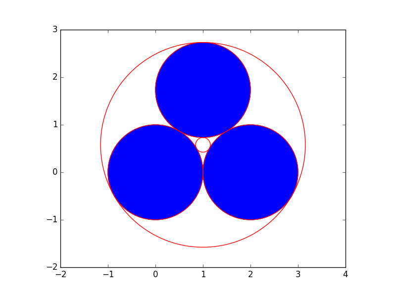
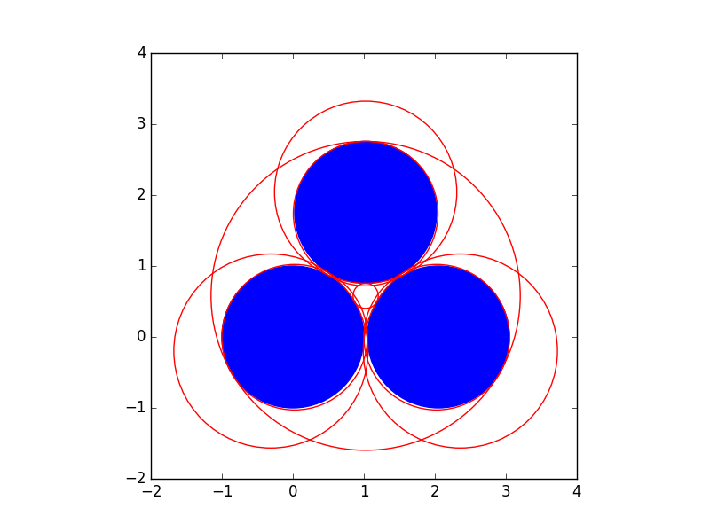

the circle problem of Apollonius
================================

The circle problem of Apollonius asks to find all circles tangent
to three given circles.  
In :numref:`figappolgeneral`,
the input circles are shown as blue disks and the eight circles
tangent to the three input circles are displayed in red.

.. _figappolgeneral:

.. figure:: ./appolfig1.png
    :align: center

    A general configuration of the circle problem of Apollonius.

This problem can be reformulated into that
of solving eight polynomial systems.  The number eight equals
the number of solutions to this problem.
This chapter presents a *use case* for phcpy.
The plots are generated with ``matplotlib``.

a general configuration
-----------------------

Without loss of generality, we may fix the first given circle on input
as the unit circle, centered at the origin and with radius one.
We may fix the coordinate system so that the center of the second given
circle on input lies on the first coordinate axis.  Then we have two
parameters for the second circle: its *x*-coordinate :math:`b_x` of 
the center and its radius :math:`r_2`.
The remaining three parameters of this problem are the
two coordinates of the third circle on input,
:math:`c_x` and :math:`c_y`, and its radius :math:`r_3`.

There are thus five parameters in the input of this problem:

1. :math:`b_x`: the *x*-coordinate of the center of the second circle,
2. :math:`r_2`: the radius of the second circle,
3. :math:`c_x`: the *x*-coordinate of the center of the third circle,
4. :math:`c_y`: the *y*-coordinate of the center of the third circle,
5. :math:`r_3`: the radius of the third circle.

The conditions on the coordinates *x* and *y* and the radius *r*
of the circles tangent to the three given circles are expressed
in the following three polynomial equations:

.. math::

   x^2 + y^2 - (r \pm 1)^2 = 0 \\
   (x - b_x)^2 + y^2 - (r \pm r_2)^2 = 0 \\
   (x - c_x)^2 + (y - c_y)^2 - (r \pm r_3)^2 = 0

where the :math:`\pm` indicates that the distance of the center of
the touching circle to a given circle is either the sum or the
difference of the radii of the circles.  Choosing one :math:`+`
or one :math:`-` for the :math:`\pm` in each equation gives one
polynomial system.  Making all combinations of the :math:`\pm`
gives eight polynomial systems to solve.  Of course, only those
real solutions with positive radius are valid solutions.
Polynomials are represented as strings as in the following function:

::

   def polynomials(c2x, r2, c3x, c3y, r3):
       """
       On input are the five parameters of the circle problem of Apollonius:
       c2x : the x-coordinate of the center of the second circle,
       r2 : the radius of the second circle,
       c3x : the x-coordinate of the center of the third circle,
       c3y : the y-coordinate of the center of the third circle,
       r3 : the radius of the third circle.
       Returns a list of lists.  Each list contains a polynomial system.
       Solutions to each polynomial system define center (x, y) and radius r
       of a circle touching three given circles.
       """
       e1m = 'x^2 + y^2 - (r-1)^2;'
       e1p = 'x^2 + y^2 - (r+1)^2;'
       e2m = '(x-%.15f)^2 + y^2 - (r-%.15f)^2;' % (c2x, r2)
       e2p = '(x-%.15f)^2 + y^2 - (r+%.15f)^2;' % (c2x, r2)
       e3m = '(x-%.15f)^2 + (y-%.15f)^2 - (r-%.15f)^2;' % (c3x, c3y, r3)
       e3p = '(x-%.15f)^2 + (y-%.15f)^2 - (r+%.15f)^2;' % (c3x, c3y, r3)
       eqs0 = [e1m,e2m,e3m]
       eqs1 = [e1m,e2m,e3p]
       eqs2 = [e1m,e2p,e3m]
       eqs3 = [e1m,e2p,e3p]
       eqs4 = [e1p,e2m,e3m]
       eqs5 = [e1p,e2m,e3p]
       eqs6 = [e1p,e2p,e3m]
       eqs7 = [e1p,e2p,e3p]
       return [eqs0,eqs1,eqs2,eqs3,eqs4,eqs5,eqs6,eqs7]

The blackbox solver is a numerical solver.  The input coefficients
are cast into double floats with 15 decimal places of precision.
The following function takes on input the list of polynomial systems
and solves the systems.  The valid solutions are extracted and returned.

::

   def solve4circles(syst, verbose=True):
       """
       Given in syst is a list of polynomial systems.
       Returns a list of tuples.  Each tuple in the list of return
       consists of the coordinates of the center and the radius of
       a circle touching the three given circles.
       """
       from phcpy.solver import solve
       from phcpy.solutions import strsol2dict, is_real
       (circle, eqscnt) = (0, 0)
       result = []
       for eqs in syst:
           eqscnt = eqscnt + 1
           if verbose:
               print('solving system', eqscnt, ':')
               for pol in eqs:
                   print(pol)
           sols = solve(eqs, verbose=False)
           if verbose:
               print('system', eqscnt, 'has', len(sols), 'solutions')
           for sol in sols:
               if is_real(sol, 1.0e-8):
                   soldic = strsol2dict(sol)
                   if soldic['r'].real > 0:
                       circle = circle + 1
                       ctr = (soldic['x'].real, soldic['y'].real)
                       rad = soldic['r'].real
                       result.append((ctr, rad))
                       if verbose:
                           print('solution circle', circle)
                           print('center =', ctr)
                           print('radius =', rad)
       return result

The code for the function ``solve4circles`` has two important statements:

1. ``sols = solve(eqs, verbose=False)`` calls the blackbox solver; and

2. ``soldic = strsol2dict(sol)`` converts a solution string ``sol``
   into the dictionary ``soldic``.

The ``solve`` takes on input a list of strings.  Each string represents
a polynomial in several variables.  What is returned by ``solve`` is
a list of string representations of solutions.  
The function ``strsol2dict`` takes on input a string representation
of a solution and returns a dictionary.  The keys contain the names
of the variables and the corresponding values are complex numbers,
with the coordinates of the solution.

Solving then a general configuration of three circles with centers
at :math:`(0, 0)`, :math:`(2, 0)`, :math:`(1, 1)`, with corresponding
radii :math:`1`, :math:`2/3`, and :math:`1/3` happens by two function calls:

::

    syst = polynomials(2, 2.0/3, 1, 1, 1.0/3)
    sols = solve4circles(syst)

a special configuration
-----------------------

A special configuration of the input circles is when they
mutually touch each other, as shown in :numref:`figappolspecial`.

.. _figappolspecial:

    A special configuration of the circle problem of Apollonius.

The five input parameters for this special configuration are
listed in the tuple :math:`(2, 1, 1, \sqrt{3}, 1)`.
The radius of each circle equals one.  The second circle has
its center at :math:`(2, 0)` and the center for the third circle
is at :math:`(1, \sqrt{3})`.

In this special configuration we see only five red circles,
three of which are equal to the given circles.
The three given circles count as double solutions to the problem.

We can see the multiplicity of the solutions with the following
session in an interactive Python shell:

::

   from math import sqrt
   h = sqrt(3)
   p = polynomials(2, 1, 1, h, 1)
   sols = solve(p[3], verbose=False)
   print(sols[0])

In what is printed, we recognize the first input circle:

::

   t :  1.00000000000000E+00   3.32383584047048E+00
   m : 2
   the solution for t :
    x :  1.14316415930020E-16   1.64667010245109E-32
    y : -7.69185074553423E-17   1.14303942199382E-31
    r :  1.00000000000000E+00  -6.42297636453143E-32
   == err :  3.298E-16 = rco :  1.004E-17 = res :  2.625E-17 =

Observe the ``m : 2`` which indicates the multiplicity of the solution.

a perturbed configuration
-------------------------

To see why we have to count some solutions of the special
configuration twice, consider :numref:`figappolperturbed`.

.. _figappolperturbed:

    A perturbed configuration of the circle problem of Apollonius.

The five input parameters for this perturbed problem are
listed in the tuple :math:`(2.05, 1, 1.025, \sqrt{3} + 0.025, 1)`.
Each circle still has radius one, but the input circles no longer
touch each other.

In an interactive Python shell, we may compute the solutions
as follows:

::

   from math import sqrt
   h = sqrt(3)
   p = polynomials(2.05, 1, 1.025, h+0.025, 1)
   sols = solve(p[3], verbose=False)
   print(sols[0])

What is printed defines the large perturbation of the unit circle:

::

   t :  1.00000000000000E+00   5.00522372103966E+00
   m : 1
   the solution for t :
    x : -3.09008334843067E-01  -2.43642416382302E-114
    y : -1.98660887619915E-01  -1.37048859215045E-114
    r :  1.36735854321414E+00   2.43642416382302E-114
   == err :  3.322E-16 = rco :  5.942E-03 = res :  1.388E-15 =

The script ``appolonius.py`` in the source code distribution in
the ``examples`` folder of ``PHCpy2`` or ``PHCpy3`` is a self contained
script which solves the three instances of the problem of Apollonius.
