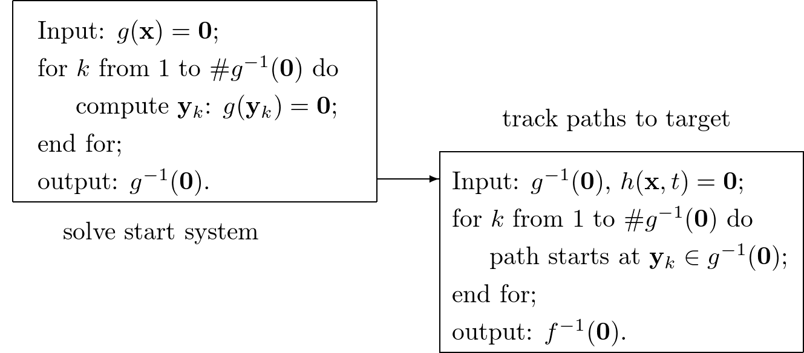
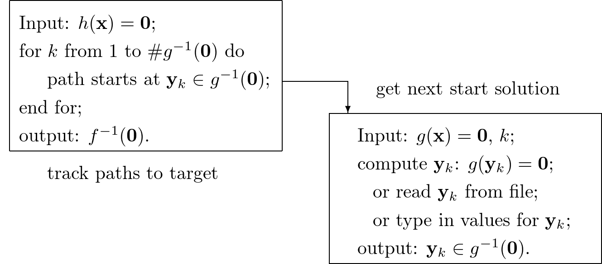
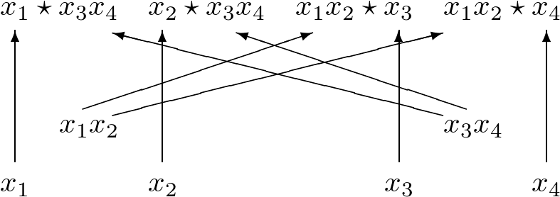
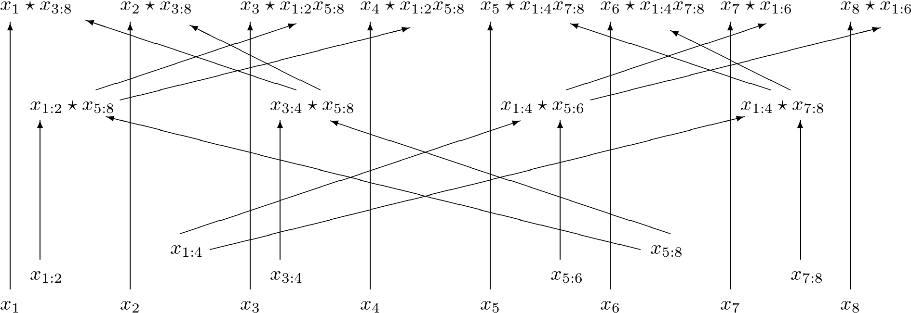

.. PHCpack documentation master file, created by
   sphinx-quickstart on Sun Jan 27 13:05:16 2013.
   You can adapt this file completely to your liking, but it should at least
   contain the root `toctree` directive.

****************
Reference Manual
****************

The code is written in the following languages:
Ada, C, C++, NVIDIA CUDA, Python, and most recently Julia.
The following description documents the organization and
design decisions which led to the current state of the code.

The main executable ``phc`` compiles on Linux, MacOS X,
and Windows computers.  Shared memory parallelism works
on all three operating systems.
The message passing with MPI has not been tested on Windows.
The development of the accelerator code with NVIDIA CUDA 
was done on Linux computers and gaming laptops running Windows.

The Python code was developed and tested on Linux and MacOS X,
not on Windows.

The Test Procedures
===================

A dynamic manner to experience the structure of the source code
is to run through all test procecures.  There over three hundred
test programs which can be built typing with the ``.gpr`` files
in the folders.

For example, typing

::

   gprbuild deformations.gpr

at the command prompt in the ``Deformations`` folder
builds all test procedures in this folder.
The tests are organized along the source code directories.
Every directory in the source code hierarchy has its own test
procedures which focus on the particular functionality coded
in that directory.  To test the mathematical library, running
``gprbuild math_lib`` invokes ten other gprbuilds, one for each
subdirectory of the mathematical library.

Organization of the Ada code
============================

The code in the first release was written in Ada 83.
Release 2 featured a new mathematical library,
rebuilt using Ada 95 concepts and offering multi-precision arithmetic.

There are four major layers in the code:

1. ``Math_Lib``: linear algebra, representations of polynomials,
   Newton polytopes, and power series;

2. ``Deformations``: Newton's method, path trackers, end games, 
   solutions and homotopies, deflation;

3. ``Root_Counts``: root counting methods and constructions of homotopies,
   linear-product start start systems based on Bézout bounds,
   mixed volumes and polyhedral homotopies;

4. ``Components``: witness sets, cascades of homotopies, monodromy, 
   diagonal homotopies, to compute a numerical irreducible decomposition.

There are five other parts, called ``System``, ``Schubert``, ``CtoPHC``,
``PHCtoC``, and ``Tasking``.  The top down perspective starts at the
folder ``Main``.

The Ada sources are organized in a tree of directories:

::

 Ada                       : Ada source code of PHC
  |-- System               : 0. OS dependencies, e.g.: timing package
  |-- Math_Lib             : 1. general mathematical library
  |      |-- Numbers       : 1.1. number representations
  |      |-- QD            : 1.2. multiple double arithmetic
  |      |-- Vectors       : 1.3. vectors and vectors of vectors
  |      |-- Matrices      : 1.4. matrices and linear-system solvers
  |      |-- Divisors      : 1.5. common divisors, integer linear algebra
  |      |-- Reduction     : 1.6. row reduction, numerical linear algebra
  |      |-- Polynomials   : 1.7. multivariate polynomial systems
  |      |-- Functions     : 1.8. evaluation and differentiation
  |      |-- Supports      : 1.9. support sets and linear programming
  |      |-- Circuits      : 1.A. circuits for algorithmic differentation
  |      |-- Series        : 1.B. manipulating truncated series
  |      |-- Laurent       : 1.C. series with integer leading exponents
  |      |-- AD            : 1.D. algorithmic differentiation of Path library
  |-- Deformations         : 2. homotopies, Newton's method & path trackers
  |      |-- Solutions     : 2.1. solutions of systems and homotopies
  |      |-- Homotopy      : 2.2. homotopies, scaling and reduction
  |      |-- Newton        : 2.3. root refining and modified Newton's method
  |      |-- Curves        : 2.4. univariate solving & plane algebraic curves
  |      |-- End_Games     : 2.5. extrapolation end games with Puiseux series
  |      |-- Trackers      : 2.6. path-tracking routines
  |      |-- Sweep         : 2.7. sweeping for singularities
  |      |-- Continuation  : 2.8. drivers and data management
  |-- Root_Counts          : 3. root counts and homotopy construction
  |      |-- Product       : 3.1. linear-product start systems
  |      |-- Binomials     : 3.2. solvers for binomial and simplicial systems
  |      |-- Implift       : 3.3. implicit lifting
  |      |-- Stalift       : 3.4. static lifting
  |      |-- Dynlift       : 3.5. dynamic lifting
  |      |-- Symmetry      : 3.6. exploitation of symmetry relations
  |      |-- MixedVol      : 3.7. translation of ACM TOMS Algorithm 846
  |      |-- DEMiCs        : 3.8. interface to the DEMiCs program
  |      |-- Puiseux       : 3.9. Puiseux series for curves
  |-- Schubert             : 4. numerical Schubert calculus
  |      |-- SAGBI         : 4.1. SAGBI homotopies
  |      |-- Pieri         : 4.2. deformations based on Pieri's rule
  |      |-- Induction     : 4.3. Schubert induction
  |-- Components           : 5. numerical irreducible decomposition
  |      |-- Samplers      : 5.1. computing witness points
  |      |-- Interpolators : 5.2. finding equations for components
  |      |-- Factorization : 5.3. factorization into irreducible components
  |      |-- Decomposition : 5.4. sequence of homotopies to filter and factor
  |      |-- Solver        : 5.5. incremental equation by equation solver
  |      |-- Tropical      : 5.6. tropical view on witness sets
  |-- CtoPHC               : 6. interface from C to phc
  |      |-- Types         : 6.1. C types equivalent to Ada
  |      |-- Structures    : 6.2. system and solution wrappers
  |      |-- Funky         : 6.3. functional interface, C -> Ada -> C 
  |      |-- State         : 6.4. state machine gateway, C <-> Ada
  |-- PHCtoC               : 7. GPU acceleration via a C interface
  |-- Tasking              : 8. multitasking
  |-- Main                 : 9. the main programs

Every directory contains a collection of test procedures.
The following sections describe the functionality defined
in each of the directories.
Then the subdirectories are described in separate sections.

System: OS Dependencies such as Timing
--------------------------------------

The ``System`` directory defines operations that may have different
definitions on different operation systems.  One such operation is
to compute the elapsed CPU time of a computation.
The timer for Ada on Unix like operation systems was originally
developed by Dave Emory of the MITRE corporation.
Not everything in this timing package could be mapped to Windows,
in particular the resource usage report for Unix.
While the interface of the timing package is the same for all operating
systems, the implementation differs for Windows

When multithreaded runs on multicore processors, the elapsed CPU time
is most often not a good time measurement and one comes interested in
the wall clock time.  The end of the output contains the start and end
date of the computation.  With the ``Ada.Calendar``, the time stamping
is defined in a portable, operating system independent manner.

The directory system contains several very useful utilities,
such as procedures to prompt the user for a yes or no answer,
or for a selection between various alternatives.
While restricting the user selection, the prompting procedures
allow to retry in case of type errors.
Similar user friendly guards are defined when the user gives
the name of an existing file for output.  Before overwriting
the existing file, the user is prompted to confirm.
When reading a file, the user is allowed to retry in case the
given name of the file does not match an existing file.

The handling of the command line options is also defined in this
directory.  Thanks to the ``Ada.Command_Line``, this definition
is operating system independent.

The package ``machines`` wraps some system calls.
One such system call is to get the process identification number (pid).
This pid is used to seed the random number generators.

The Mathematical Library
------------------------

The mathematical library defines code that is not specific
to polynomial homotopy continuation, but nevertheless necessary.
To make PHCpack self contained, the code does not require the
installation of outside libraries.  Although there are eleven
subdirectories, there are three main parts:

1. number representations, general multiprecision and quad doubles;

2. linear algebra with integers and floating-point numbers;

3. polynomials, polynomial functions, series, and Newton polytopes.

The input to a polynomial system solver is a list of polynomials in
several variables.  This input consists of exact data, such as the
integer exponents in the monomials, and approximate data, such as
the floating-point coefficients of the monomials.
Solving a polynomial system with homotopy continuation is therefore
always a hybrid computation, involving exact and approximate data.
While the machine arithmetic may still suffice for many applications,
the increasing available computational power has led to the formulation
of large problems for which software defined multiprecision arithmetic
is required.  The linear algebra operations are defined over exact
number rings and over arbitrary precision floating-point numbers.

The next subsections contain more detailed descriptions of each
subdirectory of the mathematical library.
The following three paragraphs briefly summarize the eleven 
subdirectories in the three main parts.

The number representations are defined in the subdirectory ``Numbers``
and the QD library of Y. Hida, X. S. Li, and D. H. Bailey is integrated
in the subdirectory ``QD``.  Code generated by the CAMPARY software of
M. Joldes, J.-M. Muller, V. Popescu, and W. Tucker support triple,
penta, octo, deca, and hexa double arithmetic.

The linear algebra data structures are defined in the subdirectories
``Vectors`` and ``Matrices``.  The ``Divisors`` subdirectory relies
on the greatest common divisor algorithm to define the Hermite and
Smith normal forms to solve linear systems over the integer numbers.
The linear system solvers of numerical linear algebra are provided
in the subdirectory ``Reduction``.

The third main part of the mathematical library consists in the
remaining five of the eleven subdirectories.  Multivariate polynomials
over various number rings in the subdirectory ``Polynomials``.
The subdirectory ``Functions`` contains definitions of 
nested Horner schemes to efficiently evaluate dense polynomials.
The support of a polynomial is the set of exponents of the monomials
which appear with nonzero coefficients.  Basic linear programming
and tools to work with polytopes are provided in the subdirectory
``Supports``.  The subdirectory ``Circuits`` defines arithmetic
circuits to evaluate and differentiate polynomials via the reverse
mode of algorithmic differentiation.  A better algorithmic differentiation
library is in the subdirectory ``AD``, modeled after the Path library
of Xiangcheng Yu.  Truncated power series define
a field (that is: dividing two series gives again a series)
and the arithmetic to manipulate power series is exported by the
packages in the subdirectory ``Series``.

Deforming Polynomial Systems
----------------------------

A homotopy is a family of polynomial systems defined by one parameter.
The parameter may be introduced in an artificial manner, such as
the parameter :math:`t` in the classical homotopy

.. math::

   h({\bf x}, t) = (1 - t) g({\bf x}) + t f({\bf x}) = {\bf 0}.

The homotopy :math:`h({\bf x}, t)` connects the system
:math:`g({\bf x}) = {\bf 0}` (the so-called *start system*) to the system
:math:`f({\bf x}) = {\bf 0}` (the so-called *target system*),
as :math:`h({\bf x}, 0) = g({\bf x})`
and :math:`h({\bf x}, 1) = f({\bf x})`.
The solutions :math:`{\bf x}(t)` to the homotopy are solution paths,
starting at :math:`t=0` at the solutions of the start system
and ended at :math:`t=1` at the solutions of the target system.

The code was developed mainly for constructing artificial-parameter
homotopies, but there is some still limited support for polynomial
homotopies with natural parameters.  Artificial-parameter homotopies
can be constructed so that singular solutions occur only at the end
of the paths.  For natural-parameter homotopies, the detection and
accurate computation of singularities along the paths becomes an
important topic.

There are eight subdirectories in the ``Deformations`` directory.
The subdirectories ``Solutions`` and ``Homotopies`` provide the
data structures for the solutions on the paths defined by the
polynomial homotopies.  Newton's method and deflation are implemented
in the subdirectory ``Newton``. In ``Curves`` are the extrapolation
methods for the predictors in the path trackers.  Extrapolation for
winding numbers is coded in the subdirectory ``End_Games``.
Path trackers for artificial-parameter homotopies are available
in the ``Trackers`` subdirectory.  In ``Sweep`` arc length parameter
continuation is implemented for sweeping solution paths for singularities.
Finally, the subdirectory ``Continuation`` contains the data management
and driver procedures.

Observe that in the layered organization of the source code,
the ``Deformations`` directory is placed before the ``Root_Counts``
directory, where the start systems are defined.  This organization
implies that the path trackers are written independently from the
constructors for the polynomial homotopies.

Homotopy Construction via Root Counting Methods
-----------------------------------------------

At first, it seems counter intuitive to construct a polynomial homotopy
to solve an unknown system by counting its roots.
But consider the degeneration of two planar quadrics into lines.
Each quadric degenerates to a pair of lines.  How many solutions
could we get intersection two pairs of lines in general position?
Indeed, four, computed as two by two.  Observe that in this simple
argument we have no information about the particular representation
of the quadrics.  To get to this root count, we assumed only that
the lines after degeneration were generic enough and the count
involved only the degrees of the polynomials.

Of critical importance for the performance of a polynomial homotopy
is the accuracy of the root count.  If the root count is a too large
upper bound for the number of solutions of the system that will be
solved, then too many solution paths will diverge to infinity,
representing a very wasteful computation.

We can construct homotopies based on the degree information alone
or rely on the Newton polytopes.
Sparse polynomial systems are systems where relatively few monomials
appear with nonzero coefficient, relative to the degrees of the
polynomials in the system.  
For sparse system, the information of the Newton polytopes provides
a much sharper root count than the ones provided by the degrees.

There are nine subdirecties in the ``Root_Counts`` directory.
Total degree and linear-product start systems are constructed
in the subdirectory ``Product``.  The subdirectory ``Binomials``
provides solvers for the sparsest polynomial systems.
The subdirectories ``Implift``, ``Stalift``, and ``Dynlift``
implement polyhedral homotopies, respectively with implicit,
static, and dynamic lifting methods.  In ``MixedVol`` is an
adaptation of a fast mixed volume calculator.
The code in the folder ``DEMiCs`` applies dynamic enumeration 
to compute mixed cells.
Code to exploit permutation symmetry is in the subdirectory ``Symmetry``.
A generalization of the Newton-Puiseux algorithm is implemented in
the subdirectory ``Puiseux``.

Numerical Schubert Calculus
---------------------------

The classical problem in Schubert calculus asks for the number
of lines which meet four given general lines in 3-space.
With polynomial homotopies, we not only count, but also compute
the actual number of solutions to a Schubert problem.

The problem of four lines is a special case of a Pieri problem:
compute all *p*-planes which meet :math:`m \times p` given *m*-planes 
in a space of dimension :math:`m + p`.  If the given *m*-planes are 
sufficiently generic, then all solution *p*-planes are isolated and
finite in number.  Pieri homotopies solve the output pole placement
problem in linear systems control.

There are three subdirectories to the ``Schubert`` directory,
each exporting a different type of homotopy to solve Schubert problems.
The subdirectory ``SAGBI`` applies the concept of
subalgebra analog to Groebner basis for ideals
with polyhedral homotopies to solve Pieri problems.
Pieri homotopies are defined in the subdirectory ``Pieri``.
The subdirectory ``Induction`` implements a geometric
Littlewood-Richardson rule to solve general Schubert problems.

Numerical Irreducible Decomposition
-----------------------------------

Two important characteristics of a pure dimensional solution set of 
a polynomial system are its dimension and its degree.
The dimension of a solution set equals the number of general linear equations
we need to add to the polynomial system so the intersection of the solution
set of the system with the hyperplanes consists of isolated points.
The degree of a solution set then equals the number of isolated points
we find after intersecting the solution set with as many general hyperplanes
as the dimension of the set.
These two characteristics are encoded in the *witness set*
representation of a pure dimensional solution set.
Given a polynomial system, a numerical irreducible decomposition
of its solution set provides a witness set for each irreducible
components, over all dimensions.

The decomposition can be computed in a top down fashion,
with cascades of homotopies, starting a the top dimension.
The bottom up computation applies diagonal homotopies.
Systems can be solved equation-by-equation or subsystem-by-subsystem.

Three types of factorization methods are implemented.
Interpolation with multivariate polynomials of increasing degrees 
is a local procedure.  The second method runs monodromy loops to
connect generic points on the same irreducible component,
using the linear trace test as stop criterion.  
Thirdly, we can apply the linear trace test combinatorially,
which often works very well for components of modest degrees.

The are six subdirectories of the ``Components`` directory.
The ``Samplers`` subdirectory contains the definitions of the data
structures to store witness sets.  The multivariate interpolation
algorithms are implemented in the ``Interpolators`` subdirectory.
The subdirectory ``Factorization`` provides monodromy factorization
and the linear trace test.  Cascades of homotopies and diagonal
homotopies are implemented in the subdirectory ``Decomposition``.
The ``Solver`` subdirectory provides an equation-by-equation solver.
Finally, the ``Tropical`` subdirectory offers code to generalize 
the polyhedral homotopies from isolated solutions to the computation
of representations of positive dimensional solution sets.

Calling Ada Code From C
-----------------------

The directory ``CtoPHC`` has two subdirectories, ``Funky`` and ``State``,
which define two different types of interfacing the Ada code with C.
The first type is a functional interface, the second type is an interface
which operates as a state machine.
The first folder ``Types`` in ``CtoPHC`` defines the equivalenties
between the basic array types in C and in Ada.

In a functional interface, the main C program calls an Ada function,
which then calls a C function to process the results computed by the
Ada function.  This interface was developed for the application of
the Pieri homotopies to compute output feedback laws for linear systems
control.  This type of interface is direct and efficient.
Its main application is in the ``Feedback`` folder which defines C
functions to compute realizations of the computed feedback laws.

The goal of the state interface in the subdirectory ``State`` is to
export all functionality of the Ada code to the C (and C++) programmer.
The subdirectory ``State`` contains the definition of the
``use_c2phc`` function, which defines more than 700 jobs.
The implementation of this function relies on various container
packages which hold the persistent objects, mainly polynomial systems
and solution lists.  Those container types are defined in the folder
``Structures`` intended to give the C programming access to the main
data structures.

If the main program is not an Ada procedure, but a C function,
then ``adainit`` and ``adafinal`` must be called by the C code,
respectively at the beginning and at the end of the computations.
The code for ``adainit`` is generated by the binder, by ``gnatbind``,
which is executed before the linking.  If the linking happens with
the linker of the gnu-ada compiler, the ``gnatlink`` (as is the default),
then ``gnatlink`` compiles the output of ``gnatbind``.
Otherwise, if the linking is done by another C compiler,
we must explicitly compile the output of the binder,
so the object code for the ``adainit`` can be linked as well.
These observations are important in building a shared object
with statically compiled Ada code.  The shared object can then
be used on systems where the gnu-ada compiler is not installed.
The ``makefile_unix`` in the ``Objects`` directory contains the
precise compilation instructions for Linux systems.

Calling C Code From Ada
-----------------------

The directory ``PHCtoC`` was set up to call the GPU code via a C interface.
In its current state it defines the wrappers to call the accelerated
path trackers with algorithmic differentiation.
Its main goal is to define the extension modules for calling the
accelerated path trackers from the Python package phcpy.

As a startup, to test the feasibility, the directory contains test code
to compute the norm of a vector of numbers by C code.

::

    function normC ( n : integer32;        -- n is the dimension
                     x : C_Double_Array;   -- contains 2*n doubles
                     y : C_Double_Array )  -- on return is y(0) 
                   return integer32;
    pragma import(C, normC, "cpu2norm_d_in_c");

The function ``normC`` can be used as an Ada function.
The connection with C is defined by the ``pragma import``
where ``cpu2norm_d_in_c`` is the name of the file which
contains the definition of the C code of the C function.
The type ``C_Double_Array`` is defined in the ``State`` subdirectory
of the ``CtoPHC`` directory.

Multitasking
------------

The Ada tasking mechanisms allows to define shared memory parallel
programs at a high level.  Tasks in Ada are mapped to kernel threads.
There are two main applications defined in the ``Tasking`` directory.

Given a queue of path tracking jobs, the tasks are arranged in
a work crew model to execute all jobs.  Dynamic load balancing
is achieved as tasks, when done with their current job, grab the
next job from the queue.  Synchronization overhead is minimal,
as only the movement of the current pointer in the job queue
happens in a critical section.
This parallel work crew path tracking scheme is implemented for
regular homotopies and polyhedral homotopies.

Another application of multitasking is pipelining.
Polyhedral homotopies start at initial form systems computed by
the mixed cells.  For large polynomial systems, the computation
of the mixed volume could be a bottleneck for the parallel execution.
A pipelined multitasked implementation of the polyhedral homotopies
combines the tracking of all paths with the mixed cell computation
as follows.  One task computes the mixed cells and appends the
mixed cells to the job queue.  Other tasks take the mixed cells
as the jobs to solve the random coefficient system.
As soon as one mixed cells is available in the queue,
the path tracking can start.

The Main Program
----------------

The directory ``Main`` contains the main program,
called ``dispatch`` because its main function is to dispatch
the options given at the command line to the specific procedures.

The code for the blackbox solver (invoked by ``phc -b``)
is defined by the packages ``black_box_solvers``
and ``black_box_root_counters``.

A very specific solver is defined by the file ``use_phc.adb``,
mainly as an example how the code could be customized for one
particular application.  The code is below:

::

   with text_io;                            use text_io;
   with Standard_Natural_Numbers;           use Standard_Natural_Numbers;
   with Standard_Complex_Poly_Systems;      use Standard_Complex_Poly_Systems;
   with Standard_Complex_Poly_Systems_io;   use Standard_Complex_Poly_Systems_io;
   with Standard_Complex_Solutions;         use Standard_Complex_Solutions;
   with PHCpack;

   procedure use_phc is

     infile,outfile : file_type;        -- input and output file
     p,q : Link_to_Poly_Sys;            -- target and start system
     mixed_volume : natural32;          -- root count is mixed volume
     sols : Solution_List;              -- list of solutions
   
   begin
     Open(infile,in_file,"test.in");
     get(infile,p);
     Create(outfile,out_file,"test.out");
     put(outfile,p.all);
     q := new Poly_Sys(p'range);
     PHCpack.Static_Lifting(outfile,p.all,mixed_volume,q.all,sols);
     PHCpack.Artificial_Parameter_Continuation(outfile,p.all,q.all,sols);
     PHCpack.Refine_Roots(outfile,p.all,sols);
   end use_phc;

A more typical application calls the blackbox solver,
as done in the procedure ``blackbox.adb`` (from the ``manual`` folder),
listed below:

::

   with text_io;                            use text_io;
   with Standard_Natural_Numbers;           use Standard_Natural_Numbers;
   with Standard_Natural_Numbers_io;        use Standard_Natural_Numbers_io;
   with Greeting_Banners;
   with Standard_Complex_Laur_Systems;
   with Standard_Complex_Laur_Systems_io;
   with Standard_Complex_Laur_Strings;
   with Standard_Complex_Solutions;
   with Standard_Complex_Solutions_io;
   with Black_Box_Solvers;

   procedure blackbox is

   -- DESCRIPTION :
   --   Illustrates a basic application of the blackbox solver,
   --   on a Laurent polynomial system.

     procedure Main is
   
     -- DESCRIPTION :
     --   Solves a Laurent polynomial system given as a string.

       s : constant string := "x*y + 2*x + 3; x^2 + y^(-2) + 4;";
       p : constant Standard_Complex_Laur_Systems.Laur_Sys
         := Standard_Complex_Laur_Strings.Parse(2,2,s);
       silent : constant boolean := false;
       rc : natural32;
       sols : Standard_Complex_Solutions.Solution_List;

     begin
       put_line(Greeting_Banners.welcome);
       put_line("An example polynomial system :");
       Standard_Complex_Laur_Systems_io.put(p);
       Black_Box_Solvers.Solve(p, silent, rc, sols);
       put("The root count : "); put(rc,1); new_line;
       put_line("The solutions :");
       Standard_Complex_Solutions_io.write(standard_output,sols);
     end Main;

   begin
     Main;
   end blackbox;

The program confirms the polynomial system,
displays the mixed volume as the root count
and then lists all four solutions of the system.

Numbers, Linear Algebra, Polynomials and Polytopes
==================================================

In this section we take a closer look at the ``Math_Lib`` directory,
which defines the basic mathematical data structures and operations.

Numbers
-------

The machine numbers are divided in two categories: integer and float.
For the integer types, we distinguish between the 32-bit and 64-bit
versions, between natural and integer numbers.  The following types are
defined: ``natural32``, ``natural64``, ``integer32``, and ``integer64``.
For the float types, we have single precision and double precision,
defined respectively as ``single_float`` and ``double_float``.
The renaming of the hardware number types ensures the independence
of pre-defined number types.

For polynomial system solving, our default field is the field of
complex numbers.  The real and imaginary part of a complex number
are floating-point coefficients.  The homotopy algorithms depend
on the choice of random constants.  Random number generators are
defined.  The default seed for the random number generators is the
process identification number.  For reproducible runs, the user can
set the seed to a fixed number.

Multiprecision numbers are implemented as arrays of machine integers.
Elementary school algorithms defined the arithmetic.
The implementation of the floating-point multiprecision numbers
is directly based on the multiprecision integer numbers,
for the fraction and the exponent part of the multiprecision float.
The precision of each multiprecision number can be adjusted when needed,
which is an advantage.  Mixed-precision arithmetical operations are
supported.  The disadvantage imposed by this flexibility is the
frequent memory allocation and deallocation, which makes this type of
arbitrary multiprecision arithmetic unsuitable for shared memory parallelism.

The directory ``Numbers`` contains definitions of abstract rings, domains,
and fields.  These abstract classes are useful to define composite
generic types.  Multiprecision complex numbers are defined via the
instantiation of a generic complex numbers package.

Multiple Double Arithmetic
--------------------------

The directory ``QD`` provides 
the :index:`double double` and :index:`quad double` arithmetic,
based on the QDlib package of Y. Hida, X. S. Li, and D. H. Bailey.

Compared to arbitrary multiprecision arithmetic, double double and quad
double numbers exploit the floating-point hardware and have a simple
memory management.  While arbitrary multiprecision numbers are allocated
via the heap, the two doubles of a double double and the four doubles
of a quad double use the stack.  Thus the QD library is very well suited
for shared memory parallelism.  Another advantage is the predictable
cost overhead.  Working with double doubles has a similar cost overhead
as working with complex numbers.  Computations with double doubles are about
five to eight times slower compared to computations in double precision.
With quad doubles, computations that took seconds in double precision
can turn into minutes.

The code in QDlib was hand translated into Ada.
The directory contains the original C versions for comparison
and verification of correctness.

Code generated by the ``CAMPARY`` software of
M. Joldes, J.-M. Muller, V. Popescu, and W. Tucker support triple,
penta, octo, deca, and :index:`hexa double` arithmetic.
The output of running the test program `ts_errfree` is below:

::

   Computing the 2-norm of a vector of dimension 64
   of random complex numbers on the unit circle equals 8.
   Observe the second double of the multiple double 2-norm.

   double double : 8.00000000000000E+00 - 5.50815964094749E-32
   triple double : 8.00000000000000E+00 - 5.98699295060652E-49
     quad double : 8.00000000000000E+00 + 2.68546525309769E-65
    penta double : 8.00000000000000E+00 + 2.50428676727620E-81
     octo double : 8.00000000000000E+00 - 6.27215893652071E-129
     deca double : 8.00000000000000E+00 - 3.92388008492169E-161
     hexa double : 8.00000000000000E+00 - 1.17947092065881E-257

When the result can be represented exactly by a double
(as is the case of ``8``), then the second double in the result 
represents the error of the calculation, which for the example above
represents the precision of the :index:`multiple double` arithmetic.
The procedure ``errorfree`` in the ``manual`` folder does the same
as the test program ``ts_errfree``.

Vectors and Matrices
--------------------

The directories ``Vectors`` and ``Matrices`` contain the definitions
of respectively all vector and matrix types.
In both directories, generic packages are defined, which allow to
specify the ring of numbers (natural32, integer32, natural64, integer64)
or the number fields (double, double double, quad double, or arbitrary
multiprecision).  Input and output for all types is provided.

Although both ``Vectors`` and ``Matrices`` are basic data structures,
random number generators are provided, to generate vectors and matrices
of random numbers.  The test procedures check the basic arithmetical
operations.

The directory ``Vectors`` defines vectors of vectors and 
vectors of matrices are defined in the directory ``Matrices``.

Linear Systems with Integer Coefficients
----------------------------------------

The problem considered in the directory ``Divisors``
is the manipulation of matrices with integer coefficients.

With the greatest common divisor we can define unimodular coordinate
transformations to compute an upper triangular form of a matrix with
integer coefficients.  Such form is call the Hermite normal form.
The diagonalization process results in the Smith normal form.

Even if the input matrices have small integer coefficients,
the size of the integers in the unimodular coordinate transformations
can outgrow the size of the hardware integers.
Therefore, multiprecision versions of the normal forms are provided.

This integer linear algebra is applied in the computation of the
volumes of the mixed cells of subdivisions of Newton polytopes.

Linear Systems with Floating-Point Coefficients
-----------------------------------------------

The directory ``Reduction`` contains several matrix factorizations
as common in numerical linear algebra.

The LU factorization is based on the ``lufac``, ``lufco``,
and ``lusolve`` of the F77 LINPACK libary.
The Fortran77 code was translated into Ada and extended with versions 
for double double, quad double, and arbitrary multiprecision;
both for real and complex number types.

To solve overdetermined linear systems in the least squares sense,
packages are provided for the QR decomposition.  
Also the Singular Value Decomposition (SVD) is implemented,
for all precisions, and for real and complex number types.

To implement a variable precision Newton's method, there are
variable precision linear system solvers.
Given the desired accuracy,
the variable precision linear system solver sets the working
precision based on a condition number estimate.

Polynomials in Several Variables
--------------------------------

Multivariable polynomials and polynomial systems are defined
in the directory ``Polynomials``.  In addition to ordinary polynomials,
polynomials with integer exponents, so-called Laurent polynomials,
are defined as well.  In solving Laurent polynomials, solutions
with zero coordinates are excluded.

There are packages to read and parse polynomials in symbolic form,
from the standard input, from a file, and from a string.
Also the writing of polynomials works for standard output, to file,
or to string.  The parsing from strings is especially important
in connection with the use of multiprecision arithmetic.
An innocently looking constant such as ``0.1`` has no exact
binary representation and will have a nonzero representation error,
dependent on the working precision with which it was evaluated.
The input system given by the user is stored in its string
representation.  When later in the program, the user wants to
increase the working precision, all mathematical constants
are evaluated anew in the higher working precision.
Numerical algorithms solve nearby problems not exact ones.
Increasing the working precision may increase only the
distance to the exact input problem.

The symbolic form of a polynomial system makes the program
user friendly.  For some applications, a flat representation
of a polynomial into a tuple of coefficients and exponents
is a more convenient data structure, both for internal and
external use, for a more direct interface.
In addition to the symbolic format, code is available to
represent a polynomial system in a tableau format.
For example,

::

   2
   3
    1.00000000000000E+00 0.00000000000000E+00 2 0
    4.00000000000000E+00 0.00000000000000E+00 0 2
   -4.00000000000000E+00 0.00000000000000E+00 0 0
   2
    2.00000000000000E+00 0.00000000000000E+00 0 2
   -1.00000000000000E+00 0.00000000000000E+00 1 0

is the tableau format of the system, in symbolic format:

::

   2
    x**2 + 4*y**2 - 4;
           2*y**2 - x;

where the variables are represented by the symbols ``x`` and ``y``.
In the tableau format, the term ``4*y**2`` is represented by

::

    4.00000000000000E+00 0.00000000000000E+00 0 2

where the coefficient appears first as a complex number,
as a sequence of two doubles, its real and imaginary part.
The monomial ``y**2`` is represented as ``0 2`` as the ``y``
is the second variable which appeared in the symbolic format
of the system and 2 is its exponent.

Nested Horner Forms for Evaluation
----------------------------------

Because the evaluation and differentiation of polynomials can be
just as expensive as solving a linear system in the application of
Newton's method, the distributed list of terms in a polynomial is
converted into a nested Horner form, for efficient evaluation.
The directory ``Functions`` provides specific data structures
to construct and evaluate the nested Horner forms.

For polynomial systems of low degrees and dimensions,
the change in data structure from a linked list of terms
into a recursive array structure yields significant improvements
on the memory access, in addition to the saved multiplications.
For larger polynomial systems, methods of algorithmic differentiation
are required, as provided in the directory ``Circuits``.

Support Sets and Linear Programming
-----------------------------------

Given a list of vectors with integer coefficients,
via linear programming we can extract from the list those points
which are vertex points of the polytope spanned by the points
in the list.  Another application of linear programming is
the computation of all k-dimensional faces of the polytope.
The directory ``Supports`` provides the primitive operations
for the volume computations in the polyhedral root counts.

Circuits for Algorithmic Differentiation
----------------------------------------

The directory ``Circuits`` contains implementations of the algorithms
which evaluate and differentiate polynomials in several variables using
the reverse mode of algorithmic differentiation.

The current state of the code in this directory is still experimental,
mostly geared towards algorithmic correctness rather than performance.
An efficient implementation is available in the GPU part of the source code.

AD: Algorithmic Differentiation of the Path Library
---------------------------------------------------

The code in this directory is based on the reference code on the host
of the GPU library Path, developed by Xiangcheng Yu.

The evaluation of monomials, vectors of monomials, and 
vectors of polynomials works over any ring.
For higher degree powers, the evaluated table of powers is cached
and shared as a common factor among all derivatives.

The generic code (defined over any ring) is instantiated for
complex numbers in double, double double, and quad double precision.

Truncated Power Series
----------------------

Similar to Taylor series approximations for general functions,
we can approximate roots of polynomials in a parameter by series.
The directory ``Series`` defines truncated power series with
complex numbers as coefficients.  Composite types are vectors,
matrices, and polynomials where the coefficients are series.

The division of two truncated power series is computed via
the solution of a triangular linear system.
So we can have a field and we can solve linear systems over
this field of truncated power series.  However to work efficiently,
instead of working with vectors and matrices of power series,
we apply linearization and consider series where the coefficients
are vectors and matrices.

The directory exports packages to solve linear systems where
the coefficient matrix is a power series of matrix coefficients.
We can solve such linear systems with LU factorization, or
for overdetermined problems we solve in the least squares sense,
either with a QR or an SVD decomposition.
To solve Hermite-Laurent interpolation problems,
a lower triangular echelon form is provided.

The directory ``Laurent`` contains code to work with series
that have a leading terms with negative or positive exponents.

Homotopies, Newton's Method, and Path Trackers
==============================================

The directory ``Deformations`` provides data structures
for solutions and polynomial homotopies.
Newton's method serves as a corrector in the path trackers
and has been modified by deflation to compute isolated singularities.
Predictors are defined in the ``Curves`` subdirectory
and polyhedral end games are provided in the subdirectory ``End_Games``.
Path trackers for solutions defined by artificial-parameter homotopies 
and natural-parameters are provided respectively in the subdirectories
``Trackers`` and ``Sweep``.

Solutions of Systems and Homotopies
-----------------------------------

The second most important data structures, after the polynomials,
are the data structures to represent solutions of polynomial systems.
There are three parts in the library.  

1. The data structure for solutions are defined for double,
   double double, quad double, and general arbitrary multiprecision.
   The reading and writing of the solutions makes use of the symbol table,
   so the coordinates of the solutions are connected to the symbols
   used to represent the variables in the system.
   The input and output is implemented for the standard input and output,
   for files, and for strings.

2. The directory contains functions to filter solutions subject to
   certain given criteria.  For example, one such criterion is whether 
   the solution is real or not.  To process huge lists of solutions,
   in particular to check whether all solutions are distinct from
   each other, a double hash function on a solution list fills a quad tree.

3. To export solutions to other programs, format conversions are
   implemented, in particular for Maple and Python.
   For the computer algebra system Maple, a solution is represented as
   a list of equations.  For the scripting language Python, a solution
   is formatted into Python's dictionary data structure.

Conversions between solutions in various levels of precision are
available for the variable precision Newton's method.

Polynomial Homotopies
---------------------

The ``Homotopy`` directory provides packages to define polynomial homotopies
in double, double double, quad double, and arbitrary multiprecision.
These homotopy packages encapsulate the efficient evaluation data structures.

Stable mixed volumes allow to count the solutions with zero coordinates
separately from the other solutions.  For the separate computation of
the solutions with zero coordinates, as defined by the zero type of
the stable mixed cells, special, so-called stable homotopies are 
implemented.  In these homotopies, the variables which correspond to
zero coordinates are removed so solutions with zero coordinates are
thus computed more efficiently than the solution with all their
coordinates different from zero.

This directory also provides methods to scale the coefficients of
polynomial systems via an optimization problem to recenter the
magnitudes of the coefficients.  Another preconditioner is the
reduction of the degrees of the polynomial via linear row reduction
and selective replacement with S-polynomials.

The blackbox solver recognizes linear systems as a particular case.
Packages to check whether a given polynomial system is linear and
then to call a linear solver are provided in this directory.

Newton's Method and Deflation for Isolated Singularities
--------------------------------------------------------

The directory ``Newton`` has its focus on the implementation of
Newton's method and the modification to locate isolated singularities
accurately with deflation.

Newton's method is applied as the corrector in the path trackers
and to verify and refine solutions at the end of the path tracking.
The method is available in double, double double, quad double,
and arbitrary multiprecision.  The variable precision Newton's method
estimates the condition number of the polynomial evaluation problem
and the condition number of the Jacobian matrix, both at the current
approximation of the solution, to set the precision in order to
guarantee the desired number of correct decimal places in the answer.

To restore the quadratic convergence of Newton's method in case
the Jacobian matrix is no longer of full rank, the deflation operator
appends random combinations of the derivatives recursively, 
until the extended Jacobian matrix becomes of full rank.
The rank is computed using the singular value decomposition.
Derivatives are computed in an efficient hierarchy encoded 
in a tree data structure.

Curves, Univariate Solvers, and Newton for Power Series
-------------------------------------------------------

The directory ``Curves`` contains an implementation of
the method of Weierstrass (also called the Durand-Kerner method)
to compute all roots of a polynomial in one variable.
A polynomial in one variable is another special case of
the blackbox system solver.

Divided differences are computed to extrapolate the solutions
for the predictors.  The higher order extrapolating predictors
are available in double, double double, quad double, and
arbitrary multiprecision.  Univariate polynomial solvers
are used to sample plane algebraic curves and to test the
higher-order extrapolators.

The directory provides packages to run Newton's method to
compute series solutions of polynomial homotopies,
both in the basic version with operator overloading
and the more efficient version with linearization.
The power series are the input to the methods to compute
Padé approximants for the algebraic curves.
The Padé approximants in turn lead to more accurate predictors
and path trackers, exported by ``phc -u``.

The distinction should be made between

* :index:`apriori step size control`; and

* :index:`aposteriori step size control`.

The aposteriori step size control adjusts the step size based on
the convergence of Newton's method, used as the corrector.
The apriori step size control applies the ratio theorem of Fabry
to detect the nearest singularity
and a criterion based on the curvature of the paths to estimate
the distance to the nearest solution path;
combined with Padé approximants
to predict the next point on the solution path.

Polyhedral End Games
--------------------

Deciding whether a solution path diverges to infinity
is a critical decision.  Solutions with coordinates of large magnitude
are difficult to distinguish from solutions at infinity.

The directory ``End_Games`` contains
code for a polyhedral end game, implementing Bernshtein second theorem:
if there are fewer solutions than the mixed volume,
then there are solutions of initial form systems,
supported on faces of the Newton polynomials of the given system.

In a polyhedral end game, the direction of the diverging path
gives the inner normal which defines the initial form system
that has a solution with all its coordinates different from zero.
What complicates the computation of this inner normal is the
presence of winding numbers larger than one.
If the step size is decreased in a geometric rate,
then the winding number can be computed with extrapolation.
The certificate for a diverging path consists of the inner normal
which defines an initial form system where every equation has at
least two monomials with a nonzero coefficient.  In addition,
the end point of the diverging path is (after a proper unimodular
coordinate transformation) a solution of the initial form system.

The polyhedral end games are implemented in double, double double,
and quad double precision.

Recent developments apply extrapolation methods on Taylor series
developments of solution curves defined by polynomial homotopies.
Therefore, in a future release, this folder may be renamed into
``Extrapolators`` to make the distinction between the historical
notion of end games.

Path Trackers for Artificial-Parameter Homotopies
-------------------------------------------------

In an artificial-parameter homotopy, singular solutions can only
occur at the end of the solution paths.
There are two different parts in the directory ``Trackers``,
corresponding to the different ways to run a path tracker,
depending on the level of control.

In the first, most conventional way of running a path tracker,
the procedure which implements the path tracker gets called with
data and various execution parameters.  Then the procedure takes
control of the execution thread and control is only returned when
the end of the solution path has been reached.
This first way is available in double, double double, and quad double
precsion.  The application of the QR decomposition in the corrector
leads to the capability of tracking paths defined by overdetermined
polynomial homotopies.

In the second way of running a path tracker, the path tracker is
initialized with a start solution and some initial settings of the
execution parameters.  The procedure that calls the path tracker
wants only the next point on the path and the path tracker is then
restarted when another next point is needed.
This type of path tracker is particularly useful in a scripting
environment when the user wants to visualize the results of the
path tracker and the responsibility for the memory management of
all data along a solution path is the responsibility of the calling
procedure, not of the path tracker.

A preliminary prototype of a variable precision path tracker has
been implemented.  Depending on the condition numbers of the evaluation
and the Jacobian matrix, the precision is adjusted to ensure a desired
number of correct decimal places.

Sweeping for Singularities
--------------------------

In a natural parameter homotopy, singular points along the solution
paths are expected to occur.  A path tracker for a natural parameter
homotopy has two tasks: the detection and the accurate location
of singular solutions.  The directory ``Sweep`` provides packages
to compute accurately quadratic turning points and to search for
general singularities along a solution path, in double, double double,
and quad double precision.

If one is only interested in the real solutions, then tracking
the solution paths in real instead of complex arithmetic can go
about five times faster.  One has to tracker fewer paths,
as the paths with nonzero imaginary coordinates appear in pairs,
thus it suffices to track only one path in the complex conjugated pair.
For sufficiently generic real coefficients, the only type of singular
solutions that may occur are quadratic turning points.
A quadratic turning point is where a real path turns back in
the direction of an increasing continuation parameter.
At a quadratic turning point, the real path touches the complex
conjugated pair of paths where their imaginary parts become zero.
If one forces the continuation parameter to increase, then the
real path turns complex or vice versa, a complex path turns real.
Quadratic turning points can be computed efficiently via an
arc-length parameter continuation and the application of a
shooting method when the orientation of the tangent vector flips.

The detection and accurate location of general types of singular
solutions is much more difficult.  If the sign of the determinant
of the Jacobian matrix flips, then we passed a singularity.
But the determinant of the Jacobian matrix may remain of the same
sign before and after passing through a singular solution.
The criterion implemented monitors the concavity of the determinant
of the Jacobian matrix.  If the value of the determinant increases
in magnitude after a decrease, then we may have missed a singular
solution and we turn back with a finer granularity, in an attempt 
to locate the singularity.

Polynomial Continuation
-----------------------

The directory ``Continuation`` provides data structure and data 
management procedures to organize the application of path trackers 
to the solution paths defined by a polynomial homotopy.

The interactive tuning of the settings and tolerances for the
path trackers are defined in this folder.
Several different levels of the amount of output information
during the path trackers are possible, going from nothing to all data.

Root Counts and Start Systems
=============================

An important feature of the code is the automatic construction
of a good start system in an artificial-parameter homotopy. 
For a start system to be good, it needs to resemble as much as possible
the structure of the target system.

For generic polynomial systems, where the coefficients are sufficiently
generic, the mixed volume of the Newton polytopes offers an exact count
on the number of isolated solutions, where all coordinates are nonzero.

Linear-Product Start Systems
----------------------------

The directory ``Product`` contains packages to construct start systems
based on the degree structure of a polynomial system.
There are two main categories of start systems.

1. Total degree start systems.  The classical theorem of Bézout
   that the product of the degrees of the polynomials in the system
   gives an upper bound on the number of isolated solutions.
   A total degree start system consists of a decoupled system,
   where the *k*-th polynomial equation in the start system equals
   :math:`x_k^{d_k} - c_k = 0`, where :math:`d_k` is the degree of
   the *k*-th polynomial in the target system and where :math:`c_k`
   is some random nonzero complex coefficient.

2. Linear-product start systems.  Every polynomial in a linear-product
   start system is a product of linear polynomials with random coefficients.
   Which variables appear with a nonzero coefficient in the linear
   polynomials is determined in three ways.  The first way is one single
   partition of the set of unknowns.  In the second way, a different
   partition may be used for each different polynomial in the system.
   For general linear-product start systems, the structure of each
   polynomial is represented by a sequence of sets of variables.
   Every variable should appear in as many sets in the sequence
   as its degree in the polynomial.

Lexicographic enumeration of the solutions of a start system is supported.
By this enumeration, it is not necessary to compute the entire solution
set of a start system in memory, as one can ask for the computation of
a particular start solution.

The generalized Bézout bounds are a special case of the polyhedral
root counts.  In case the Newton polytopes can be written as the sum
of simplices, the generalized Bézout bound matches the mixed volume.

Binomials are Polynomials with Two Terms
----------------------------------------

The sparsest (Laurent) polynomial systems which allow solutions with
all coordinates different from zero are systems where the polynomials
have exactly two monomials with a nonzero coefficient.
We call such polynomials binomials and systems of binomials are
binomial systems.  The computation of all solutions with nonzero
coordinates happens via a unimodular coordinate transformation.
An extension of a binomial system is a simplicial system:
the support of a simplicial system is a simplex.
The directory ``Binomials`` provides solvers for binomial
and simplicial systems.

Binomial and simplicial systems are start systems in a polyhedral
homotopy, induced by a generic lifting, where all mixed cells in
the regular subdivision are fine.  A simplicial system is reduced
to a binomial system via a diagonalization of its coefficient matrix.
Binomial systems are solved via a Hermite normal form on the
matrix of exponent vectors.  Because the solution of binomial and
simplicial systems does not involve any path tracking
(just linear algebra), the systems can be solved much faster
and the blackbox solver treats such systems as a special case.

Even though as the exponents in the binomial systems might be small
in size, the size of the coefficients in the unimodular coordinate
transformations may result in relatively high exponents.
This height of the exponents could lead to overflow in the floating-point
exponentiation of the partial results in the forward substitution.
Therefore, for a numerically stable solution of a binomial system,
we separate the radii from the arguments in the right hand side constant
coefficients.  This scaled solving prevents overflow.

Underdetermined binomial systems are rational: their positive dimensional
solution set admits an explicit parameter representation.
Packages are defined to represent and manipulate monomial maps.
Monomial maps define the leading terms of a Puiseux series expansion
of a positive dimensional solution set.

Implicit Lifting
----------------

The directory ``Implift`` contains the code for the original version
of the polyhedral homotopies, as provided in the constructive proof
of D. N. Bernshtein's paper.  The polyhedral homotopies induced by
an implicit lifting are based on the following formula to compute
the mixed volume of the Newton polytopes.
Given a tuple of Newton polytopes :math:`{\bf P} = (P_1,P_2,\ldots,P_n)`,
the mixed volume :math:`V_n({\bf P})` can be computed via the formula

.. math::

   V_n (P_1,P_2,\ldots,P_n) =
   \sum_{\begin{array}{c}
             {\bf v} \in {\mathbb Z}^n \\ {\rm gcd}({\bf v}) = 1
         \end{array} } \ p_1 ({\bf v}) \
   V_{n-1}({\partial}_{\bf v} P_2, \ldots , {\partial}_{\bf v} P_n),

where :math:`p_1` is the support function for :math:`P_1`
and :math:`V_1` is the length of a line segment.
Vectors :math:`\bf v` are normalized so the components of :math:`\bf v`
have their greatest common divisor equal to one.

Functionality is provided to extract the vertex points from the
support sets of the polynomials in the system.
Polyhedral homotopies may be combined with linear-product start systems:
for some polynomials we use a linear-product structure
and for the remaining polynomials a random coefficient start system
is solved.

Static Lifting
--------------

The static lifting as implemented in the code in the directory
``Stalift`` is so named in contrast with dynamic lifting.
Static lifting applies before the mixed volume computation.
Both integer valued and floating-point valued lifting functions
are supported.

One particular lifting leads to the computation of the stable mixed volume.
While the mixed volume often excludes solutions with zero coordinates,
the stable mixed volume is an upper bound for all isolated solutions,
also for solutions with zero coordinates.

Dynamic Lifting
---------------

Volumes are monotone increasing in the size of the polytopes:
the more vertices in a polytope, the larger the volume.
One way to build a triangulation of a polytopes is by placing
the points one after the other.  The next point can be lifted
sufficiently high so that the existing simplices in the triangulation
remain invariant.  Applied in connection with a polyhedral homotopy,
one can solve polynomial systems monomial by monomial.

Dynamic lifting is applied to compute a triangulation of the
Cayley embedding, which leads to the Minkowski polynomial.
Given a tuple of polytopes :math:`(P_1, P_2, \ldots, P_n)`,
Minkowski showed that the volume of the linear combination
:math:`\lambda_1 P_1 + \lambda_2 P_2 + \cdots + \lambda_n P_n`
is a homogeneous polynomial of degree :math:`n` in the
variables :math:`\lambda_1`, :math:`\lambda_2`, and :math:`\lambda_n`.
The coefficients of this homogeneous polynomial are mixed volumes
of the polytopes in the tuple.

Exploitation of Permutation Symmetry
------------------------------------

In a polynomial homotopy where every system, for every value
of the parameter, has the same permutation symmetry,
it suffices to track only the generating solution paths.
The directory ``Symmetry`` provides support to construct symmetric 
start systems, given the generators of the permutation group.

MixedVol to Compute Mixed Volumes Fast
--------------------------------------

The directory ``MixedVol`` contains an Ada translation of
the MixedVol algorithm, archived by ACM TOMS as Algorithm 846,
developed by Tangan Gao, T. Y. Li and Mengnien Wu.

The C version of the code (written by Yan Zhuang) is contained
for comparison and correctness verification.

The code is restricted for randomly generated lifting values.

DEMiCs applies dynamic enumeration to compute mixed cells
---------------------------------------------------------

The code in the directory ``DEMiCs`` was developed by
Tomohiko Mizutani, Akiko Takeda, and Masakazu Kojima.
The directory contains the original code with a basic interface
and a second interface that calls the code modified with
callback functions.

The pace at which the mixed cells are computed is faster than
MixedVol which is beneficial for pipelined polyhedral homotopies.

The Newton-Puiseux Method
-------------------------

The directory ``Puiseux`` contains an implementation of the
Newton-Puiseux method to compute power series expansions for
all solution curves of a regular polynomial system.
In this context, a polynomial system is regular if its coefficients
are sufficiently generic, so its initial form systems have no
singular solutions.

The code in this directory applies the integer lifting applied
to compute the mixed volume of a tuple of Newton polytopes.
The key is to use as values of the lifting the powers of the
variable of the parameter in the series.
Newton's method on power series provides the series expansion
for the solution curves.

Determinantal Systems and Schubert Problems
===========================================

A Schubert problem gives rise to a so-called determinantal system,
a system where the polynomials are obtained via minor expansions
of a matrix.  That matrix then represents the intersection condition
of a given plane with an unknown plane.  In a general Schubert problem
we require that a *k*-dimensional plane intersects a sequence of
spaces nontrivially in particular dimensions.

The directory ``Schubert`` consists in three parts,
described briefly in the sections below.

SAGBI Homotopies to Solve Pieri Problems
----------------------------------------

SAGBI stands for Subalgebra Analogue to Groebner Basis for Ideals.
The directory ``SAGBI`` provides packages to define SAGBI homotopies
to compute all *k*-planes which meet as many as :math:`m \times p`
general *m*-planes in a space of dimension :math:`m + p`.
The SAGBI homotopies were applied to investigate a conjecture 
concerning particular input *m*-planes for which all solution
*k*-planes are real.

Packages are available to manipulate brackets.
Brackets represent intersection conditions
and encode selection of columns in minor expansions.
A particular application is the symbolic encoding of
the Laplace expansion to compute the determinant of a matrix.
The straightening law for brackets leads to a Groebner basis
for the Grassmannian.  This Groebner basis defines a flat
deformation which defines the SAGBI homotopy.
The start system in the SAGBI homotopy is solved by
a polynomial homotopy.

Pieri Homotopies
----------------

The directory ``Pieri`` offers a more generic solution to
solve Pieri problems.  Pieri homotopies are capable to solve
more general Pieri problems.  For all these Pieri problems,
there is a combinatorial root count which quickly gives
the number of solutions to a generic Pieri problem.

Littlewood-Richardson Homotopies
--------------------------------

General Schubert problems can be solved by 
a geometric Littlewood-Richardson rule,
as implemented by the code in the directory ``Induction``.

A general Schubert problem is given by a sequence of flags
and a sequence of intersection conditions that must be satisfied
by the *k*-plane solutions of the Schubert problem.
The geometric Littlewood-Richardson rule to count the number
of solutions is implemented by a checker board game.
The stages in the game correspond to specific moves of the
solutions with respect to the moving flag.

Positive Dimensional Solution Sets
==================================

This section describes the specific code to compute
a numerical irreducible decomposition of a polynomial system.
The directory ``Components`` have six subdirectors,
which are briefly described in the next sections.

Witness Sets, Extrinsic and Intrinsic Trackers
----------------------------------------------

The subdirectory ``Samplers`` contains the definition of the
data structures to represent positive dimensional solution sets,
the so-called witness set.  A witness set contains the polynomial
equations, as many random linear equations as the dimension of
the set, and as many generic points (which satisfy the original
polynomial equations and the random linear equations) as the
degree of the solution set.

The extrinsic way to represent a witness set is formulated
in the given equations, in the given variables.  For a high
dimensional solution set, the number of equations and variables
almost doubles.  For example, for a hypersurface, a solution
set of dimension :math:`n-1`, the extrinsic representation
requires :math:`2 n - 1` equations and variables.
This doubling of the dimension leads to an overhead of a factor
of eight on the linear algebra operations when computing new
points on the positive solution set.

The intrinsic way to represent a witness set computes a basis
for the linear space spanned by the random linear equations.
This basis consists of an offset point and as many directions
as the dimension of the linear space.  Then the number of
intrisic variables equals the dimension of the linear space.
For a random line to intersect a hyperface, the intrisic
representation reduces to one variable and computing new
generic points on a hypersurface is reduced to computing new
solutions of a polynomial equation in one variable.

Unfortunately, the use of intrinsic coordinates, while reducing
the number of equations and variables, increases the condition
numbers of the witness points.  To remedy the numerical conditioning
of the intrinsic representation, tools to work with local coordinates 
are implemented.  In local intrinsic coordinates, the offset point
is the origin.

Equations for Solution Components
---------------------------------

Once we have enough generic points on the positive dimensional
solution components, we can compute equations for the components
with the application of interpolation.  
Code for the interpolation is 
provided in the subdirectory ``Interpolators``.

Three approaches have been implemented.  The first direct approach
solves a linear system, either with row reduction or in the least
squares sense.  The second technique applies a recursive bootstrapping
method with generalized divided differences.
Thirdly, the trace form leads to Newton interpolation.

Another application of interpolation is the computation of the
linear span of a solution set.  We know for instance that every
quadratic space curve lies in a plane.  With the linear equations
that define this plane, an accurate representation for a quadratic
space curve is obtained.  With the linear span of a component,
the cost to compute new generic points on a solution set is reduced.

Absolute Factorization into Irreducible Components
--------------------------------------------------

The problem considered in the ``Factorization`` directory takes
a pure dimensional solution set on input, given as a witness set,
and computes a witness set for every irreducible component.
The *absolute* in the title of this section refers to the factorization
over the complex numbers.

Three methods are implemented to decompose a pure dimensional solution set
into irreducible components.
The first method applies incremental interpolation at generic points,
using polynomials of increasing degrees.  Multiprecision becomes necessary
when the degrees increase.  The second method is more robust and can handle
higher degree components without multiprecision.  This method runs loops
exploiting the monodromy, using the linear trace as the stop test.
The third method enumerates all factorizations and prunes the
enumeration tree with linear traces.

A particular case is the factorization of a multivariate polynomial,
which is directly accessible from the blackbox solver.

Cascades of Homotopies and Diagonal Homotopies
----------------------------------------------

The code in ``Decomposition`` aims to produce generic points on all
pure dimensional components of the solution set of a polynomial system.

The first top down method applies cascades of homotopies, starting
at the top dimensional solution set.  With every added linear equation
there is a slack variable.  For solutions on the component intersected
by the linear equations, all slack variables are zero.  Solutions with
zero slack variables are generic points on the positive dimensional
solution set.  Solutions with nonzero slack variables are regular
and serve as start solutions in a homotopy to compute generic points on 
the lower dimensional solution sets.  Every step in the cascade
removes one linear equation.  At the end of the cascade we have
computed all isolated solutions.

The result of running a cascade of homotopies is list of candidate
generic points, as some of the paths may have ended to higher dimensional
solution sets.  To filter those points, a homotopy membership test
starts at a witness set and moves to another set of linear equations
that pass through the test point.  If the test point is among the new
generic points, then the test point belongs to the solution set
represented by the witness set.

The second bottom up method applies diagonal homotopies.
A diagonal homotopy takes on input two witness sets and produces
on output generic points on all parts of the intersection of the
solution sets represented by the two witness sets.
Two versions of the diagonal homotopy are implemented,
once in extrinsic coordinates, and once in intrinsic coordinates.

An Equation-by-Equation Solver
------------------------------

Diagonal homotopies can be applied to solve polynomial systems
incrementally, adding one equation after the other,
and updating the data for the solution sets.
An equation-by-equation solver is implemented in the directory ``Solver``.

Tropicalization of Witness Sets
-------------------------------

The asymptotics of witness sets lead to tropical geometry
and generalizations of polyhedral methods from isolated solutions
to positive dimensional solution sets.

The code in the directory ``Tropical`` collects a preliminary
standalone implementation of a method to compute the tropical prevariety
for low dimensional problems.

Organization of the C and C++ code
==================================

C code can be called from within Ada, as is the case
with the realization of the feedback laws in the output
placement problem, as defined in the ``Feedback`` directory.
A C (or C++) function may call Ada code, as was done in
the message passing code in the ``MPI`` directory.

Via the options of the main executable ``phc`` the user
navigates through menus and the data is stored on files.
The C interface defines a state machine with persistent objects.
As an example for the state machine metaphor,
consider a vending machine for snacks.  The user deposits coins,
makes a selection, and then retrieves the snacks.
The solution of a polynomial system via the C library happens
in the same manner.  The user enters the polynomials, either
from file or via their string representations, 
selects some algorithms, and then retrieves the solutions,
either from file, or in strings.

The Main Gateway Function
-------------------------

The directory ``Lib`` defines the C interface libraries.
In analogy with the single main executable ``phc``,
there is only one interface function which serves at the main gateway 
exporting the Ada functionality to the C and C++ programmers.

The header files in the definitions of the prototypes of the
library functions typically start with the following declarations:

::

   #ifdef compilewgpp
   extern "C" void adainit( void );
   extern "C" int _ada_use_c2phc ( int task, int *a, int *b, double *c );
   extern "C" void adafinal( void );
   #else
   extern void adainit( void );
   extern int _ada_use_c2phc ( int task, int *a, int *b, double *c );
   extern void adafinal( void );
   #endif

The ``adainit`` and ``adafinal`` are generated by the binder
of the gnu-ada compiler, see the section on Calling Ada from C.
They are required when the main program is not written in Ada.
Before the first call of the Ada code, ``adainit`` must be executed
and ``adafinal`` is required after the last call, before termination
of the program.

Persistent Objects
------------------

The C (or C++) can pass data via files or strings.
The definition of the data structures for the polynomials
and solution lists should not be duplicated in C (or C++).
Unless an explicit deallocation job is performed,
the objects remain in memory after a call to the Ada code.

The blackbox solver is exported by the C program ``phc_solve``.
The version which prompts the user for input and output files
starts as follows:

::

   int input_output_on_files ( int precision )
   {
      int fail,rc,nbtasks;

      if(precision == 0)
      {
         fail = syscon_read_standard_system();
         printf("\nThe system in the container : \n");
         fail = syscon_write_standard_system();
         printf("\nGive the number of tasks : "); scanf("%d",&nbtasks);
         fail = solve_system(&rc,nbtasks);
         printf("\nThe root count : %d\n",rc);
         printf("\nThe solutions :\n");
         fail = solcon_write_standard_solutions();
      }

The ``precision`` equal to zero is the default
standard double precision.  Other precisions that are supported
are double double and quad double precision.
If the number of tasks in ``nbtasks`` is a positive integer,
then the shared multicore version of the path trackers is executed.
The code below illustrates the use of persistent objects:
after the call to ``solve_system``, the solutions remain in main
memory even though only the value of the root count is returned
in ``rc``.  The solutions are printed with the call to
``solcon_write_standard_solutions()``.

The Library libPHCpack
----------------------

The C interface is availlable via the file ``libPHCpack``
(with the extension ``.so`` on Linux, ``.dll`` on Windows,
and ``.dylib`` on Mac OS X), made with

::

   gprbuild phclib.gpr

where ``phclib.gpr`` is in the folder ``Main`` of the Ada source code.

The code below illustrates the linking of a C program ``welcome.c``
with the shared object libPHCpack.

::

   #include <stdlib.h>
   #include <stdio.h>

   extern int _ada_use_c2phc ( int job, int *a, int *b, double *c, int v );

   int main ( int argc, char* argv[] )
   {
      int *a;
      int *b;
      double *c;

    // writes the welcome banner to PHC

      int fail = _ada_use_c2phc(0, a, b, c, 1);

      int len;
      int name[30];

    // retrieves the version string of PHCpack

      fail = _ada_use_c2phc(999, &len, name, c, 1);

      char *version = calloc(30, sizeof(char));

      for(int i=0; i<30; i++) version[i] = (char) name[i];

      printf("%s\n", version);

      return 0;
   }

The executable ``welcome`` is made executing the statement

::

    gcc -o welcome welcome.c ../lib/libPHCpack.so

where the shared object libPHCpack is present in the folder ``../lib.`` 
On windows and mac, the ``.so`` extension needs to be replaced
respectively with ``.dll`` and ``.dylib.``

Message Passing
===============

The shared memory parallelism is based on the tasking mechanism
defined by the Ada language and implemented by the gnu-ada compiler.
This section describes the distributed memory parallelism with
message passing, using the MPI library.  

The tracking of all solution paths is a pleasingly parallel computation
as the paths can be tracked independently from each other.
Some paths are more difficult to track than others and may require
more time, so dynamic load balancing in a manager/worker paradigm
often gives close to optimal speedups.
The setup suggested by :numref:`figprograminversion1`
is one wherein the manager solves the start system and
then distributes the start solutions to the worker nodes.

.. _figprograminversion1:

    A homotopy solver first solves the start system
    and then tracks all paths from start to target.

The setup in :numref:`figprograminversion1` leads to a top down control
in which the manager dictates the actions of the workers.
A more flexible setup is suggested in :numref:`figprograminversion2`:
start solutions are computed or retrieved when needed by the workers.

.. _figprograminversion2:

    The path tracker in a homotopy solver 
    calls for the next solution of the start system.

The advantage of the inverted control in
:numref:`figprograminversion2` over the more conventional setup in
:numref:`figprograminversion1` is the immediate availability of
solutions of the target system.
Moreover, the inverted control in :numref:`figprograminversion2`
does not require to store all start solutions.
For large polynomial systems, the number of start solutions may be 
too large to store in the main memory of one node.

GPU Acceleration
================

The acceleration with Graphics Processing Units (GPUs) is coded with
the NVIDIA compiler.  GPUs are designed for data parallel applications.  
Their execution model is single instruction multiple data: 
the same instruction is executed on many different data elements.  
Unlike shared memory parallelism with threads on multicore processors, 
to fully occupy a GPU, one must launch ten thousands of threads.

Polynomial homotopy continuation methods can take advantage of GPUs
by the evaluation and differentiation of polynomials as required in
the frequent application of Newton's method.  The reverse mode of
algorithmic differentiation applied to the monomials with appear
with a nonzero coefficient in the polynomials provides sufficient
parallelism and a granularity fine enough for the data parallel
execution model.  The same arithmetic circuits to evaluate and
differentiate monomials are applied to different solutions when
tracking many solution paths.  For the tracking of one path in
large enough dimension, different threads collaborate in the
evaluation and differentiation algorithms.

To introduce the evaluation and differentiation algorithms
consider :numref:`figcirceval4` and :numref:`figcircdiff4`
to compute the product of four variables and its gradient.
Observe that results from the evaluation can be recycled in
the computation of all partial derivatives.

.. _figcirceval4:

.. figure:: ./figcirceval4.png
    :align: center

    An arithmetic circuit to evaluate the product of four variables
    :math:`x_1`, :math:`x_2`, :math:`x_3`, and :math:`x_4`.

.. _figcircdiff4:

    An arithmetic circuit to compute the gradient of
    the product :math:`x_1 x_2 x_3 x_4`.

The computation of the gradient of :math:`x_1 x_2 \cdots x_8` is
illustrated in :numref:`figcircdiff8`.

.. _figcircdiff8:

    An arithmetic circuit to compute the gradient of the product
    of eight variables
    :math:`x_1`, :math:`x_2`, :math:`\ldots`, and :math:`x_8`.

GPU acceleration capable of teraflop performance can compensate 
the cost overhead of quad double arithmetic.
Another overhead is caused by running Newton's method to
compute Taylor series developments of the solution curves
defined by polynomial homotopies.

The Web Interface
=================

The directory ``cgi`` in the source code contains the Python CGI scripts
to define a basic web interface.

The interface is entirely constructed in Python,
the ``index.html`` directs the user to the ``login.py`` script
in the ``cgi-bin`` directory.
Images, the logo, and demonstration screenshots are contained
in the ``imag`` directory.  The directory ``style`` collects the
style files.  Data from users is in the directory ``users``.

The Python Package phcpy
========================

The package phcpy provides a scripting interface.
For its functionality phcpy depends mainly on the C interface
and that was done on purpose: as the Python package grows,
so does the C interface.

There are several other scripting interfaces to PHCpack:
to the computer algebra system Maple (PHCmaple), 
PHClab for MATLAB and Octave, and for Macaulay2: PHCpack.m2.
These other interfaces rely only on the executable version of the program.

Another major difference between phcpy and other scripting
interface is the scope of exported functionality.
The main goal of phcpy is to export all functionality of ``phc``
to the Python programmer.  The development of phcpy can be viewed
as a modernization of the PHCpack code, bringing it into 
Python's growing computational ecosystem.

The scripting interface to PHCpack has its own documentation.
