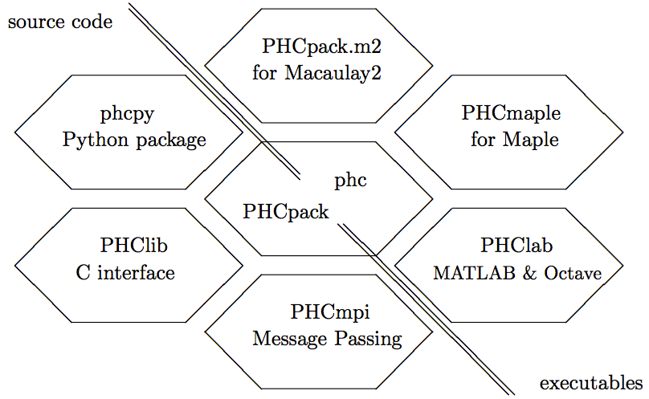

********
Tutorial
********

This chapter provides a short tutorial,
mainly for use at the command line.
Interfaces for Maple, MATLAB (Octave), SageMath, and Python 
provide a scripting environment.

Input Formats
=============

A lot of examples are contained in the database of Demo systems,
which can be downloaded in zipped and tarred format from the above web site.

The input file starts with the number of equations and (optionally,
but necessary in case of an unequal number) the number of unknowns.
For example, the polynomial system of Bertrand Haas (which provided
a counterexample for the conjecture of Koushnirenko) is represented
as follows

::

   2
     x**108 + 1.1*y**54 - 1.1*y;
     y**108 + 1.1*x**54 - 1.1*x;

For future use, we save this system in the file ``haas``.
Observe that every polynomial terminates with a semicolon.
The exponentiation may also be denoted by a hat instead of
a double asterix. 

The :index:`forbidden symbols`
to denote names of variables are ``i`` and ``I``, because they 
both represent the square root of -1.
Also forbidden are ``e`` and ``E`` because they are used in
the scientific notation of floating-point numbers,
like 0.01 = 1.0e-2 = 1.0E-2.

The equations defining the adjacent 2-by-2 minors of
a general 2-by-4 matrix are represented as

::

   3 8
    x11*x22 - x21*x12;
    x12*x23 - x22*x13;
    x13*x24 - x23*x14;

thus as 3 polynomials in the 8 undeterminates of a general
2-by-4 matrix.  We save this file as ``adjmin4``.

The program also accepts polynomials in factored form, for example,

::

   5
    (a-1)*(b-5)*(c-9)*(d-13) - 21;
    (a-2)*(b-6)*(c-10)*(f-17) - 22;
    (a-3)*(b-7)*(d-14)*(f-18) - 23;
    (a-4)*(c-11)*(d-15)*(f-19) - 24;
    (b-8)*(c-12)*(d-16)*(f-20) - 25;

is a valid input file for phc.
Note that we replaced the logical e variable by f.
We save this input in the file with name ``multilin``.

Interfaces
==========

The software is developed for command line interactions.
Because there is no interpreter provided with PHCpack,
there are interfaces to :index:`computer algebra` systems
such as for example Maple.

From the web site mentioned above we can download the Maple procedure
run_phc and an example worksheet on how to use this procedure.
The Maple procedure requires only two arguments: the path name ending
in the name of the executable version of the program, and a list of
polynomials.  This procedure sets up the input file for phc, calls
the blackbox solver and returns the list of approximate solutions.
This list is returned in Maple format.

.. index:: Octave, MATLAB, SageMath, Macaulay2, Maple

Other interfaces are PHClab (for Octave and MATLAB),
phc.py (for SageMath), and PHCpack.m2 (for Macaulay 2).
These interfaces require only the executable phc to be present
in some directory contained in the execution path.
Interfaces for C and C++ programmers require the compilation
of the source code.  For Python, a shared object file needs
to exist for the particular architecture.

A diagram of the interfaces to PHCpack and phc is depicted
in :numref:`figintdesign`. 

.. _figintdesign:

    Interfaces either require the source code or only the executable.

The interfaces PHCpack.m2, PHCmaple, PHClab, shown to the right
of the antidiagonal require only the executable version phc.
The other interfaces PHClib, PHCmpi, and phcpy are tied
to the source code.

The ``phc.py`` (observe the dot between ``phc`` and ``py``) 
is an optional package, available in the distribution
of SageMath.  Another, perhaps more natural interface to SageMath,
is to extend the Python interpreter of SageMath with phcpy.

Runs in a Jupyter notebook work with a Python or SageMath kernel,
using the interpreter with phcpy installed.
For Julia, use PHCpack.jl, either as standalone or in a Jupyter
notebook with a Julia kernel.

The Blackbox Solvers
====================

Depending on whether the polynomial system has only isolated solutions,
or whether also positive dimensional solution sets, select one of those
two blackbox options:

1. ``phc -b`` to approximate all isolated solutions;  or

2. ``phc -B`` for a numerical irreducible decomposition.

To use ``phc -b`` on the system we saved earlier in
the file multilin, we invoke the blackbox solver typing
at the command prompt

::

    phc -b multilin multilin.phc

The output of the solver will be sent to the file multilin.phc.
In case the input file did not yet contain any solutions, 
the solution list will be appended to the input file.

The output can also appear directly on screen,
if the name of the output file is omitted at the command line.

We now explain the format of the solutions, for example, the last
solution in the list occurs in the following format:

::

   solution 44 :    start residual :  1.887E-14   #iterations : 1   success
   t :  1.00000000000000E+00   0.00000000000000E+00
   m : 1
   the solution for t :
    a :  5.50304308029581E+00  -6.13068078142107E-44
    b :  8.32523889626848E+00  -5.18918337570284E-45
    c :  1.01021324864917E+01  -1.29182202179944E-45
    d :  1.42724963260133E+01   1.38159270467025E-44
    f :  4.34451307203401E+01  -6.26380413553193E-43
   == err :  3.829E-12 = rco :  3.749E-03 = res :  2.730E-14 = real regular ==

This is the actual output of the root refiner.  As the residual
at the end of the solution path and at the start of the root refinement
is already ``1.887E-14``, one iteration of
Newton's method suffices to confirm the quality of the root.

The next line in the output indicates that we reached the end of
the path, at ``t :  1.00000000000000E+00   0.00000000000000E+00``
properly.  The multiplicity of the root is one,
as indicated by ``m : 1``.  Then we see the values for the five variables,
as pairs of two floating-point numbers: the real and imaginary part of
each value.  The last line summarizes the numerical quality of the root.
The value for err is the magnitude of the last correction term
used in Newton's method.  The number for rco is an estimate for
the inverse condition number of the root.  Here this means that we are
guaranteed to have all decimal places correct, except for the last three
decimal places.  The last number represents the residual, the magnitude
of the vector evaluated at the root.

The blackbox solver has two other interesting options:

1. To change the default working precision from hardware double precision
   into double double or quad double precision, call ``phc`` respectively
   with the options ``-b2`` or ``-b4``.

2. To use multiple threads in the solver, call ``phc`` with the option 
   ``-t`` immediately followed by the number of threads.
   For example, to run the blackbox solver on 4 threads, type ``phc -b -t4``.

Those two options may be combined.  For example ``phc -b2 -t8`` runs
the blackbox solver on 8 threads in double double precision.
If the computer has 8-core processors available, then ``phc -b2 -t8``
may compensate for the overhead of double double arithmetic
and be just as fast as the ``phc -b`` in double precision.

For the system ``adjmin4`` above, representing
the equations defining the adjacent 2-by-2 minors of
a general 2-by-4 matrix, running ``phc -b`` does not make sense,
as there are no isolated solutions.  
Instead, we can compute a *numerical irreducible decompsition*
with the option ``-B``, typing at the command prompt

::

    phc -B adjmin4 adjmin4.phc

The user is then prompted to enter the top dimension of the solution set,
which by default equals the number of variables minus one.

For this system, the output file will show that the solution set
is a 5-dimensional solution set of degree 8, which factors into
three irreducible components, of degrees 2, 2, and 4.

Double double, quad double, and multithreading is also supported
in the numerical irreducible decomposition.
To run in quad double precision on 16 threads,
type ``phc -B4 -t16`` at the command prompt.

Running the Program in Full Mode
================================

If we just type in ``phc`` without any option, we run the program
in full mode and will pass through all the main menus.
A nice application is the verification of the counterexample of Bertrand
Haas.  We type in haas when the program asks us for the name of
the input file.  As the output may be rather large, we better save the
output file on /tmp.  As we run through all the menus, for this system,
a good choice is given by the default, so we can type in 0 to answer
every question.  At the very end, for the output format, it may be good
to type in 1 instead of 0, so we can see the progress of the program as
it adds solution after solution to the output file.

If we look at the output file for the system in ``multilin``,
then we see that the mixed volume equals the 4-homogeneous Bezout number.
Since polyhedral methods (e.g. to compute the mixed volume)
are computationally more expensive than the solvers based on product
homotopies, we can solve the same problem faster.
If we run the program on the system in multilin in full mode,
we can construct a multi-homogeneous homotopy as follows.
At the menu for Root Counts and Method to Construct Start Systems,
we type in 1 to select a multi-homogeneous Bezout number.
Since there are only 52 possible partitions of a set of four unknowns,
it does not take that long for the program to try all 52 partitions
and to retain that partition that yields the lowest Bezout number.
Once we have this partition, we leave the root counting menu with 0,
and construct a linear-product system typing 2 in the menu to construct
m-homogeneous start systems.  We can save the start system in the file
multilin\_start (only used for backup).
Now we continue just as before.

Running Toolbox Mode
====================

The blackbox mode makes a selection of algorithms
and runs them with default settings of the tolerances and parameters.
In toolbox mode, defaults can be alterned and the stages in the solver
are separated.

For Isolated Solutions Only
---------------------------

Skipping the preconditioning stage (scaling and reduction),
we can compute root counts and construct start systems via the option ``-r``,
thus calling the program as ``phc -r``.  One important submenu is
the mixed-volume computation, invoked via ``phc -m``.

Once we created an appropriate start system, we can call the path
trackers via the option ``-p``.  Calling the program as ``phc -p``
is useful if we have to solve a slightly modified problem.
For instance,
suppose we change the coefficients of the system in multilin,
then we can still use multilin_start to solve the system with
modified coefficients, using the ``-p`` option.  
In this way we use a :index:`cheater's homotopy`, alternatively called
:index:`coefficient-parameter polynomial continuation`.

Computing Components of Solutions
---------------------------------

Consider the system of adjacent minors, we previously saved 
as ``adjmin4``.  We first must construct a suitable embedding
to get to a system with as many equations as unknowns.
We call ``phc -c`` and type 5 as top dimension.  The system
the program produces is saved as ``adjmin4e5``.  The blackbox
solver has no difficulty to solve this problem and appends the
witness points to the file ``adjmin4e5``.  To compute the
irreducible decomposition, we may use the monodromy breakup
algorithm, selecting 2 from the menu that comes up when we
run with the option ``-f``.
